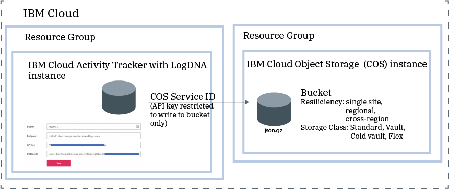

---

copyright:
  years: 2019, 2020
lastupdated: "2020-04-27"
subcollection: logdnaat

---

{:new_window: target="_blank"}
{:shortdesc: .shortdesc}
{:screen: .screen}
{:pre: .pre}
{:table: .aria-labeledby="caption"}
{:codeblock: .codeblock}
{:tip: .tip}
{:download: .download}
{:important: .important}
{:note: .note}


# Managing events in your account
{: #manage_events}

Collect, archive, view and analyze events. 
{:shortdesc}


## Collecting events to monitor activity in the account
{: #manage_events_provision}

To collect and monitor activity in your account, you must provision the {{site.data.keyword.at_full_notm}} (AT) service in your account. Collection of events is automatic for AT-enabled services.

* There is 1 instance of the {{site.data.keyword.at_full_notm}} service per location. For more information, see [Locations](/docs/Activity-Tracker-with-LogDNA?topic=logdnaat-regions).
* To monitor [global events](/docs/Activity-Tracker-with-LogDNA?topic=logdnaat-monitor_events#mon_def_global), you must provision 1 instance in Frankfurt. 

Notice that to monitor activity in your account, you might need to provision multiple {{site.data.keyword.at_full_notm}} instances. For example, you have services in the US South location only. To monitor activity in your account, you need 1 instance in US South to monitor events that are generated by services that are running in that location. You need 1 instance in EU-DE (Frankfurt) to monitor global actions that happen in your account such as user management actions, and provisioning of service instances. 

In the {{site.data.keyword.cloud_notm}}, you can click the **Menu** icon  &gt; **Observability** &gt; **Activity Tracker** to see the dashboard where all the instances that are provisioned in the account are listed. 

[Learn more about provisioning the service](/docs/Activity-Tracker-with-LogDNA?topic=logdnaat-provision).

To get the list of locations where the service is available in the {{site.data.keyword.cloud_notm}}, see [Locations](/docs/Activity-Tracker-with-LogDNA?topic=logdnaat-regions).

As soon as an instance is available, events are collected and available for monitoring through the web UI of that instance.


## Defining views, dashboards, and screens to analyze events
{: #manage_events_category}

You can define [views](/docs/Activity-Tracker-with-LogDNA?topic=logdnaat-views), dashboards, and screens to analyze events and monitor activity in your account. 

You can use categories to group resources of the same type so that users can easily find them. 

You can define categories through the **Categories** section in the web UI. 
* You can define categories to group views. 
* You can define a different set of categories to group dashboards.
* You can define categories to group screens.


## Archiving events for long-term storage
{: #manage_events_archive}

You can archive events from an {{site.data.keyword.at_full_notm}} instance into a bucket in an {{site.data.keyword.cos_full_notm}} (COS) instance. [Learn more](/docs/Activity-Tracker-with-LogDNA?topic=logdnaat-archiving).

* Events are automatically archived in a compressed format **(.json.gz)**. Each event preserves its metadata.
* Events are archived within 24-48 hours after you save the configuration. 
* Events are archived hourly. 

    The name of the file has the following format:

    ```
    year=YYYY/month=MM/day=DD/<accountID>.<YYYY>-<MM>-<DD>.<HH>00.json.gz 
    ```
    {: codeblock}

    Where `HH` is hours in 24 format and `accountID` corresponds to the LogDNA instance ID. You can get the LogDNA instance ID from the URL that you get when you launch the LogDNA web UI. 

    For example, an archive file can have the following name: `2020/03/18/0f6efbef16.2020-03-18.1800.json.gz`

    The events that are included in a file correspond to the period of time that is indicated as part of the name of the file. 

* The timestamp that is used to determine whether the event is included in an archive is the UTC timestamp.

    Notice that depending on your location, there might be events that you see in local time in your views on a specific day. However, you cannot find them on the archive file. You are most likely viewing events in local time and the archive process uses the UTC timestamp.

* After you configure archiving, the first archive file is created when the archiving process runs and there is data.
* The first time the archive process runs, consider the following information:

    * The maximum number of days that data is archived includes events for the past 30 days when the instance has a `30 day search` plan.

    * The maximum number of days that data is archived includes events for the past 14 days when the instance has a `14 day search` plan.

    * The maximum number of days that data is archived includes events for the past 7 days when the instance has a `7 day search` plan.

For example, you have a service plan of 30 days. You configured the instance 10 days ago. You enable archiving on the 10th day. The archiving process generates multiple files. Each file includes events for the period of time indicated as part of its name. If there is no data, the archive file for that period is empty.

Each {{site.data.keyword.at_full_notm}} instance has its own archiving configuration.
{: important}

The following figure shows a high-level view of the different components that are integrated when archiving events:



The {{site.data.keyword.cos_full_notm}} instance is provisioned within the context of a resource group. The {{site.data.keyword.at_full_notm}} instance is also provisioned within the context of a resource group. Both instances can be grouped under the same resource group or in different ones. 

{{site.data.keyword.at_full_notm}} uses a service ID to communicate with the {{site.data.keyword.cos_full_notm}} service.
* The service ID that you create for an {{site.data.keyword.cos_full_notm}} instance is used by the {{site.data.keyword.at_full_notm}} to authenticate and access the {{site.data.keyword.cos_full_notm}} instance. 
* You can assign specific access policies to the service ID that restrict permissions on the {{site.data.keyword.cos_full_notm}} instance. Restrict the service ID to only have writing permissions on the bucket where you plan to archive the events.
* You can also restrict the IP addresses that are allowed to manage the bucket.

**Archiving in an EU-managed location:** You must configure a bucket that complies with the EU-managed and GDPR regulations.
{: important}


## Viewing archived events by using the SQL Query service
{: #manage_events_sqlquery}


{{site.data.keyword.sqlquery_short}} provides a serverless, no-ETL solution to easily query data stored in COS. [Learn more](/docs/sql-query?topic=sql-query-overview).

You can use this service to analyze data from archived files in COS. 

Once you have SQL Query running on IBM Cloud, you can immediately start querying your data using the SQL Query user interface, programmatically by using either the REST API or the Python `ibmcloudsql` library, or write a serverless function by using {{site.data.keyword.openwhisk_short}}.

When you query events, consider the following information:
* You must provision an instance of the {{site.data.keyword.sqlquery_short}} service.
* You must restrict user access to work with that instance. Users need the platform **viewer** role to launch the UI, and the service **writer** role to run queries.
* When you open the UI, the {{site.data.keyword.sqlquery_short}} service automatically generates a unique COS bucket that will store all of the results as CSV files from your SQL queries. To make sure that you are using a custom bucket, create one. You can specify your custom bucket to store results in. 


