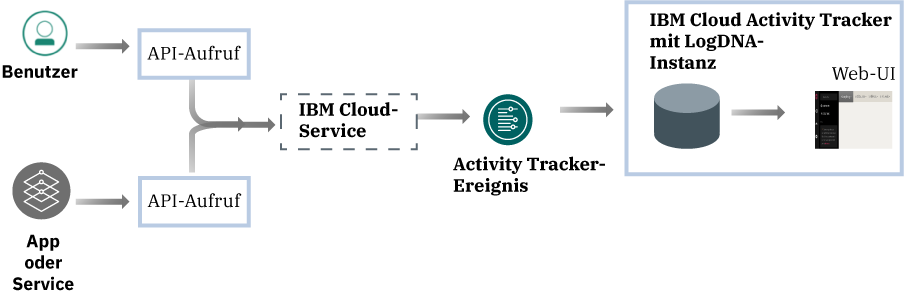
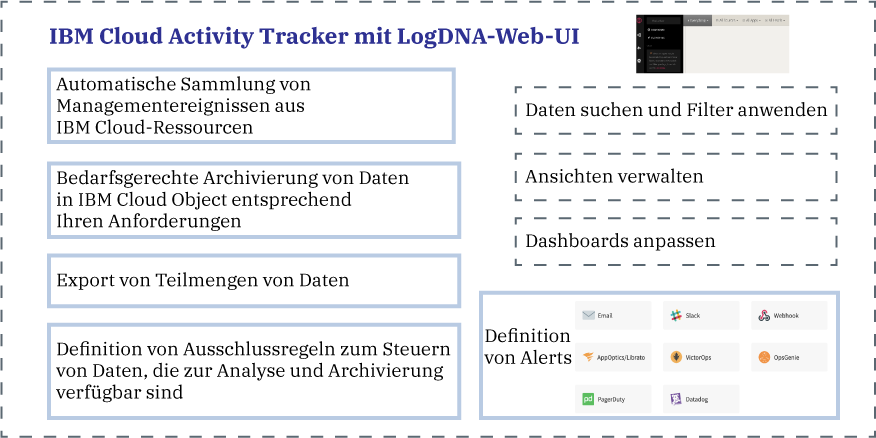

---

copyright:
  years: 2019
lastupdated: "2019-06-06"

keywords: IBM Cloud, LogDNA, Activity Tracker, getting started

subcollection: logdnaat

---

{:new_window: target="_blank"}
{:shortdesc: .shortdesc}
{:screen: .screen}
{:pre: .pre}
{:table: .aria-labeledby="caption"}
{:codeblock: .codeblock}
{:tip: .tip}
{:download: .download}
{:important: .important}
{:note: .note}

# Lernprogramm 'Einführung'
{: #getting-started}

Verwenden Sie den {{site.data.keyword.at_full}}-Service, um die Aktivität Ihres {{site.data.keyword.cloud_notm}}-Kontos zu überwachen. Sie können diesen Service verwenden, um nach anormaler Aktivität und kritischen Aktionen zu suchen und um regulatorische Prüfvorschriften zu erfüllen. Darüber hinaus können Sie zeitnah zu Aktionen benachrichtigt werden. Die gesammelten Ereignisse sind mit dem CADF-Standard (Cloud Auditing Data Federation) kompatibel.
{:shortdesc}

{{site.data.keyword.at_full_notm}} sammelt und speichert Auditdatensätze für API-Aufrufe von Ressourcen, die in der {{site.data.keyword.cloud_notm}} ausgeführt werden. Sie können diese Ereignisse in der {{site.data.keyword.cloud_notm}} langfristig speichern.
{: note}

## Informationen zu {{site.data.keyword.at_full}}
{: #gs_ov}

Compliance mit internen Richtlinien und Branchenregularien ist eine zentrale Anforderung jeder Unternehmensstrategie, unabhängig davon, wo Anwendungen ausgeführt werden: lokal, in einer hybriden Cloud oder in einer öffentlichen Cloud. Der {{site.data.keyword.at_full_notm}}-Service stellt das Framework und die Funktionalität für die Überwachung von API-Aufrufen an Services in der {{site.data.keyword.cloud_notm}} bereit und erzeugt die Nachweise für die Compliance mit Unternehmensrichtlinien und branchenspezifischen Regularien.

Wenn Sie in einer Cloudumgebung arbeiten, z. B. {{site.data.keyword.cloud_notm}}, müssen Sie die Cloudstrategie für die Prüfung und Überwachung von Workloads und Daten in Übereinstimmung mit Ihren internen Richtlinien und mit branchen- und länderspezifischen Compliance-Anforderungen planen. Sie können die Informationen verwenden, die über den {{site.data.keyword.at_full_notm}}-Service registriert werden, um Sicherheitsvorfälle zu ermitteln, nicht autorisierte Zugriffe festzustellen und mit regulatorischen und internen Auditanforderungen konform zu bleiben.

* {{site.data.keyword.at_full_notm}} unterstützt übergeordnete Sicherheits-Governance für Ihre IT-Ressourcen in der Cloud.
* {{site.data.keyword.at_full_notm}} stellt eine Lösung für Administratoren zum Erfassen, Speichern, Anzeigen, Suchen und Überwachen von API-Aktivität an einem zentralen Ort bereit. Es bietet auch eine Benachrichtigungsfunktion, um Sie über einen der unterstützten Benachrichtigungskanäle zu warnen.
* {{site.data.keyword.at_full_notm}} stellt Funktionen für den Export von Ereignissen bereit, die Sie anschließend verwenden können, um einen Auditprotokollbericht zu generieren. Unter Umständen brauchen Sie diese Berichte, um sicherzustellen, dass Ihre Organisation mit internen Regularien und externen Branchen- und Länderregularien konform ist.

Sie können beispielsweise die {{site.data.keyword.at_full_notm}}-Ereignisse verwenden, um die folgenden Informationen zu ermitteln:
* Die Benutzer, die API-Aufrufe an Cloud-Services gestartet haben.
* Die Zeitmarke der API-Aufrufe.
* Der Status des API-Aufrufs.
* Die Kritikalität der Aktion.

Berücksichtigen Sie die folgenden Informationen zur Sicherheit, wenn Sie mit dem {{site.data.keyword.at_full_notm}}-Service arbeiten:

* IBM Services, die {{site.data.keyword.at_full_notm}}-Ereignisse generieren, befolgen die {{site.data.keyword.IBM_notm}} Cloud-Sicherheitsrichtlinie. Weitere Informationen finden Sie unter [Sicherheit in der IBM Cloud ](https://www.ibm.com/cloud/security){: new_window}.
* Der {{site.data.keyword.at_full_notm}}-Service zeichnet benutzerinitiierte Aktivitäten auf, die den Status von Cloud-Services ändern. Die Informationen geben keinen direkten Zugriff auf Datenbanken oder Anwendungen.
* Nur berechtigte Benutzer können {{site.data.keyword.at_full_notm}}-Ereignisprotokolle anzeigen und überwachen. Jeder Benutzer ist durch seine eindeutige ID in der {{site.data.keyword.cloud_notm}} angegeben.
* Sie können nur 1 Instanz des Service pro {{site.data.keyword.cloud_notm}}-Position (Region) bereitstellen.

## Ziele
{: #gs_objectives}

Führen Sie dieses Lernprogramm aus, um zu erfahren, wie Sie einen Service in der {{site.data.keyword.cloud_notm}} bereitstellen können. Finden Sie heraus, welche allgemeinen Daten in den einzelnen Ereignissen verfügbar sind und wie diese Ihnen dabei helfen, Ihre Cloudumgebung zu überwachen. Lernen Sie, wie Sie sich in der Webbenutzerschnittstelle zurechtfinden. 

## Voraussetzungen
{: #gs_prereq}

* Sie benötigen eine Benutzer-ID, die ein Mitglied oder ein Eigner eines {{site.data.keyword.cloud_notm}}-Kontos ist. So rufen Sie eine {{site.data.keyword.cloud_notm}}-Benutzer-ID ab: [Registrierung ](https://cloud.ibm.com/login){:new_window}.

* Wenn Sie die Befehlszeile vorziehen, müssen Sie die {{site.data.keyword.cloud_notm}}-Befehlszeilenschnittstelle installieren. Weitere Informationen finden Sie unter [{{site.data.keyword.cloud_notm}}-Befehlszeilenschnittstelle installieren](/docs/cli?topic=cloud-cli-ibmcloud-cli#ibmcloud-cli).

* Um die Schritte zur Verwaltung des Zugriffs auf den Service durchzuführen, benötigt Ihre Benutzer-ID **Administratorplattformberechtigungen**, um den {{site.data.keyword.at_full_notm}}-Service zu verwalten. Wenden Sie sich an den Kontoadministrator. Der Kontoeigner kann einen anderen Benutzerzugriff auf das Konto für die Verwaltung des Benutzerzugriffs und die Verwaltung von Kontoressourcen erteilen. [Weitere Informationen](/docs/iam?topic=iam-userroles).

## Schritt 1. Instanz des {{site.data.keyword.at_full_notm}}-Service bereitstellen
{: #gs_step1}

Führen Sie die folgenden Schritte aus, um eine Instanz bereitzustellen:

1. [Melden Sie sich bei Ihrem {{site.data.keyword.cloud_notm}}-Konto ](https://cloud.ibm.com/login){:new_window} an.

	Nachdem Sie sich mit Ihrer Benutzer-ID und Ihrem Kennwort angemeldet haben, wird die {{site.data.keyword.cloud_notm}}-Benutzerschnittstelle geöffnet.

2. Navigieren Sie zum Menüsymbol . Wählen Sie dann **Beobachtbarkeit** aus, um auf das Dashboard *Beobachtbarkeit* zuzugreifen.

3. Wählen Sie **Activity Tracker** aus und klicken Sie dann auf **Instanz erstellen**. 

4. Geben Sie einen Namen für die Serviceinstanz ein. 

5. Wählen Sie die Position **Frankfurt** aus. 

    Weitere Informationen zu den Regionen, in denen der Service verfügbar ist, finden Sie unter [Regionen](/docs/services/Activity-Tracker-with-LogDNA?topic=logdnaat-regions).

6. Wählen Sie eine Ressourcengruppe aus. 

    Standardmäßig ist die Ressourcengruppe **Standard** festgelegt.

    **Hinweis:** Wenn Sie keine Ressourcengruppe auswählen können, prüfen Sie, dass Sie über Bearbeitungsberechtigungen für die Ressourcengruppe verfügen, in der Sie die Instanz bereitstellen möchten.

7. Wählen Sie den Serviceplan `Lite` aus. 

    Der Plan 'Lite' ist standardmäßig festgelegt.

8. Klicken Sie auf **Erstellen**. 

Nachdem Sie eine Instanz bereitgestellt haben, wird das *Activity Tracker*-Dashboard geöffnet. 

## Schritt 2. Zugriff auf den Service verwalten
{: #gs_step2}

**Jedem Benutzer, der auf den {{site.data.keyword.at_full_notm}}-Service in Ihrem Konto zugreift, muss eine Zugriffsrichtlinie mit einer definierten IAM-Benutzerrolle zugewiesen werden.** Die Richtlinie bestimmt, welche Aktionen der Benutzer im Kontext des ausgewählten Service oder der ausgewählten Instanz ausführen kann. Die zulässigen Aktionen werden angepasst und definiert als Operationen, die für den Service ausgeführt werden dürfen. Die Aktionen werden dann IAM-Benutzerrollen zugeordnet. [Weitere Informationen](/docs/services/Activity-Tracker-with-LogDNA?topic=logdnaat-iam). 

In diesem Lernprogramm erfahren Sie, wie Sie einem Benutzer Verwaltungsberechtigungen für die Arbeit mit dem {{site.data.keyword.at_full_notm}}-Service im Kontext einer Ressourcengruppe erteilen.

### 1. Zugriffsgruppe erstellen
{: #gs_step2_1}

Führen Sie die folgenden Schritte aus, um eine Zugriffsgruppe zu erstellen:
1. Klicken Sie in der Menüleiste auf **Verwalten** &gt; **Zugriff (IAM)** und wählen Sie **Zugriffsgruppen** aus.
2. Klicken Sie auf **Erstellen**. 
3. Geben Sie einen Namen und eine optionale Beschreibung für Ihre Gruppe ein und klicken Sie auf **Erstellen**.

### 2. Berechtigungen zum Verwalten von Ereignissen hinzufügen
{: #gs_step2_2}

Nachdem Sie Ihre Gruppe eingerichtet haben, müssen Sie einer der Gruppe eine allgemeine Zugriffsrichtlinie zuweisen. Jede Richtlinie, die Sie für eine Zugriffsgruppe festlegen, gilt für alle Entitäten, Benutzer und Service-IDs in der Gruppe.

Wenn Sie die Richtlinie definieren, müssen Sie eine Plattformrolle und eine Servicerolle auswählen:
* Plattformmanagementrollen decken eine Reihe von Aktionen ab, einschließlich der Möglichkeit, Instanzen zu erstellen und zu löschen, Aliasnamen, Bindungen und Berechtigungsnachweise zu verwalten sowie den Zugriff zu verwalten. Bei den Plattformrollen handelt es sich um Administrator, Editor, Operator und Anzeigeberechtigter. Plattformmanagementrollen gelten auch für Kontoverwaltungsservices, die es Benutzern abhängig von der zugewiesenen Rolle für den jeweiligen Kontoverwaltungsservice ermöglichen, Benutzer einzuladen, Service-IDs, Zugriffsrichtlinien und Katalogeinträge zu verwalten sowie Abrechnungen und Nutzung zu verfolgen. 
* Servicezugriffsrollen definieren die Fähigkeit eines Benutzers oder Service, Aktionen für eine Serviceinstanz auszuführen. Bei den Servicezugriffsrollen handelt es sich um Manager, Schreibberechtigter und Leseberechtigter.

Für die Verwaltung des {{site.data.keyword.at_full_notm}}-Service benötigt ein Benutzer die folgenden Rollen:
* Plattformrolle: **Administrator**. 
* Servicerolle: **Manager**. 

Führen Sie die folgenden Schritte aus, um über die Benutzerschnittstelle eine Richtlinie zuzuweisen:

1. Klicken Sie in der Menüleiste auf **Verwalten** &gt; **Zugriff (IAM)**.
2. Wählen Sie **Zugriffsgruppen** aus.
3. Wählen Sie den Namen der Gruppe aus, der Sie Zugriff zuweisen möchten. 
4. Klicken Sie auf **Zugriffsrichtlinien**.
5. Klicken Sie auf **Zugriff zuweisen**.
6. Wählen Sie **Zugriff in einer Ressourcengruppe zuweisen** aus.
7. Wählen Sie eine Ressourcengruppe aus. 
8. Wenn dem Benutzer noch keine Rolle für die ausgewählte Ressourcengruppe zugewiesen wurde, wählen Sie eine Rolle für das Feld **Zugriff für eine Ressourcengruppe zuweisen** aus. 

    Abhängig von der ausgewählten Rolle kann der Benutzer die Ressourcengruppe im Dashboard anzeigen, den Ressourcengruppennamen bearbeiten oder den Benutzerzugriff auf die Gruppe verwalten. 
    
    Sie können **Kein Zugriff** auswählen, wenn der Benutzer nur auf den {{site.data.keyword.at_full_notm}}-Service in der Ressourcengruppe zugreifen soll.

9. Wählen Sie **IBM Cloud Activity Tracker mit LogDNA** aus.
10. Wählen Sie die Plattformrolle **Administrator** aus.
11. Wählen Sie die Servicerolle **Manager** aus.
12. Klicken Sie auf **Zuweisen**.

### 3. Benutzer zur Gruppe hinzufügen
{: #gs_step2_3}

Führen Sie die folgenden Schritte aus, um den Benutzer zur Zugriffsgruppe hinzuzufügen.
1. Klicken Sie auf der Registerkarte **Benutzer** auf **Benutzer hinzufügen**.
2. Wählen Sie den Benutzer aus, den Sie aus der Liste hinzufügen möchten, und klicken Sie auf **Zu Gruppe hinzufügen**.

## Schritt 3. {{site.data.keyword.at_full_notm}}-Ereignisse generieren
{: #gs_step3}

Führen Sie die folgenden Schritte aus, um ein Ereignis zu generieren, wenn eine Instanz des {{site.data.keyword.cloudcerts_short}}-Service bereitgestellt wird:

1. Wählen Sie im [{{site.data.keyword.cloud_notm}}-Katalog ](https://cloud.ibm.com/catalog){:new_window} die Kategorie **Sicherheit und Identität** aus.

2. Wählen Sie den {{site.data.keyword.cloudcerts_short}}-Service aus.

3. Geben Sie einen Namen für die Serviceinstanz ein.

4. Wählen Sie die Region aus, in der Sie die Instanz bereitstellen möchten.

5. Wählen Sie eine Ressourcengruppe aus.  

    Standardmäßig ist die Ressourcengruppe **Standard** festgelegt.

    **Hinweis:** Wenn Sie keine Ressourcengruppe auswählen können, prüfen Sie, dass Sie über Bearbeitungsberechtigungen für die Ressourcengruppe verfügen, in der Sie die Instanz bereitstellen möchten.

6. Wählen Sie den Serviceplan `Kostenlos` aus. 

7. Klicken Sie auf **Erstellen**.

Eine Instanz des {{site.data.keyword.cloudcerts_short}}-Service wird erstellt.

## Schritt 4. Webbenutzerschnittstelle starten 
{: #gs_step4}

Führen Sie die folgenden Schritte aus, um die Webbenutzerschnittstelle zu starten:

1. [Melden Sie sich bei Ihrem {{site.data.keyword.cloud_notm}}-Konto ](https://cloud.ibm.com/login){:new_window} an.

	Nachdem Sie sich mit Ihrer Benutzer-ID und Ihrem Kennwort angemeldet haben, wird das {{site.data.keyword.cloud_notm}}-Dashboard geöffnet.

2. Wählen Sie im Navigationsmenü **Beobachtbarkeit** aus. 

3. Wählen Sie **Activity Tracker** aus. 

    Die Liste von Instanzen, die in der {{site.data.keyword.cloud_notm}} verfügbar sind, wird angezeigt.

4. Wählen Sie die Instanz aus, die sich in **Frankfurt** befindet. Klicken Sie dann auf **LogDNA anzeigen**.

    Globale Ereignisse, wie die Bereitstellung eines Service, sind über die globale Domäneninstanz verfügbar, die sich in Frankfurt befindet.

Die Webbenutzerschnittstelle wird geöffnet. 

## Schritt 5. Ereignisse anzeigen
{: #gs_step5}

Der {{site.data.keyword.at_full_notm}}-Service erfasst Aktivitätsdaten mit Bezug auf API-Aufrufe und andere Aktionen, die für ausgewählte Cloud-Services in der {{site.data.keyword.cloud_notm}} gestartet werden. 

* Ereignisse werden automatisch erfasst. 
* Die in {{site.data.keyword.at_full_notm}} gesammelten Ereignisse sind mit dem **CADF-Standard (Cloud Auditing Data Federation)** kompatibel. Der CADF-Standard definiert ein umfassendes Ereignismodell, das die Informationen enthält, die zum Zertifizieren, Verwalten und Prüfen der Sicherheit von Anwendungen in Cloudumgebungen erforderlich sind.
* {{site.data.keyword.at_full_notm}} speichert und gruppiert Ereignisse nach Position. 
* Ereignisse, die über globale {{site.data.keyword.cloud_notm}}-Kontoaktionen berichten, werden gesammelt und in **Frankfurt (EU-DE)** gespeichert.
* Der Serviceplan, den Sie für Ihre {{site.data.keyword.at_full_notm}}-Instanz auswählen, bestimmt, wie viele Tage Ereignisse in der Webbenutzerschnittstelle gesucht werden können. 

Wenn die Webbenutzerschnittstelle geöffnet wird, ist die Ansicht **Alles** zu sehen. Über diese Ansicht können Ereignisse angezeigt werden.

Sie können auch angepasste Ansichten definieren, um eine Gruppe von Ereignissen anzuzeigen; dabei wird eine Zeitmarke und/oder eine Suchabfrage angewendet. [Weitere Informationen](/docs/services/Activity-Tracker-with-LogDNA?topic=logdnaat-views).

## Schritt 6. Struktur von Ereignissen verstehen
{: #gs_step6}

Ereignisse sind mit dem **CADF-Standard (Cloud Auditing Data Federation)** kompatibel. Der CADF-Standard definiert ein umfassendes Ereignismodell, das die Informationen enthält, die zum Zertifizieren, Verwalten und Prüfen der Sicherheit von Anwendungen in Cloudumgebungen erforderlich sind.

Das CADF-Ereignismodell schließt die folgenden Komponenten ein:

| Komponente | Beschreibung |
|------------|----------------------------|
| `Aktion`   | Die Aktion ist die Operation bzw. die Aktivität, die ein Initiator ausführt, auszuführen versucht oder bald ausführen wird. |
| `Initiator`| Der Initiator ist die Ressource, die einen API-Aufruf startet und ein CADF-Ereignis generiert. Welches Ereignis ausgelöst wird, hängt von der Aktion ab, die vom dem API-Aufruf angefordert wird. |
| `Observer` | Der Observer ist die Ressource, die einen CADF-Datensatz aus im CADF-Ereignis verfügbaren Informationen erstellt und speichert. |
| `Ergebnis`  | Das Ergebnis ist der Status der Aktion, die für ein Ziel ausgeführt wird. |
| `Ziel`   | Das Ziel ist die Ressource, in der die Aktion ausgeführt wird, auszuführen versucht wird oder bald ausgeführt werden soll. |
{: caption="Tabelle 2. In einem CADF-Ereignismodell verfügbare Komponenten" caption-side="top"} 

[Weitere Informationen](/docs/services/Activity-Tracker-with-LogDNA?topic=logdnaat-event#event).

## Nächste Schritte
{: #gs_next_steps}

[Definieren Sie angepasste Ansichten](/docs/services/Activity-Tracker-with-LogDNA?topic=logdnaat-views). 

Führen Sie ein Upgrade für den {{site.data.keyword.at_full_notm}}-Serviceplan auf einen bezahlten Plan aus, um [durch Anwenden einer Abfrage nach Ereignissen zu suchen](/docs/services/Activity-Tracker-with-LogDNA?topic=logdnaat-views#views_step2) und [Alerts zu konfigurieren](/docs/services/Activity-Tracker-with-LogDNA?topic=logdnaat-alerts). 

Weitere Informationen zu {{site.data.keyword.at_full_notm}}-Serviceplänen finden Sie unter [Servicepläne](/docs/services/Activity-Tracker-with-LogDNA?topic=logdnaat-service_plan#service_plan).

