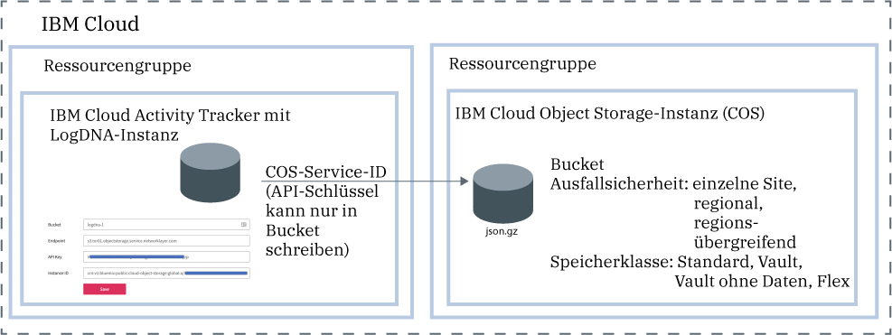

---

copyright:
  years: 2019
lastupdated: "2019-05-25"

keywords: IBM Cloud, LogDNA, Activity Tracker, manage events

subcollection: logdnaat

---

{:new_window: target="_blank"}
{:shortdesc: .shortdesc}
{:screen: .screen}
{:pre: .pre}
{:table: .aria-labeledby="caption"}
{:codeblock: .codeblock}
{:tip: .tip}
{:download: .download}
{:important: .important}
{:note: .note}

# Ereignisse in Ihrem Konto verwalten
{: #manage_events}

Als Administrator des {{site.data.keyword.at_full_notm}}-Service in der {{site.data.keyword.cloud_notm}} müssen Sie eine Instanz des Service an jeder Position bereitstellen, die Sie überwachen möchten. Sie müssen die Kontorichtlinien definieren, um Ereignisse in dem Konto zu verwalten.
{:shortdesc}

## Eine Instanz des Service pro Position bereitstellen
{: #manage_events_provision}

Um die Aktivität in Ihrem Konto zu erfassen und zu überwachen, müssen Sie den {{site.data.keyword.at_full_notm}}-Service in Ihrem Konto bereitstellen. 

Sie können nur 1 Instanz des {{site.data.keyword.at_full_notm}}-Service pro Position bereitstellen. Um die Aktivität in Ihrem Konto zu überwachen, müssen Sie daher möglicherweise mehrere {{site.data.keyword.at_full_notm}}-Instanzen bereitstellen. 

* In der {{site.data.keyword.cloud_notm}} können Sie auf das **Menüsymbol**  > **Beobachtbarkeit** > **Activity Tracker** klicken, um das Dashboard anzuzeigen, in dem alle Instanzen aufgelistet sind, die in dem Konto bereitgestellt werden. 
* Wenn Sie [globale Ereignisse](/docs/services/Activity-Tracker-with-LogDNA?topic=logdnaat-monitor_events#mon_def_global) überwachen möchten, müssen Sie eine Instanz in Frankfurt bereitstellen. 

[Weitere Informationen zum Bereitstellen des Service](/docs/services/Activity-Tracker-with-LogDNA?topic=logdnaat-provision).

Informationen zum Abrufen der Liste der Positionen, an denen der Service in der {{site.data.keyword.cloud_notm}} verfügbar ist, finden Sie unter [Positionen](/docs/services/Activity-Tracker-with-LogDNA?topic=logdnaat-regions).

Sobald eine Instanz verfügbar ist, werden Ereignisse erfasst und zur Überwachung über die Webbenutzerschnittstelle dieser Instanz zur Verfügung gestellt.

## Ereignisse archivieren
{: #manage_events_archive}

Sie können Ereignisse aus einer {{site.data.keyword.at_full_notm}}-Instanz in einem Bucket in einer {{site.data.keyword.cos_full_notm}}-Instanz (COS) archivieren. [Weitere Informationen](/docs/services/Activity-Tracker-with-LogDNA?topic=logdnaat-archiving).

* Ereignisse werden automatisch einmal pro Tag in einem komprimierten Format **(.json.gz)** archiviert. Jede Zeile behält ihre Metadaten bei.
* Ereignisse werden innerhalb von 24 - 48 Stunden archiviert, nachdem Sie die Konfiguration gespeichert haben. 

Jede {{site.data.keyword.at_full_notm}}-Instanz hat ihre eigene Archivierungskonfiguration.
{: important}

In der folgenden Abbildung sehen Sie eine abstrakte Ansicht der verschiedenen Komponenten, die beim Archivieren von Ereignissen involviert sind:

Die {{site.data.keyword.cos_full_notm}}-Instanz wird im Kontext einer Ressourcengruppe bereitgestellt. Die {{site.data.keyword.at_full_notm}}-Instanz wird ebenfalls im Kontext einer Ressourcengruppe bereitgestellt. Beide Instanzen können unter derselben Ressourcengruppe oder in verschiedenen Ressourcengruppen gruppiert werden. 

{{site.data.keyword.at_full_notm}} verwendet eine Service-ID für die Kommunikation mit dem {{site.data.keyword.cos_full_notm}}-Service.
* Die Service-ID, die Sie für eine {{site.data.keyword.cos_full_notm}}-Instanz erstellen, wird von {{site.data.keyword.at_full_notm}} zur Authentifizierung und für den Zugriff auf die {{site.data.keyword.cos_full_notm}}-Instanz verwendet. 
* Sie können der Service-ID spezifische Zugriffsrichtlinien zuweisen, die Berechtigungen für die {{site.data.keyword.cos_full_notm}}-Instanz beschränken. Beschränken Sie die Service-ID insofern, als dass sie nur über Schreibberechtigungen für das Bucket verfügt, in dem Sie die Ereignisse archivieren möchten.

## Ereignisse mithilfe von Kategorien klassifizieren
{: #manage_events_category}

Sie können Kategorien über den Abschnitt **Kategorien** in der Webbenutzerschnittstelle definieren. 

Sie können Kategorien für Gruppenansichten definieren. Sie können eine andere Gruppe von Kategorien definieren, um Dashboards zu gruppieren.

Verwenden Sie Kategorien, um Ressourcen zu gruppieren, sodass Benutzer sie leicht finden können. 

