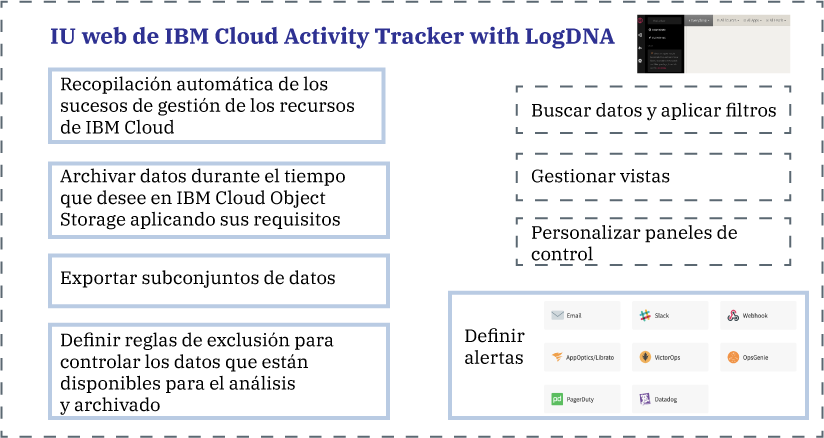

---

copyright:
  years: 2019
lastupdated: "2019-04-04"

keywords: IBM Cloud, LogDNA, Activity Tracker, getting started

subcollection: logdnaat

---

{:new_window: target="_blank"}
{:shortdesc: .shortdesc}
{:screen: .screen}
{:pre: .pre}
{:table: .aria-labeledby="caption"}
{:codeblock: .codeblock}
{:tip: .tip}
{:download: .download}
{:important: .important}
{:note: .note}

# Guía de aprendizaje de iniciación
{: #getting-started}

Utilice el servicio {{site.data.keyword.at_full}} para hacer un seguimiento de cómo interactúan las aplicaciones con los servicios de {{site.data.keyword.cloud_notm}}. Puede utilizar este servicio para investigar una actividad anormal y acciones críticas, así como para cumplir los requisitos de auditoría de la normativa. Además, puede obtener alertas sobre las acciones que ocurren. Los sucesos que se han recopilado cumplen con la normativa de Cloud Auditing Data Federation (CADF).
{:shortdesc}

{{site.data.keyword.at_full_notm}} recopila y almacena registros de auditoría para las llamadas de API realizadas a recursos que se ejecutan en {{site.data.keyword.cloud_notm}}. Puede archivar estos sucesos en {{site.data.keyword.cloud_notm}} para su almacenamiento a largo plazo.
{: note}

## Acerca de {{site.data.keyword.at_full}}
{: #ov}

El cumplimiento de las políticas internas y de las normativas del sector es un requisito clave en la estrategia de cualquier organización, independientemente de dónde se ejecuten las aplicaciones: de forma local, en una nube híbrida o en una nube pública. El servicio {{site.data.keyword.at_full_notm}} proporciona la infraestructura y la funcionalidad para supervisar las llamadas de API a los servicios de {{site.data.keyword.cloud_notm}} y genera un informe que demuestra el cumplimiento de las políticas corporativas y las normativas específicas del sector de mercado.

Cuando se trabaja en un entorno de nube, como {{site.data.keyword.cloud_notm}}, se debe planificar la estrategia de nube para auditar y supervisar las cargas de trabajo y los datos de acuerdo con las políticas internas y con los requisitos de cumplimiento de cada país. Puede utilizar la información que se registra a través del servicio {{site.data.keyword.at_full_notm}} para identificar incidencias de seguridad, detectar accesos no autorizados y cumplir con la normativa y con los requisitos de auditoría.

* {{site.data.keyword.at_full_notm}} da soporte al control de seguridad de alto nivel para los recursos de TI de la nube.
* {{site.data.keyword.at_full_notm}} ofrece una solución para los administradores para capturar, almacenar, visualizar, buscar y controlar actividad de API en un mismo lugar. También ofrece una característica de notificaciones para avisarle a través de cualquiera de los canales de notificación admitidos.
* {{site.data.keyword.at_full_notm}} proporciona capacidades para exportar sucesos que puede utilizar para generar un informe de seguimiento de auditoría. Es posible que necesite estos informes para que la organización pueda cumplir con las normativas internas y con las normativas externas del sector y del país.

Por ejemplo, puede utilizar los sucesos {{site.data.keyword.at_full_notm}} para identificar la siguiente información:
* Los usuarios que han realizado llamadas de API a servicios en la nube
* La indicación de fecha y hora de realización de las llamadas de API
* El estado de la llamada de API
* La gravedad de la acción

Considere la siguiente información acerca de la seguridad cuando trabaje con el servicio {{site.data.keyword.at_full_notm}}:

* Los servicios de IBM que generan sucesos de {{site.data.keyword.at_full_notm}} siguen la política de seguridad {{site.data.keyword.IBM_notm}} Cloud. Para obtener más información, consulte [Confíe en la seguridad y privacidad de IBM Cloud ](https://www.ibm.com/cloud/security){: new_window}.
* El servicio {{site.data.keyword.at_full_notm}} captura acciones iniciadas por el usuario que cambian el estado de los servicios en la nube. La información no ofrece acceso directo a las bases de datos ni a las aplicaciones.
* Sólo los usuarios autorizados pueden visualizar y supervisar los registros de sucesos de {{site.data.keyword.at_full_notm}}. Cada usuario se identifica mediante un ID exclusivo en {{site.data.keyword.cloud_notm}}.

## Objetivos
{: #gs_objectives}

Complete esta guía de aprendizaje para aprender a suministrar un servicio en {{site.data.keyword.cloud_notm}}. Averigüe qué datos comunes están disponibles en cada sucesos y cómo le pueden ayudar a supervisar su entorno de nube. Aprenda a navegar en la interfaz de usuario web. 

## Requisitos previos
{: #gs_prereq}

* Necesita un ID de usuario que sea miembro o propietario de una cuenta de {{site.data.keyword.cloud_notm}}. Para obtener un ID de usuario de {{site.data.keyword.cloud_notm}}, vaya a: [Registro ](https://cloud.ibm.com/login){:new_window}.

* El ID de {{site.data.keyword.IBM_notm}} debe tener políticas de IAM asignadas para funcionar en
{{site.data.keyword.cloud_notm}} con el servicio {{site.data.keyword.at_full_notm}}. En la tabla siguiente se muestran los permisos necesarios que necesita para completar esta guía de aprendizaje: 

| Recurso                             | Ámbito de la política de acceso | Rol    | Región    | Información                  |
|--------------------------------------|----------------------------|---------|-----------|------------------------------|
| Grupo de recursos **predeterminado**           |  Grupo de recursos            | Editor  | us-south  | Esta política es necesaria para permitir que el usuario vea las instancias de servicio en el grupo de recursos predeterminado.    |
| Servicio {{site.data.keyword.at_full_notm}} |  Grupo de recursos            | Editor  | us-south  | Esta política es necesaria para permitir que el usuario suministre y administre el servicio {{site.data.keyword.at_full_notm}} en el grupo de recursos predeterminado.   |
{: caption="Tabla 1. Lista de políticas de IAM necesarias para completar la guía de aprendizaje" caption-side="top"} 

* Si prefiere trabajar con la línea de mandatos, debe instalar la CLI de {{site.data.keyword.cloud_notm}}. Para obtener más información, consulte [Instalación de la CLI de {{site.data.keyword.cloud_notm}}](/docs/cli?topic=cloud-cli-ibmcloud-cli#ibmcloud-cli).

## Paso 1. Suministrar una instancia del servicio {{site.data.keyword.at_full_notm}}
{: #gs_step1}

Realice los pasos siguientes para suministrar una instancia:

1. [Inicie sesión en su cuenta de {{site.data.keyword.cloud_notm}} ](https://cloud.ibm.com/login){:new_window}.

	Cuando inicia una sesión con su ID de usuario y su contraseña, se abre la interfaz de usuario de {{site.data.keyword.cloud_notm}}.

2. Vaya al icono de menú . A continuación, seleccione **Observabilidad** para acceder al panel de control *Observabilidad*.

3. Seleccione **Activity Tracker** y, a continuación, pulse **Crear instancia**. 

4. Especifique un nombre para la instancia de servicio.

5. Seleccione la región donde tenga pensado suministrar la instancia.

6. Seleccione un grupo de recursos. 

    De forma predeterminada, se selecciona el grupo de recursos **predeterminado**.

    **Nota:** si no puede seleccionar un grupo de recursos, compruebe que tiene permisos de edición sobre el grupo de recursos donde desea suministrar la instancia.

7. Seleccione el plan de servicio `Lite`. 

    De forma predeterminada, se establece el plan Lite.

8. Pulse **Crear**.

Después de suministrar una instancia, se abre el panel de control *Activity Tracker*. 

## Paso 2. Gestionar el acceso al servicio
{: #gs_step2}

**Todos los usuarios que acceden al servicio {{site.data.keyword.at_full_notm}} en su cuenta deben tener asignada una política de acceso con un rol de usuario de IAM definido.** La política determina qué acciones puede llevar a cabo el usuario en el contexto del servicio o de la instancia que seleccione. Las acciones permitidas se pueden personalizar y se definen como operaciones que se permite realizar en el servicio. Las acciones se correlacionan entonces con los roles de usuario de IAM. 

En esta guía de aprendizaje, aprenderá a otorgar a un usuario permisos de gestión para trabajar con el servicio
{{site.data.keyword.at_full_notm}} dentro del contexto de un grupo de recursos. [Más información](/docs/services/Activity-Tracker-with-LogDNA?topic=logdnaat-iam#iam).

### 1. Crear un grupo de acceso
{: #gs_step2_step1}

Realice los pasos siguientes para crear un grupo de acceso:

1. En la barra de menús, pulse **Gestionar** &gt; **Acceso (IAM)** y seleccione **Grupos de acceso**.
2. Pulse **Crear**.
3. Especifique un nombre y una descripción opcional para el grupo y pulse **Crear**.

### 2. Añadir permisos para gestionar sucesos
{: #gs_step2_step2}

Después de configurar el grupo, puede asignar una política de acceso común al grupo.

Para otorgar a un usuario el rol de administrador para gestionar instancias dentro de un grupo de recursos en la cuenta, el usuario debe tener una política de IAM para el servicio {{site.data.keyword.at_full_notm}} con el rol de **Administrador** de la plataforma
dentro del contexto del grupo de recursos. 

Realice los pasos siguientes para asignar una política a un grupo de acceso a través de la interfaz de usuario:

1. En la barra de menús, pulse **Gestionar** &gt; **Acceso (IAM)**.
2. Seleccione **Grupos de acceso**.
3. Seleccione el nombre del grupo al que desea asignar el acceso. 
4. Pulse **Políticas de acceso**.
5. Pulse **Asignar acceso**.
6. Seleccione **Asignar acceso dentro de un grupo de recursos**.
7. Seleccione un grupo de recursos.
8. Si el usuario no tiene todavía un rol otorgado para el grupo de recursos seleccionado, elija un rol para el campo **Asignar acceso a un grupo de recursos**. 

    En función del rol que seleccione, el usuario puede ver el grupo de recursos en su panel de control, editar el nombre del grupo de recursos o gestionar el acceso de usuarios al grupo. 
    
    Puede seleccionar **Sin acceso** si desea que el usuario solo tenga acceso al servicio {{site.data.keyword.at_full_notm}} en el grupo de recursos.

9. Seleccione **IBM Cloud Activity Tracker with LogDNA**.
10. Seleccione el rol de **Administrador** de la plataforma.
11. Seleccione el rol de **Gestor** del servicio.
12. Pulse **Asignar**.

### 3.  Añadir el usuario al grupo
{: #gs_step2_step3}

Realice los pasos siguientes para añadir el usuario al grupo de acceso:
1. Pulse **Añadir usuarios** en el separador **Usuarios**.
2. Seleccione el usuario de la lista que desea añadir y pulse **Añadir a grupo**.

## Paso 3. Generar sucesos de {{site.data.keyword.at_full_notm}}
{: #gs_step3}

Realice los pasos siguientes para generar un suceso al crear un grupo de acceso:

1. En el [catálogo de {{site.data.keyword.cloud_notm}}
](https://cloud.ibm.com/catalog){:new_window}, seleccione Gestionar &gt; Seguridad e identidad.

2. Seleccione **Grupos de acceso**.

3. Seleccione **Crear**. A continuación, especifique un nombre para el grupo de acceso.

4. Pulse **Crear**.

Se crea un grupo de acceso.

## Paso 4. Iniciar la interfaz de usuario web 
{: #gs_step4}

Siga los pasos siguientes para iniciar la interfaz de usuario web:

1. [Inicie sesión en su cuenta de {{site.data.keyword.cloud_notm}} ](https://cloud.ibm.com/login){:new_window}.

	Después de iniciar sesión con su ID de usuario y su contraseña, se abre el panel de control de {{site.data.keyword.cloud_notm}}.

2. En el menú de navegación, seleccione **Observabilidad**. 

3. Seleccione **Activity Tracker**. 

    Se muestra la lista de instancias que están disponibles en {{site.data.keyword.cloud_notm}}.

4. Seleccione una instancia. A continuación, pulse **Ver LogDNA**.

Se abre la interfaz de usuario web. 

## Paso 5. Visualizar sucesos
{: #gs_step5}

El servicio {{site.data.keyword.at_full_notm}} captura los datos de actividad que están relacionados con las llamadas
API y otras acciones que se realizan en servicios en la nube seleccionados de {{site.data.keyword.cloud_notm}}. 

* Los sucesos se recopilan automáticamente. 
* Los sucesos que se recopilan en {{site.data.keyword.at_full_notm}} se ajustan al **estándar Cloud Auditing Data Federation (CADF)**. El estándar CADF define un modelo de sucesos completo que incluye información necesaria para clarificar, gestionar y auditar la seguridad de las aplicaciones en entornos de nube.
* {{site.data.keyword.at_full_notm}} almacena y agrupa sucesos por región. 
* Los sucesos que informan sobre acciones globales de la cuenta de {{site.data.keyword.cloud_notm}}, se recopilan y almacenan en la región **EE.UU. sur**.
* El plan de servicio que seleccione para la instancia de {{site.data.keyword.at_full_notm}} determina el número de días que los sucesos están disponibles para la búsqueda a través de la interfaz de usuario web. 

En cualquier momento, puede ver cada línea en su contexto. Realice los pasos siguientes para ver un suceso en contexto: 

1. En la interfaz de usuario web, pulse el icono **Vistas** .
2. Seleccione **Todo**.
3. Identifique una línea que desee explorar.
4. Expanda la línea. 

    Aparece información sobre identificadores, códigos y etiquetas de línea.

5. Pulse **Ver en contexto** para ver la línea de suceso en el contexto de otras entradas de dicho host, app, o ambos.

Cuando haya terminado de explorar el suceso, pulse **Cerrar** para cerrar la línea.

[Más información](/docs/services/Activity-Tracker-with-LogDNA?topic=logdnaat-view_events.md#view_events.md).

## Paso 6. Obtener información acerca de la estructura de un suceso
{: #gs_step6}

Los sucesos se ajustan al **estándar Cloud Auditing Data Federation (CADF)**. El estándar CADF define un modelo de sucesos completo que incluye información necesaria para clarificar, gestionar y auditar la seguridad de las aplicaciones en entornos de nube.

El modelo de sucesos CADF incluye los siguientes componentes:

| Componente | Descripción |
|------------|----------------------------|
| `Acción`   | La acción es la operación o la actividad que realiza el iniciador, que intenta realizar, o espera completar. |
| `Iniciador`| El iniciador es el recurso que realiza una llamada API y genera un suceso CADF. El suceso que se desencadena depende de la acción solicitada por la llamada de API. |
| `Observador` | El observador es el recurso que crea y almacena un registro CADF a partir de información disponible en un suceso CADF. |
| `Resultado`  | El resultado es el estado de la acción frente al destino. |
| `Destino`   | El destino es el recurso en el que se realiza o se intenta realizar la acción, o en el que está pendiente de completarse la acción. |
{: caption="Tabla 2. Componentes que están disponibles en el modelo de sucesos CADF" caption-side="top"} 

[Más información](/docs/services/Activity-Tracker-with-LogDNA?topic=logdnaat-event#event).

## Pasos siguientes
{: #gs_next_steps}

Actualice el plan del servicio {{site.data.keyword.at_full_notm}} a un plan de pago para poder [filtrar sucesos](/docs/services/Activity-Tracker-with-LogDNA?topic=logdnaat-views.md#views_step1), [buscar en sucesos](/docs/services/Activity-Tracker-with-LogDNA?topic=logdnaat-views.md#views_step2), [definir vistas](/docs/services/Activity-Tracker-with-LogDNA?topic=logdnaat-views.md#views_step3) y [configurar alertas](/docs/services/Activity-Tracker-with-LogDNA?topic=logdnaat-alerts.md#alerts.md). 

Para obtener más información sobre los planes de servicio de {{site.data.keyword.at_full_notm}}, consulte [Planes de servicio](/docs/services/Activity-Tracker-with-LogDNA?topic=logdnaat-service_plan#service_plan).

