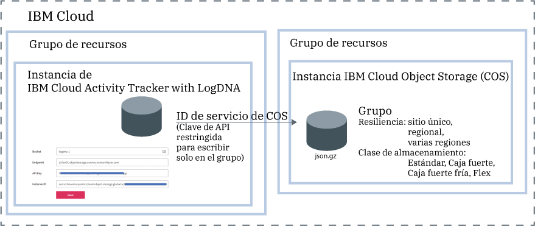

---

copyright:
  years: 2019
lastupdated: "2019-05-25"

keywords: IBM Cloud, LogDNA, Activity Tracker, manage events

subcollection: logdnaat

---

{:new_window: target="_blank"}
{:shortdesc: .shortdesc}
{:screen: .screen}
{:pre: .pre}
{:table: .aria-labeledby="caption"}
{:codeblock: .codeblock}
{:tip: .tip}
{:download: .download}
{:important: .important}
{:note: .note}

# Gestión de sucesos en la cuenta
{: #manage_events}

Como administrador del servicio {{site.data.keyword.at_full_notm}} en {{site.data.keyword.cloud_notm}}, debe suministrar una instancia del servicio en cada ubicación que tenga pensado supervisar. Debe definir las directrices de la cuenta para gestionar sucesos en la cuenta.
{:shortdesc}

## Suministro de una instancia del servicio por ubicación
{: #manage_events_provision}

Para recopilar y supervisar la actividad de la cuenta, debe suministrar el servicio {{site.data.keyword.at_full_notm}} en la cuenta. 

Hay una instancia del servicio {{site.data.keyword.at_full_notm}} por ubicación. Por lo tanto, para supervisar la actividad de su cuenta, es posible que necesite suministrar varias instancias de {{site.data.keyword.at_full_notm}}. 

* En {{site.data.keyword.cloud_notm}}, puede pulsar el icono **Menú**  > **Observabilidad** > **Activity Tracker** para ver el panel de control donde aparecen todas las instancias suministradas en la cuenta. 
* Si desea supervisar [sucesos globales](/docs/services/Activity-Tracker-with-LogDNA?topic=logdnaat-monitor_events#mon_def_global), debe suministrar una instancia en Frankfurt. 

[Obtenga más información sobre el suministro del servicio](/docs/services/Activity-Tracker-with-LogDNA?topic=logdnaat-provision).

Para obtener una lista de ubicaciones donde el servicio está disponible en
{{site.data.keyword.cloud_notm}}, consulte [Ubicaciones](/docs/services/Activity-Tracker-with-LogDNA?topic=logdnaat-regions).

Tan pronto como una instancia esté disponible, se recopilan sucesos y están disponibles para su supervisión a través de la interfaz de usuario web de dicha instancia.

## Archivado de sucesos
{: #manage_events_archive}

Puede archivar sucesos de una instancia de {{site.data.keyword.at_full_notm}} en un grupo en una instancia de {{site.data.keyword.cos_full_notm}} (COS). [Más información](/docs/services/Activity-Tracker-with-LogDNA?topic=logdnaat-archiving).

* Los sucesos se archivan automáticamente una vez al día en un formato comprimido **(.json.gz)**. Cada línea mantiene sus metadatos.
* Los sucesos se archivan en 24-48 horas después de guardar la configuración. 

Cada instancia de {{site.data.keyword.at_full_notm}} tiene su propia configuración de archivado.
{: important}

En la figura siguiente se muestra una vista de alto nivel de los distintos componentes que están integrados al archivar sucesos:

La instancia de {{site.data.keyword.cos_full_notm}} se suministra dentro del contexto de un grupo de recursos. La instancia de {{site.data.keyword.at_full_notm}} también se suministra dentro del contexto de un grupo de recursos. Ambas instancias se pueden agrupar bajo el mismo grupo de recursos o en grupos distintos. 

{{site.data.keyword.at_full_notm}} utiliza un ID de servicio para comunicarse con el servicio {{site.data.keyword.cos_full_notm}}.
* El ID de servicio que cree para una instancia de {{site.data.keyword.cos_full_notm}} lo utiliza {{site.data.keyword.at_full_notm}} para autenticarse y acceder a la instancia de {{site.data.keyword.cos_full_notm}}. 
* Puede asignar políticas de acceso específicas a un ID de servicio que restrinjan los permisos en la instancia de {{site.data.keyword.cos_full_notm}}. Restrinja el ID de servicio para que solo tenga permisos de escritura sobre el grupo donde tenga pensado archivar los sucesos.

## Clasificación de sucesos mediante categorías
{: #manage_events_category}

Puede definir categorías a través de la sección **Categorías** de la interfaz de usuario web. 

Puede definir categorías para agrupar vistas. Puede definir un conjunto distinto de categorías para agrupar paneles de control.

Utilice las categorías para agrupar recursos, de manera que los usuarios puedan encontrarlos con facilidad. 

