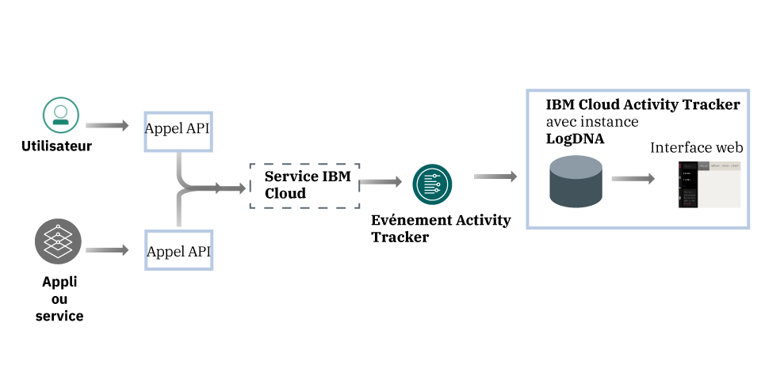
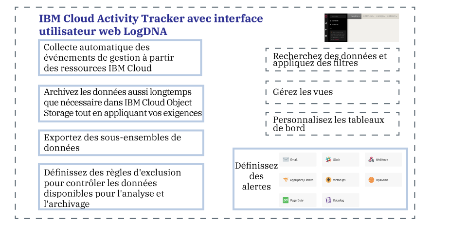

---

copyright:
  years: 2019
lastupdated: "2019-04-04"

keywords: IBM Cloud, LogDNA, Activity Tracker, getting started

subcollection: logdnaat

---

{:new_window: target="_blank"}
{:shortdesc: .shortdesc}
{:screen: .screen}
{:pre: .pre}
{:table: .aria-labeledby="caption"}
{:codeblock: .codeblock}
{:tip: .tip}
{:download: .download}
{:important: .important}
{:note: .note}

# Tutoriel d'initiation 
{: #getting-started}

Utilisez le service {{site.data.keyword.at_full}} pour suivre comment les applications interagissent avec des services {{site.data.keyword.cloud_notm}}. Vous pouvez utiliser ce service pour rechercher une activité anormale et des actions critiques, et pour vous conformer aux exigences d'audit réglementaires. De plus, vous pouvez être averti des actions au fur et à mesure qu'elles se produisent. Les événements collectés sont conformes à la norme CADF (Cloud Auditing Data Federation).
{:shortdesc}

{{site.data.keyword.at_full_notm}} collecte et stocke les enregistrements d’audit des appels d’API vers les ressources exécutées dans {{site.data.keyword.cloud_notm}}. Vous pouvez archiver ces événements sur {{site.data.keyword.cloud_notm}} pour un stockage à long terme.
{: note}

## A propos d'{{site.data.keyword.at_full}}
{: #ov}

La conformité avec les règlements internes et les réglementations du secteur est une exigence cruciale dans la stratégie
d'une organisation, quel que soit l'endroit où les applications s'exécutent : sur site, dans un cloud hybride ou dans un cloud public. Le service {{site.data.keyword.at_full_notm}} fournit le cadre et les fonctionnalités permettant de surveiller les appels d'API aux services sur {{site.data.keyword.cloud_notm}} et fournit la preuve de la conformité avec les règles de l'entreprise et les réglementations spécifiques du secteur. 

Lorsque vous travaillez dans un environnement de cloud, tel qu'{{site.data.keyword.cloud_notm}}, vous devez planifier la stratégie de cloud pour l'audit
et la surveillance des contenus et des données en conformité avec vos règlements internes et avec les exigences de conformité du secteur et du pays. Vous pouvez
utiliser les informations enregistrées via le service {{site.data.keyword.at_full_notm}}
pour identifier des incidents de sécurité, détecter des accès non autorisés et vous conformer aux exigences d'audit réglementaires et internes.

* {{site.data.keyword.at_full_notm}} prend en charge une gouvernance de sécurité de haut niveau pour vos ressources informatiques dans le cloud.
* {{site.data.keyword.at_full_notm}} fournit aux administrateurs une solution pour la capture, le stockage, l'affichage, la recherche et la surveillance de l'activité d'API à partir d'un seul emplacement. Il offre également une fonction de notification pour vous avertir en utilisant l’un des canaux de notification pris en charge. 
* {{site.data.keyword.at_full_notm}} fournit des fonctionnalités pour exporter des événements que vous pouvez ensuite utiliser pour générer un rapport de trace d'audit. Vous pouvez avoir besoin de ces rapports pour vérifier que votre organisation se conforme
à vos règlements internes et aux réglementations externes du secteur et du pays.

Par exemple, vous pouvez utiliser les événements {{site.data.keyword.at_full_notm}} pour identifier les informations suivantes :
* Les utilisateurs ayant effectué des appels d'API vers des services de cloud 
* L'heure à laquelle les appels d'API ont été effectués 
* Le statut de l'appel d'API 
* La criticité de l'action 

Prenez en compte les informations suivantes concernant la sécurité lorsque vous travaillez avec le service {{site.data.keyword.at_full_notm}} :

* Les services IBM qui génèrent des événements {{site.data.keyword.at_full_notm}} respectent la politique de sécurité {{site.data.keyword.IBM_notm}} Cloud. Pour plus d'informations, voir [Faites confiance à la sécurité et à la confidentialité d'IBM Cloud ](https://www.ibm.com/cloud/security){: new_window}.
* Le service {{site.data.keyword.at_full_notm}} capture les actions initiées par des utilisateurs, qui modifient l'état de services Cloud. Les informations ne permettent pas un accès direct à des bases de données ou des applications.
* Seuls les utilisateurs autorisés peuvent afficher et surveiller les journaux d'événements {{site.data.keyword.at_full_notm}}. Chaque utilisateur est identifié par son ID unique dans {{site.data.keyword.cloud_notm}}.

## Objectifs
{: #gs_objectives}

Effectuez ce tutoriel pour apprendre à mettre à disposition un service dans {{site.data.keyword.cloud_notm}}. Découvrez quelles données communes sont disponibles pour chaque événement et comment elles peuvent vous aider à surveiller votre environnement cloud. Apprenez à naviguer dans l'interface utilisateur Web.  

## Conditions préalables
{: #gs_prereq}

* Vous avez besoin d'un ID utilisateur membre ou propriétaire d'un compte {{site.data.keyword.cloud_notm}}. Pour obtenir un ID utilisateur {{site.data.keyword.cloud_notm}}, accédez à [Inscription ](https://cloud.ibm.com/login){:new_window}. 

* Des règles IAM doivent être affectées à votre {{site.data.keyword.IBM_notm}}ID pour qu'il fonctionne dans {{site.data.keyword.cloud_notm}} avec le service {{site.data.keyword.at_full_notm}}. Le tableau suivant répertorie les droits minimaux nécessaires pour mener à bien ce tutoriel :  

|Ressource | Portée de la règle d'accès |Rôle | Région    | Informations                  |
|--------------------------------------|----------------------------|---------|-----------|------------------------------|
| Groupe de ressources **par défaut**           |  Groupe de ressources            |Editeur | us-south  | Cette règle est requise pour autoriser l'utilisateur à visualiser des instances de service dans le groupe de ressources par défaut.    |
| Service {{site.data.keyword.at_full_notm}} |  Groupe de ressources            |Editeur | us-south  |Cette règle est requise pour autoriser l'utilisateur à mettre à disposition et à administrer le service {{site.data.keyword.at_full_notm}} dans le groupe de ressources par défaut.   |
{: caption="Tableau 1. Liste des règles IAM requises pour suivre ce tutoriel" caption-side="top"} 

* Si vous préférez utiliser la ligne de commande, vous devez installer l'interface de ligne de commande {{site.data.keyword.cloud_notm}}. Pour plus d'informations, voir [Installation de l'interface de ligne de commande {{site.data.keyword.cloud_notm}}.](/docs/cli?topic=cloud-cli-ibmcloud-cli#ibmcloud-cli)

## Etape 1. Mise à disposition d'une instance du service {{site.data.keyword.at_full_notm}}
{: #gs_step1}

Pour mettre à disposition une instance, procédez comme suit :

1. [Connectez-vous à votre compte {{site.data.keyword.cloud_notm}} ](https://cloud.ibm.com/login){:new_window}.

	Une fois que vous êtes connecté avec votre ID utilisateur et votre mot de passe, l'interface utilisateur {{site.data.keyword.cloud_notm}} s'ouvre. 

2. Cliquez sur l'icône Menu . Ensuite, sélectionnez **Observabilité** pour accéder au tableau de bord *Observabilité*.

3. Sélectionnez **Activity Tracker**, puis cliquez sur **Créer une instance**. 

4. Saisissez un nom pour l'instance de service.

5. Sélectionnez la région dans laquelle vous prévoyez de mettre à disposition l'instance. 

6. Sélectionnez un groupe de ressources. 

    Le groupe de ressources **par défaut** est défini automatiquement.

    **Remarque :** si vous n'arrivez pas à sélectionner un groupe de ressources, vérifiez que vous disposez du droit d'édition sur le groupe de ressources où vous voulez mettre l'instance à disposition.

7. Sélectionnez le forfait de service `Lite`. 

    Le forfait Lite est sélectionné par défaut.

8. Cliquez sur **Créer**.

Une fois que vous avez mis une instance à disposition, le tableau de bord *Activity Tracker* apparaît. 

## Etape 2. Gestion de l'accès au service 
{: #gs_step2}

**Une règle d'accès avec un rôle utilisateur IAM doit être affectée à chaque utilisateur disposant d'un accès au service {{site.data.keyword.at_full_notm}}.** La règle détermine les actions que l'utilisateur peut exécuter dans le contexte du service ou de l'instance que vous sélectionnez. Les actions autorisées sont personnalisées et définies en tant qu'opérations exécutables sur le service. Les actions sont ensuite mappées à des rôles utilisateur IAM. 

Dans ce tutoriel, vous apprendrez à accorder à un utilisateur des droits de gestion lui permettant de travailler avec le service {{site.data.keyword.at_full_notm}} dans le contexte d’un groupe de ressources. [En savoir plus](/docs/services/Activity-Tracker-with-LogDNA?topic=logdnaat-iam#iam).

### 1. Créez un groupe d'accès 
{: #gs_step2_step1}

Pour créer un groupe d'accès, procédez comme suit :

1. Dans la barre de menus, cliquez sur **Gérer** &gt; **Accès (IAM)** puis sélectionnez **Groupes d'accès**.
2. Cliquez sur **Créer**.
3. Entrez un nom et une description facultative pour votre groupe, puis cliquez sur **Créer**.

### 2. Ajoutez des droits pour gérer des événements 
{: #gs_step2_step2}

Après avoir configuré votre groupe, vous pouvez attribuer une règle d'accès commun au groupe. 

Pour accorder à un utilisateur le rôle d'administrateur afin de gérer des instances au sein d'un groupe de ressources dans le compte, l'utilisateur doit disposer d'une règle IAM pour le service {{site.data.keyword.at_full_notm}} avec le rôle de plateforme **Administrateur** dans le cadre du groupe de ressources. 

Effectuez les étapes suivantes pour affecter une règle à un groupe d'accès via l'interface utilisateur :

1. Dans la barre de menus, cliquez sur **Gérer** &gt; **Accès (IAM)**.
2. Sélectionnez **Groupes d'accès**.
3. Sélectionnez le nom du groupe auquel vous voulez affecter des accès. 
4. Cliquez sur **Règles d'accès**.
5. Cliquez sur **Affecter un accès**.
6. Sélectionnez **Affecter l'accès au sein d'un groupe de ressources**.
7. Sélectionnez un groupe de ressources.
8. Si aucun rôle n'a encore été accordé à l'utilisateur pour le groupe de ressources concerné, sélectionnez un rôle pour la zone **Affecter l'accès à un groupe de ressources**. 

    Selon le rôle que vous sélectionnez, l'utilisateur peut afficher le groupe de ressources sur son tableau de bord, modifier le nom du groupe de ressources, ou gérer l'accès des utilisateurs au groupe. 
    
    Vous pouvez sélectionner **Aucun accès** si vous voulez que l'utilisateur puisse uniquement accéder au service {{site.data.keyword.at_full_notm}} dans le groupe de ressources.

9. Sélectionnez **IBM Cloud Activity Tracker with LogDNA**.
10. Sélectionnez le rôle de plateforme **Administrateur**. 
11. Sélectionnez le rôle de service **Responsable**. 
12. Cliquez sur **Affecter**.

### 3.  Ajoutez l'utilisateur au groupe
{: #gs_step2_step3}

Effectuez les étapes suivantes pour ajouter l'utilisateur au groupe d'accès : 
1. Cliquez sur **Ajouter des utilisateurs** sur l'onglet **Utilisateurs**.
2. Sélectionnez dans la liste l'utilisateur que vous souhaitez ajouter, puis cliquez sur **Ajouter au groupe**.

## Etape 3. Génération d'événements {{site.data.keyword.at_full_notm}}
{: #gs_step3}

Effectuez les étapes suivantes pour générer un événement lorsque vous créez un groupe d'accès : 

1. Dans le catalogue [{{site.data.keyword.cloud_notm}} ](https://cloud.ibm.com/catalog){:new_window}, sélectionnez **Gérer** &gt; **Sécurité et identité**.

2. Sélectionnez **Groupes d'accès**.

3. Sélectionnez **Créer**. Puis, entrez un nom pour le groupe d'accès. 

4. Cliquez sur **Créer**.

Un groupe d'accès est créé. 

## Etape 4. Lancement de l'interface utilisateur Web.  
{: #gs_step4}

Pour lancer l'interface utilisateur Web, procédez comme suit :

1. [Connectez-vous à votre compte {{site.data.keyword.cloud_notm}} ](https://cloud.ibm.com/login){:new_window}.

	Une fois connecté avec votre ID utilisateur et votre mot de passe, le tableau de bord {{site.data.keyword.cloud_notm}} s'ouvre.

2. Dans le menu de navigation, sélectionnez **Observabilité**.  

3. Sélectionnez **Activity Tracker**. 

    La liste des instances disponibles sur {{site.data.keyword.cloud_notm}} s'affiche. 

4. Sélectionnez une instance. Ensuite, cliquez sur **Afficher LogDNA**.

L'interface utilisateur web s'ouvre.  

## Etape 5. Affichage des événements 
{: #gs_step5}

Le service {{site.data.keyword.at_full_notm}} capture les données d'activité associées à des appels d'API et à d'autres actions effectuées pour sélectionner des services cloud dans {{site.data.keyword.cloud_notm}}. 

* Les événements sont collectés automatiquement. 
* Les événements collectés dans {{site.data.keyword.at_full_notm}} sont conformes à la **norme CADF (Cloud Auditing Data Federation)**. La norme CADF définit un modèle d'événement complet incluant les informations nécessaires pour certifier, gérer et auditer
la sécurité des applications dans les environnements de cloud.
* {{site.data.keyword.at_full_notm}} stocke et regroupe les événements par région. 
* Les événements faisant rapport sur les actions de compte {{site.data.keyword.cloud_notm}} sont collectés et stockés dans la région **Sud des États-Unis**.
* Le forfait de service que vous sélectionnez pour votre instance {{site.data.keyword.at_full_notm}} détermine le nombre de jours pendant lesquels des événements sont disponibles pour la recherche dans l'interface utilisateur Web. 

A tout moment, vous pouvez visualiser chaque ligne d'événement dans son contexte. Effectuez les étapes suivantes pour afficher un événement dans son contexte :  

1. Dans l'interface Web, cliquez sur l'icône **Vues** .
2. Sélectionnez **Tout**. 
3. Identifiez la ligne que vous souhaitez explorer.
4. Développez la ligne d'événement. 

    Des informations relatives aux identificateurs, aux étiquettes et aux libellés de la ligne s'affichent.

5. Cliquez sur **Afficher en contexte** pour voir la ligne d'événement dans le contexte des autres entrées depuis l'hôte, l'appli ou les deux.

Lorsque vous avez terminé d'explorer l'événement, cliquez sur **Fermer** pour fermer la ligne.

[En savoir plus](/docs/services/Activity-Tracker-with-LogDNA?topic=logdnaat-view_events.md#view_events.md).

## Etape 6. En savoir plus sur la structure d'un événement 
{: #gs_step6}

Les événements sont conformes à la **norme CADF (Cloud Auditing Data Federation)**. La norme CADF définit un modèle d'événement complet incluant les informations nécessaires pour certifier, gérer et auditer
la sécurité des applications dans les environnements de cloud.

Le modèle d'événement CADF inclut les composants suivants :

|Composant | Description |
|------------|----------------------------|
| `Action`   | L'action est l'opération ou l'activité qu'effectue l'initiateur, qu'il tente d'effectuer, ou dont il attend l'achèvement. |
| `Initiator`| L'initiateur est la ressource effectuant un appel d'API et générant un événement CADF. L'événement déclenché dépend de l'action demandée par l'appel d'API. |
| `Observer` | L'observateur est la ressource qui crée et sauvegarde un enregistrement CADF à partir des informations disponibles dans un événement CADF. |
| `Outcome`  | Le résultat est le statut de l'action par rapport à la cible. |
| `Target`   | La cible est la ressource sur laquelle l'action est réalisée, tentée ou dont l'achèvement est attendu |
{: caption="Tableau 2. Composants disponibles dans un modèle d'événement CADF " caption-side="top"} 

[En savoir plus](/docs/services/Activity-Tracker-with-LogDNA?topic=logdnaat-event#event).

## Etapes suivantes
{: #gs_next_steps}

Mettez à niveau le forfait de service {{site.data.keyword.at_full_notm}} vers un forfait payant pour pouvoir [filtrer les événements](/docs/services/Activity-Tracker-with-LogDNA?topic=logdnaat-views.md#views_step1), [rechercher des événements](/docs/services/Activity-Tracker-with-LogDNA?topic=logdnaat-views.md#views_step2), [définir des vues](/docs/services/Activity-Tracker-with-LogDNA?topic=logdnaat-views.md#views_step3) et [configurer des alertes](/docs/services/Activity-Tracker-with-LogDNA?topic=logdnaat-alerts.md#alerts.md).  

Pour plus d'informations sur les forfaits de service {{site.data.keyword.at_full_notm}}, voir [Forfaits de service](/docs/services/Activity-Tracker-with-LogDNA?topic=logdnaat-service_plan#service_plan).

