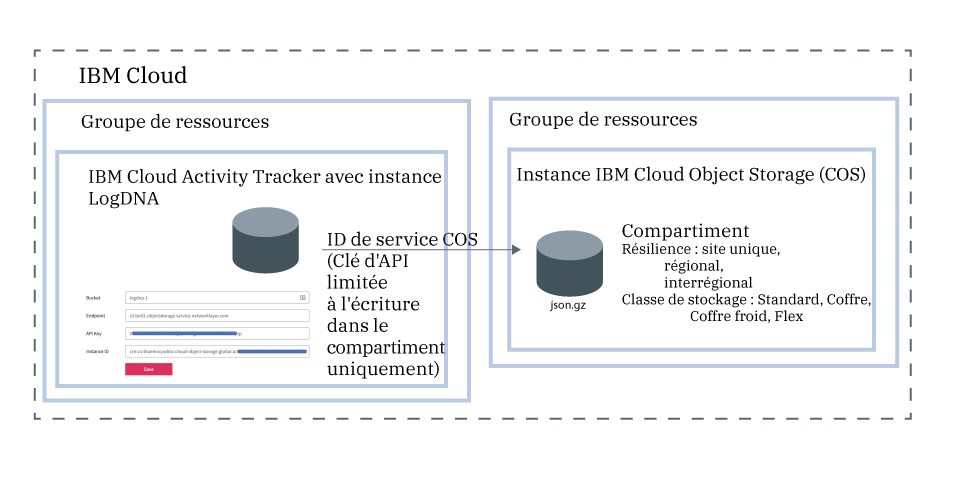

---

copyright:
  years: 2019
lastupdated: "2019-05-25"

keywords: IBM Cloud, LogDNA, Activity Tracker, manage events

subcollection: logdnaat

---

{:new_window: target="_blank"}
{:shortdesc: .shortdesc}
{:screen: .screen}
{:pre: .pre}
{:table: .aria-labeledby="caption"}
{:codeblock: .codeblock}
{:tip: .tip}
{:download: .download}
{:important: .important}
{:note: .note}

# Gestion des événements dans votre compte
{: #manage_events}

En tant qu'administrateur du service {{site.data.keyword.at_full_notm}} dans {{site.data.keyword.cloud_notm}}, vous devez mettre à disposition une instance du service dans chaque emplacement que vous prévoyez de surveiller. Vous devez définir les instructions de compte permettant de gérer les événements dans le compte.
{:shortdesc}

## Mise à disposition d'une instance du service par emplacement
{: #manage_events_provision}

Pour collecter et surveiller l'activité dans votre compte, vous devez mettre à disposition le service {{site.data.keyword.at_full_notm}} dans votre compte.  

Il existe une instance du service {{site.data.keyword.at_full_notm}} par emplacement. Par conséquent, pour surveiller l'activité dans votre compte, vous devrez peut-être mettre à disposition plusieurs instances {{site.data.keyword.at_full_notm}}.  

* Dans {{site.data.keyword.cloud_notm}}, vous pouvez cliquer sur l'icône **Menu**  > **Observabilité** > **Activity Tracker** pour afficher le tableau de bord dans lequel toutes les instances mises à disposition dans le compte sont répertoriées.  
* Si vous souhaitez surveiller les [événements globaux](/docs/services/Activity-Tracker-with-LogDNA?topic=logdnaat-monitor_events#mon_def_global), vous devez mettre à disposition une instance à Francfort. 

[En savoir plus sur la mise à disposition du service](/docs/services/Activity-Tracker-with-LogDNA?topic=logdnaat-provision).

Pour obtenir la liste des emplacements dans lesquels le service est disponible dans {{site.data.keyword.cloud_notm}}, voir [Emplacements](/docs/services/Activity-Tracker-with-LogDNA?topic=logdnaat-regions). 

Dès qu'une instance est disponible, les événements sont collectés et peuvent être surveillés via l'interface utilisateur Web de cette instance. 

## Archivage des événements
{: #manage_events_archive}

Vous pouvez archiver des événements d'une instance {{site.data.keyword.at_full_notm}} dans un compartiment d'une instance {{site.data.keyword.cos_full_notm}} (COS). [En savoir plus](/docs/services/Activity-Tracker-with-LogDNA?topic=logdnaat-archiving). 

* Les événements sont automatiquement archivés une fois par jour dans un format compressé **(.json.gz)**. Chaque ligne conserve ses métadonnées.
* Les événements sont archivés dans les 24 à 48 heures après que vous avez enregistré la configuration. 

Chaque instance {{site.data.keyword.at_full_notm}} a sa propre configuration d'archivage.
{: important}

La figure suivante présente une vue d'ensemble des différents composants intégrés lors de l'archivage d'événements :

L'instance {{site.data.keyword.cos_full_notm}} est mise à disposition dans le contexte d'un groupe de ressources. L'instance {{site.data.keyword.at_full_notm}} est également mise à disposition dans le contexte d'un groupe de ressources. Les deux instances peuvent être regroupées dans le même groupe de ressources ou se trouver dans des groupes différents. 

{{site.data.keyword.at_full_notm}} utilise un ID de service pour communiquer avec le service {{site.data.keyword.cos_full_notm}}.
* {{site.data.keyword.at_full_notm}} utilise l'ID de service que vous créez pour une instance {{site.data.keyword.cos_full_notm}} pour authentifier et accéder à l'instance {{site.data.keyword.cos_full_notm}}. 
* Vous pouvez affecter à l'ID de service des règles d'accès spécifiques qui limitent les droits sur l'instance {{site.data.keyword.cos_full_notm}}. Limitez l'ID de service pour avoir uniquement des droits en écriture sur le compartiment où vous prévoyez d'archiver les événements.

## Classification des événements à l'aide de catégories
{: #manage_events_category}

Vous pouvez définir des catégories via la section **Catégories** de l'interface utilisateur Web.  

Vous pouvez définir des catégories pour regrouper les vues. Vous pouvez définir un autre ensemble de catégories pour regrouper les tableaux de bord. 

Utilisez des catégories pour regrouper les ressources afin que les utilisateurs puissent les trouver facilement.  

