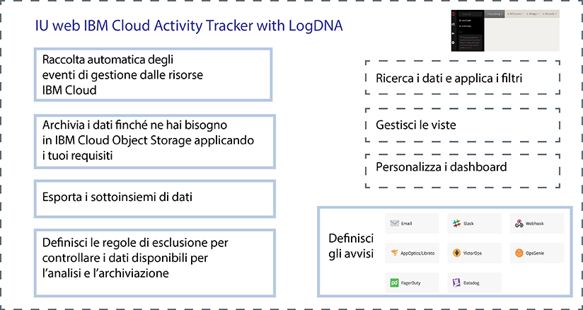

---

copyright:
  years: 2019
lastupdated: "2019-04-04"

keywords: IBM Cloud, LogDNA, Activity Tracker, getting started

subcollection: logdnaat

---

{:new_window: target="_blank"}
{:shortdesc: .shortdesc}
{:screen: .screen}
{:pre: .pre}
{:table: .aria-labeledby="caption"}
{:codeblock: .codeblock}
{:tip: .tip}
{:download: .download}
{:important: .important}
{:note: .note}

# Esercitazione introduttiva 
{: #getting-started}

Utilizza il servizio {{site.data.keyword.at_full}} per tracciare come le applicazioni interagiscono con i servizi {{site.data.keyword.cloud_notm}}. Puoi utilizzare il servizio per esaminare l'attività anomala e le azioni critiche e rispettare i requisiti di controllo normativi. Inoltre, puoi essere avvertito sulle azioni che possono verificarsi. Gli eventi vengono raccolti conformi agli standard CADF (Cloud Auditing Data Federation).
{:shortdesc}

{{site.data.keyword.at_full_notm}} raccoglie e archivia i record di controllo per le chiamate API effettuare alle risorse eseguite in {{site.data.keyword.cloud_notm}}. Puoi archiviare questi eventi su {{site.data.keyword.cloud_notm}} per l'archiviazione di lungo termine.
{: note}

## Informazioni su {{site.data.keyword.at_full}}
{: #ov}

La conformità con le politiche interne e le normative di settore sono un requisito chiave nella strategia aziendale, indipendentemente da dove vengono eseguite le applicazioni: in locale, in un cloud ibrido o in un cloud pubblico. Il servizio {{site.data.keyword.at_full_notm}} fornisce il framework e le funzionalità per monitorare le chiamate API ai servizi su {{site.data.keyword.cloud_notm}} ed esegue il controllo di conformità con le politiche aziendali e le normative specifiche per il settore di marketing.

Quando lavori in un ambiente cloud, come ad esempio {{site.data.keyword.cloud_notm}}, devi pianificare la strategia cloud per il controllo e il monitoraggio dei carichi di lavoro e dei dati in conformità alle tue politiche interne e ai requisiti di conformità su base nazionale e di settore. Puoi utilizzare le informazioni registrate tramite il servizio {{site.data.keyword.at_full_notm}} per identificare gli incidenti di sicurezza, individuare un accesso non autorizzato ed essere conforme con le normative e i requisiti di controllo interni.

* {{site.data.keyword.at_full_notm}} supporta governance di sicurezza di alto livello per le tue risorse IT nel cloud.
* {{site.data.keyword.at_full_notm}} fornisce una soluzione per gli amministratori per acquisire, memorizzare, visualizzare, cercare e monitorare l'attività API in un solo posto. Offre inoltre una funzione di notifica per avvisarti utilizzando uno qualsiasi dei canali di notifica supportati. 
* {{site.data.keyword.at_full_notm}} fornisce capacità per esportare gli eventi che possono venire utilizzati per generare un report audit trail. Puoi richiedere questi report in modo che la tua organizzazione sia conforme con i regolamenti interni, le normative di settore esterne e i regolamenti nazionali.

Ad esempio, puoi utilizzare gli eventi {{site.data.keyword.at_full_notm}} per identificare le seguenti informazioni: 
* Gli utenti che hanno effettuato le chiamate API ai servizi cloud
* La data/ora in cui le chiamate API sono state effettuate
* Lo stato della chiamata API
* La criticità dell'azione

Considera le seguenti informazioni sulla sicurezza quando utilizzi il servizio {{site.data.keyword.at_full_notm}}:

* I servizi IBM che generano gli eventi {{site.data.keyword.at_full_notm}} seguono la politica di sicurezza cloud {{site.data.keyword.IBM_notm}}. Per ulteriori informazioni, consulta [Trust the security and privacy of IBM Cloud ](https://www.ibm.com/cloud/security){: new_window}.
* Il servizio {{site.data.keyword.at_full_notm}} acquisisce le azioni avviate dall'utente che modificano lo stato dei servizi cloud. Le informazioni non forniscono l'accesso diretto al database o alle applicazioni.
* Soltanto gli utenti autorizzati possono visualizzare e monitorare i log evento {{site.data.keyword.at_full_notm}}. Ogni utente viene identificato tramite il proprio ID univoco {{site.data.keyword.cloud_notm}}.

## Obiettivi
{: #gs_objectives}

Completa questa esercitazione per imparare come eseguire il provisioning di un servizio in {{site.data.keyword.cloud_notm}}. Scopri quali dati comuni sono disponibili in ogni evento e come possano aiutarti a monitorare il tuo ambiente cloud. Impara a navigare nell'IU web. 

## Prerequisiti
{: #gs_prereq}

* Hai bisogno di un ID utente che sia un membro o un proprietario di un account {{site.data.keyword.cloud_notm}}. Per ottenere un ID utente {{site.data.keyword.cloud_notm}}, vai a: [Registrazione ](https://cloud.ibm.com/login){:new_window}.

* Il tuo {{site.data.keyword.IBM_notm}}ID deve avere assegnate delle politiche IAM per lavorare in {{site.data.keyword.cloud_notm}} con il servizio {{site.data.keyword.at_full_notm}}. La seguente tabella elenca le autorizzazioni minime di cui hai bisogno per completare questa esercitazione:  

|Risorsa| Ambito della politica di accesso | Ruolo    |Regione|Informazioni|
|--------------------------------------|----------------------------|---------|-----------|------------------------------|
|Gruppo di risorse **Predefinito** |Gruppo di risorse| Editor  | us-south  |Questa politica è obbligatoria per consentire all'utente di visualizzare le istanze del servizio nel gruppo di risorse Predefinito. |
|Servizio {{site.data.keyword.at_full_notm}}  |Gruppo di risorse| Editor  | us-south  |Questa politica è obbligatoria per consentire all'utente di eseguire il provisioning e l'amministrazione del servizio {{site.data.keyword.at_full_notm}} nel gruppo di risorse Predefinito. |
{: caption="Tabella 1. Elenco delle politiche IAM necessarie per completare l'esercitazione " caption-side="top"} 

* Se preferisci utilizzare la riga di comando, devi installare la CLI {{site.data.keyword.cloud_notm}}. Per ulteriori informazioni, vedi [Installazione della CLI {{site.data.keyword.cloud_notm}}](/docs/cli?topic=cloud-cli-ibmcloud-cli#ibmcloud-cli).

## Passo 1. Esegui il provisioning di un'istanza del servizio {{site.data.keyword.at_full_notm}} 
{: #gs_step1}

Completa la seguente procedura per eseguire il provisioning di un'istanza: 

1. [Accedi al tuo account {{site.data.keyword.cloud_notm}} ](https://cloud.ibm.com/login){:new_window}.

	Dopo aver eseguito l'accesso con i tuoi ID e password utente, viene aperta la IU {{site.data.keyword.cloud_notm}}.

2. Vai all'icona di menu . Seleziona quindi **Osservabilità** per accedere al dashboard *Osservabilità*. 

3. Seleziona **Programma di traccia dell'attività**, quindi fai clic su **Crea istanza**. 

4. Immetti un nome per l'istanza del servizio.

5. Seleziona la regione in cui intendi eseguire il provisioning dell'istanza. 

6. Seleziona un gruppo di risorse. 

    Per impostazione predefinita, è impostato il gruppo di risorse **Predefinito**.

    **Nota:** se non sei in grado di selezionare un gruppo di risorse, controlla di disporre delle autorizzazioni di modifica sul gruppo di risorse dove desideri eseguire il provisioning dell'istanza. 

7. Seleziona il piano di servizio `Lite`.  

    Per impostazione predefinita, è impostato il piano Lite. 

8. Fai clic su **Crea**.

Dopo che hai eseguito il provisioning di un'istanza, viene aperto il dashboard *Programma di traccia dell'attività*. 

## Passo 2. Gestisci l'accesso al servizio 
{: #gs_step2}

**Ad ogni utente che accede al servizio {{site.data.keyword.at_full_notm}} nel tuo account deve essere assegnata una politica di accesso con un ruolo utente IAM definito.** La politica determina quali azioni possono essere eseguite dall'utente nel contesto del servizio o dell'istanza che selezioni. Le azioni consentite vengono personalizzate e definite come operazioni che possono essere eseguite sul servizio. Le azioni vengono poi associate ai ruoli utente IAM. 

In questa esercitazione, imparerai come concedere a un utente le autorizzazioni di gestione per utilizzare il servizio {{site.data.keyword.at_full_notm}} all'interno di un gruppo di risorse. [Ulteriori informazioni](/docs/services/Activity-Tracker-with-LogDNA?topic=logdnaat-iam#iam).

### 1. Crea un gruppo di accesso 
{: #gs_step2_step1}

Completa la seguente procedura per creare un gruppo di accesso: 

1. Dalla barra dei menu, fai clic su **Gestisci** &gt; **Accesso (IAM)** e seleziona **Gruppi di accesso**.
2. Fai clic su **Crea**.
3. Immetti un nome e una descrizione facoltativi per il gruppo e fai clic su **Crea**.

### 2. Aggiungi le autorizzazioni per gestire gli eventi 
{: #gs_step2_step2}

Dopo aver configurato il tuo gruppo, puoi assegnare una politica di accesso comune al gruppo. 

Per concedere a un utente il ruolo di amministratore per gestire le istanze all'interno di un gruppo di risorse nell'account, l'utente deve disporre di una politica IAM per il servizio {{site.data.keyword.at_full_notm}} con il ruolo della piattaforma **Amministratore** all'interno del contesto del gruppo di risorse.  

Completa la seguente procedura per assegnare una politica a un gruppo di accesso tramite l'IU: 

1. Dalla barra dei menu, fai clic su **Gestisci** &gt; **Accesso (IAM)**.
2. Seleziona **Gruppi di accesso**.
3. Seleziona il nome del gruppo a cui vuoi assegnare l'accesso. 
4. Fai clic su **Politiche di accesso**.
5. Fai clic su **Assegna accesso**.
6. Seleziona **Assegna l'accesso in un gruppo di risorse**.
7. Seleziona un gruppo di risorse.
8. Se all'utente non è stato già concesso un ruolo per il gruppo di risorse selezionato, scegli un ruolo per il campo **Assegna accesso a un gruppo di risorse**.  

    A seconda del ruolo che selezioni, l'utente può visualizzare il gruppo di risorse nel suo dashboard, modificarne il nome o gestire l'accesso degli utenti ad esso. 
    
    Puoi selezionare **Nessun accesso** se desideri che l'utente abbia accesso solo al servizio {{site.data.keyword.at_full_notm}} nel gruppo di risorse. 

9. Seleziona **IBM Cloud Activity Tracker with LogDNA**.
10. Seleziona il ruolo della piattaforma **Amministratore**.
11. Seleziona il ruolo del servizio **Gestore**.
12. Fai clic su **Assegna**.

### 3.  Aggiungi l'utente al gruppo
{: #gs_step2_step3}

Completa la seguente procedura per aggiungere l'utente al gruppo di accesso: 
1. Fai clic su **Aggiungi utenti** nella scheda **Utenti**.
2. Seleziona l'utente che vuoi aggiungere dall'elenco e fai clic su **Aggiungi al gruppo**.

## Passo 3. Genera gli eventi {{site.data.keyword.at_full_notm}} 
{: #gs_step3}

Completa la seguente procedura per generare un evento quando crei un gruppo di accesso: 

1. Dal [catalogo {{site.data.keyword.cloud_notm}} ](https://cloud.ibm.com/catalog){:new_window}, seleziona **Gestisci** &gt; **Sicurezza e identità**.

2. Seleziona **Gruppi di accesso**.

3. Seleziona **Crea**. Quindi, immetti un nome per il gruppo di accesso. 

4. Fai clic su **Crea**.

Viene creato un gruppo di accesso. 

## Passo 4. Avvia l'IU web 
{: #gs_step4}

Completa la seguente procedura per avviare l'IU web: 

1. [Accedi al tuo account {{site.data.keyword.cloud_notm}} ](https://cloud.ibm.com/login){:new_window}.

	Dopo che hai eseguito l'accesso con il tuo ID utente e la tua password, viene aperto il dashboard {{site.data.keyword.cloud_notm}}. 

2. Nel menu di navigazione, seleziona **Osservabilità**.  

3. Seleziona **Programma di traccia dell'attività**. 

    Viene visualizzato l'elenco delle istanze disponibili in {{site.data.keyword.cloud_notm}}. 

4. Seleziona un'istanza. Fai quindi clic su **Visualizza LogDNA**. 

Viene aperta l'IU web 

## Passo 5. Visualizzazione degli eventi
{: #gs_step5}

Il servizio {{site.data.keyword.at_full_notm}} acquisisce i dati di attività relativi alle chiamate API e ad altre azioni effettuate nei servizi cloud selezionati in {{site.data.keyword.cloud_notm}}.  

* Gli eventi vengono raccolti automaticamente. 
* Gli eventi vengono raccolti in {{site.data.keyword.at_full_notm}} conformi agli **standard CADF (Cloud Auditing Data Federation)**. Lo standard CADF definisce un modello evento completo che include le informazioni necessarie per certificare, gestire e controllare la sicurezza delle applicazioni negli ambienti cloud.
* {{site.data.keyword.at_full_notm}} archivia e raggruppa gli eventi per regione. 
* Gli eventi che segnalano delle azioni dell'account {{site.data.keyword.cloud_notm}} globali, vengono raccolti e archiviati nella regione **US-South**.
* Il piano di servizio che selezioni per la tua istanza {{site.data.keyword.at_full_notm}} determina il numero di giorni in cui gli eventi sono disponibili per la ricerca tramite l'IU web. 

In qualsiasi momento, puoi visualizzare ogni riga di evento nel contesto. Completa la seguente procedura per visualizzare un evento nel contesto:  

1. Nell'IU web, fai clic sull'icona **Views** .
2. Seleziona **Everything**.
3. Identifica una riga che vuoi esplorare.
4. Espandi la riga di evento. 

    Vengono visualizzate le informazioni su etichette, tag e identificativi riga. 

5. Fai clic su **View in Context** per visualizzare la riga di evento nel contesto delle altre righe voci da tale host, applicazione o entrambi. 

Quando hai terminato di esplorare l'evento, fai clic su **Close** per chiudere la riga.

[Ulteriori informazioni](/docs/services/Activity-Tracker-with-LogDNA?topic=logdnaat-view_events.md#view_events.md).

## Passo 6. Ulteriori informazioni sulla struttura di un evento 
{: #gs_step6}

Gli eventi conformi agli **standard CADF (Cloud Auditing Data Federation)**. Lo standard CADF definisce un modello evento completo che include le informazioni necessarie per certificare, gestire e controllare la sicurezza delle applicazioni negli ambienti cloud.

Il modello evento CADF include i seguenti componenti: 

|Componente  |Descrizione|
|------------|----------------------------|
| `Action`   |L'azione è l'operazione o l'attività eseguita, tentata o in attesa di completamento da un iniziatore. |
| `Initiator`|L'iniziatore è la risorsa che esegue una chiamata API e genera un evento CADF. L'evento che viene attivato dipende dall'azione che è stata richiesta dalla chiamata API.|
| `Observer` |L'osservatore è la risorsa che crea e archivia un record CADF dalle informazioni disponibili in un evento CADF. |
| `Outcome`  |Il risultato è lo stato dell'azione per la destinazione. |
| `Target`   |La destinazione è la risorsa su cui viene eseguita, tentata o è in attesa di completamento l'azione. |
{: caption="Tabella 2. Componenti disponibili in un modello dell'evento CADF " caption-side="top"} 

[Ulteriori informazioni](/docs/services/Activity-Tracker-with-LogDNA?topic=logdnaat-event#event).

## Passi successivi 
{: #gs_next_steps}

Esegui l'upgrade del piano di servizio {{site.data.keyword.at_full_notm}} a un piano a pagamento per poter [filtrare gli eventi](/docs/services/Activity-Tracker-with-LogDNA?topic=logdnaat-views.md#views_step1), [cercare negli eventi](/docs/services/Activity-Tracker-with-LogDNA?topic=logdnaat-views.md#views_step2), [definire le viste](/docs/services/Activity-Tracker-with-LogDNA?topic=logdnaat-views.md#views_step3) e [configurare gli avvisi](/docs/services/Activity-Tracker-with-LogDNA?topic=logdnaat-alerts.md#alerts.md).  

Per ulteriori informazioni sui piani di servizio {{site.data.keyword.at_full_notm}}, vedi [Piani di servizio](/docs/services/Activity-Tracker-with-LogDNA?topic=logdnaat-service_plan#service_plan).

