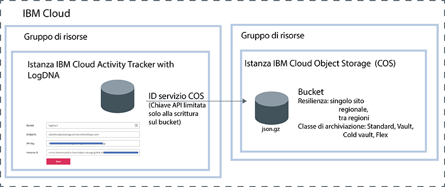

---

copyright:
  years: 2019
lastupdated: "2019-05-25"

keywords: IBM Cloud, LogDNA, Activity Tracker, manage events

subcollection: logdnaat

---

{:new_window: target="_blank"}
{:shortdesc: .shortdesc}
{:screen: .screen}
{:pre: .pre}
{:table: .aria-labeledby="caption"}
{:codeblock: .codeblock}
{:tip: .tip}
{:download: .download}
{:important: .important}
{:note: .note}

# Gestione degli eventi nel tuo account
{: #manage_events}

Come amministratore del servizio {{site.data.keyword.at_full_notm}} in {{site.data.keyword.cloud_notm}}, devi eseguire il provisioning di un'istanza del servizio in ogni ubicazione che intendi monitorare. Devi definire le linee guida dell'account per gestire gli eventi nell'account.
{:shortdesc}

## Provisioning di un'istanza del servizio per ogni ubicazione
{: #manage_events_provision}

Per raccogliere e monitorare l'attività nel tuo account, devi eseguire il provisioning del servizio {{site.data.keyword.at_full_notm}} nell'account. 

Esiste 1 istanza del servizio {{site.data.keyword.at_full_notm}} per ogni ubicazione. Pertanto, per monitorare l'attività nel tuo account, potresti dover eseguire il provisioning di più istanze {{site.data.keyword.at_full_notm}}. 

* In {{site.data.keyword.cloud_notm}}, puoi fare clic sull'icona **Menu**  > **Osservabilità** > **Activity Tracker** per visualizzare il dashboard in cui sono elencate tutte le istanze di cui è stato eseguito il provisioning nell'account. 
* Se vuoi monitorare gli [eventi globali](/docs/services/Activity-Tracker-with-LogDNA?topic=logdnaat-monitor_events#mon_def_global), devi eseguire il provisioning di un'istanza a Francoforte. 

[Ulteriori informazioni sul provisioning del servizio](/docs/services/Activity-Tracker-with-LogDNA?topic=logdnaat-provision).

Per ottenere l'elenco di ubicazioni in cui il servizio è disponibile in {{site.data.keyword.cloud_notm}}, vedi [Ubicazioni](/docs/services/Activity-Tracker-with-LogDNA?topic=logdnaat-regions).

Non appena è disponibile un'istanza, gli eventi vengono raccolti e resi disponibili per il monitoraggio tramite l'IU web di tale istanza.

## Archiviazione degli eventi
{: #manage_events_archive}

Puoi archiviare gli eventi da un'istanza {{site.data.keyword.at_full_notm}} in un bucket in un'istanza {{site.data.keyword.cos_full_notm}} (COS). [Ulteriori informazioni](/docs/services/Activity-Tracker-with-LogDNA?topic=logdnaat-archiving).

* Gli eventi vengono automaticamente archiviati una volta al giorno in un formato compresso **(.json.gz)**. Ciascuna riga conserva i suoi metadati.
* Gli eventi vengono archiviati entro 24-48 ore dopo che hai salvato la configurazione. 

Ciascuna istanza {{site.data.keyword.at_full_notm}} ha la sua configurazione di archiviazione.
{: important}

La seguente figura mostra una vista di alto livello dei diversi componenti che sono integrati quando si archiviano gli eventi:

Il provisioning di un'istanza {{site.data.keyword.cos_full_notm}} viene eseguito nel contesto di un gruppo di risorse. Il provisioning di un'istanza {{site.data.keyword.at_full_notm}} viene anche eseguito nel contesto di un gruppo di risorse. Entrambe le istanze possono essere raggruppate nello stesso gruppo di risorse o in gruppi diversi. 

{{site.data.keyword.at_full_notm}} utilizza un ID servizio per comunicare con il servizio {{site.data.keyword.cos_full_notm}}.
* L'ID servizio che crei per un'istanza {{site.data.keyword.cos_full_notm}} viene utilizzato da {{site.data.keyword.at_full_notm}} per autenticare l'istanza {{site.data.keyword.cos_full_notm}} e per accedere a essa. 
* Puoi assegnare delle specifiche politiche di accesso all'ID servizio che limitano le autorizzazioni sull'istanza {{site.data.keyword.cos_full_notm}}. Limita l'ID del servizio con soltanto le autorizzazioni in scrittura sul bucket nel quale pensi di archiviare gli eventi.

## Classificazione degli eventi utilizzando le categorie
{: #manage_events_category}

Puoi definire le categorie tramite la sezione **Categorie** dell'IU web. 

Puoi definire le categorie per raggruppare le viste. Puoi definire una serie diversa di categorie per raggruppare i dashboard.

Utilizza le categorie per raggruppare le risorse in modo che gli utenti possano trovarle facilmente. 

