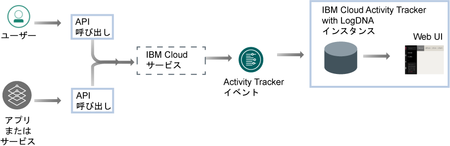
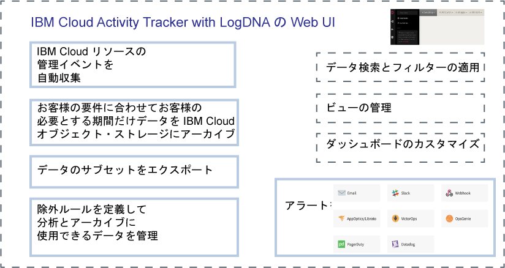

---

copyright:
  years: 2019
lastupdated: "2019-04-04"

keywords: IBM Cloud, LogDNA, Activity Tracker, getting started

subcollection: logdnaat

---

{:new_window: target="_blank"}
{:shortdesc: .shortdesc}
{:screen: .screen}
{:pre: .pre}
{:table: .aria-labeledby="caption"}
{:codeblock: .codeblock}
{:tip: .tip}
{:download: .download}
{:important: .important}
{:note: .note}

# 入門チュートリアル
{: #getting-started}

{{site.data.keyword.at_full}} サービスを使用して、アプリケーションが {{site.data.keyword.cloud_notm}} サービスとどのように対話するのかをトラッキングします。 このサービスを使用して、異常なアクティビティーや重大なアクションがないかを調査し、規制当局の監査条件に適合させることができます。さらに、アクションが発生した際にそれに関するアラートを通知させるようにできます。収集されるイベントは、Cloud Auditing Data Federation (CADF) 標準に準拠しています。
{:shortdesc}

{{site.data.keyword.at_full_notm}} は、 {{site.data.keyword.cloud_notm}} で実行されるリソースに対する API 呼び出しの監査レコードを収集し、保管します。これらのイベントは  {{site.data.keyword.cloud_notm}} にアーカイブして、長期的に保管できます。
{: note}

## {{site.data.keyword.at_full}} について
{: #ov}

アプリケーションの実行場所がオンプレミス、ハイブリッド・クラウド、またはパブリック・クラウドのいずれであるかに関係なく、社内のポリシーおよび業界の規定に準拠することは、すべての組織の戦略にとって重要な要件です。 {{site.data.keyword.at_full_notm}} サービスは {{site.data.keyword.cloud_notm}} 上のサービスへの API 呼び出しをモニターするためのフレームワークおよび機能を提供し、企業のポリシーおよび市場の業界固有の規定への準拠の証拠を生成します。

クラウド環境 ({{site.data.keyword.cloud_notm}} など) で作業をする場合、社内のポリシーと業界や国ベースの準拠要件に従って、ワークロードやデータの監査とモニターに関するクラウド戦略を立てる必要があります。 {{site.data.keyword.at_full_notm}} サービスを通じて登録された情報を使用することで、セキュリティー・インシデントを特定し、無許可アクセスを検出して、規制上および社内の監査要件に準拠することができます。

* {{site.data.keyword.at_full_notm}} は、クラウド内の IT リソースに対する高水準のセキュリティー・ガバナンスをサポートします。
* {{site.data.keyword.at_full_notm}} は、管理者が 1 つの場所で API アクティビティーの取り込み、保管、表示、検索、およびモニターを行えるようにするソリューションを提供します。 また、サポートされているいずれかの通知チャネルを使用してアラートを通知する機能も提供しています。
* {{site.data.keyword.at_full_notm}} は、イベントをダウンロードする機能を提供します。エクスポートしたイベントは監査証跡レポートを生成するために使用できます。 組織が社内規定および外部の業界や国の規制に準拠するために、これらのレポートが必要になることがあります。

例えば、{{site.data.keyword.at_full_notm}} イベントを使用して、以下の情報を識別できます。
* クラウド・サービスに対して API 呼び出しを行ったユーザー
* API 呼び出しが行われたタイム・スタンプ
* API 呼び出しの状況
* アクションの重大度

{{site.data.keyword.at_full_notm}} サービスでの処理を行うときには、セキュリティーに関する以下の情報を考慮してください。

* {{site.data.keyword.at_full_notm}} イベントを生成する IBM サービスは、{{site.data.keyword.IBM_notm}} クラウドのセキュリティー・ポリシーに従います。 詳しくは、[Trust the security and privacy of IBM Cloud ](https://www.ibm.com/cloud/security){: new_window} を参照してください。
* {{site.data.keyword.at_full_notm}} サービスは、クラウド・サービスの状態を変更するユーザー開始アクションを取り込みます。 この情報からデータベースまたはアプリケーションに直接アクセスすることはできません。
* 許可されたユーザーのみが {{site.data.keyword.at_full_notm}} イベント・ログの表示およびモニターを行うことができます。 各ユーザーは、{{site.data.keyword.cloud_notm}} での固有の ID によって識別されます。

## 達成目標
{: #gs_objectives}

このチュートリアルを完了すると、{{site.data.keyword.cloud_notm}} でサービスをプロビジョンする方法を学習できます。各イベントでどの一般的なデータが使用できるか、お使いのクラウド環境の監視のにどのように役立てることができるかを学びます。Web UI でのナビゲートについて学びます。 

## 前提条件
{: #gs_prereq}

* {{site.data.keyword.cloud_notm}} アカウントのメンバーまたは所有者であるユーザー ID が必要です。{{site.data.keyword.cloud_notm}} ユーザー ID を取得するには、[「登録」](https://cloud.ibm.com/login){:new_window} にアクセスしてください。

* {{site.data.keyword.cloud_notm}} で {{site.data.keyword.at_full_notm}} サービスを使用して作業するには、{{site.data.keyword.IBM_notm}} ID に IAM ポリシーが割り当てられていなければなりません。以下の表は、このチュートリアルを完了するために最低限必要な権限をリストしたものです。 

| リソース                             | アクセス・ポリシーの有効範囲 | 役割    | 地域    | 情報                  |
|--------------------------------------|----------------------------|---------|-----------|------------------------------|
| リソース・グループ **Default**           |  リソース・グループ            | エディター  | us-south  | デフォルトのリソース・グループ内のサービス・インスタンスをユーザーが表示できるようにするためには、このポリシーが必要です。    |
| {{site.data.keyword.at_full_notm}} サービス |  リソース・グループ            | エディター  | us-south  | デフォルトのリソース・グループ内の {{site.data.keyword.at_full_notm}} サービスをユーザーがプロビジョンおよび管理できるようにするためには、このポリシーが必要です。|
{: caption="表 1. チュートリアルを実行するために必要な IAM ポリシーのリスト" caption-side="top"} 

* コマンド・ラインを使用して作業する方法を選ぶ場合は、{{site.data.keyword.cloud_notm}} CLI をインストールする必要があります。詳しくは、[『{{site.data.keyword.cloud_notm}}CLI のインストール』](/docs/cli?topic=cloud-cli-ibmcloud-cli#ibmcloud-cli)を参照してください。

## ステップ 1. {{site.data.keyword.at_full_notm}} のインスタンスをプロビジョンする
{: #gs_step1}

インスタンスをプロビジョンするには、以下のステップを実行します。

1. [{{site.data.keyword.cloud_notm}} アカウントにログイン ](https://cloud.ibm.com/login){:new_window} します。

	ユーザー ID とパスワードを使用してログインすると、{{site.data.keyword.cloud_notm}} UI が開きます。

2. メニュー・アイコン  に移動します。 その後、**「プログラム識別情報」**を選択して、*「プログラム識別情報」*ダッシュボードにアクセスします。

3. **「Activity Tracker」**を選択してから、**「インスタンスの作成」**をクリックします。 

4. サービス・インスタンスの名前を入力します。

5. インスタンスをプロビジョンすることを計画している地域を選択します。

6. リソース・グループを選択します。 

    デフォルトでは、**Default** リソース・グループが設定されます。

    **注:** リソース・グループを選択できない場合、インスタンスをプロビジョンするリソース・グループでの編集許可があることを確認してください。

7. `「ライト」`サービス・プランを選択します。 

    デフォルトでは、ライト・プランが設定されます。

8. **「作成」**をクリックします。

インスタンスがプロビジョンされると、*「Activity Tracker」*ダッシュボードが開きます。 

## ステップ 2. サービスへのアクセスを管理する
{: #gs_step2}

**ご使用のアカウント内の {{site.data.keyword.at_full_notm}} サービスにアクセスするすべてのユーザーには、IAM ユーザー役割が定義されたアクセス・ポリシーを割り当てる必要があります。** そのポリシーによって、選択したサービスまたはインスタンスのコンテキスト内でユーザーが実行できるアクションが決まります。 許可されるアクションは、サービス上で実行できる操作としてカスタマイズされて定義されます。 その後、アクションは IAM ユーザー役割にマップされます。 

このチュートリアルでは、リソース・グループのコンテキスト内で、{{site.data.keyword.at_full_notm}} サービスを使用して作業するための管理権限をユーザーに付与する方法を学習します。[詳細はこちら](/docs/services/Activity-Tracker-with-LogDNA?topic=logdnaat-iam#iam)。

### 1. アクセス・グループを作成する
{: #gs_step2_step1}

アクセス・グループを作成するには、以下のステップを実行します。

1. メニュー・バーから、**「管理」** &gt; **「アクセス (IAM)」**をクリックして、**「アクセス・グループ」**を選択します。
2. **「作成」**をクリックします。
3. グループの名前と説明 (オプション) を入力して**「作成」**をクリックします。

### 2. イベントを管理する権限を追加する
{: #gs_step2_step2}

グループをセットアップした後で、共通するアクセス・ポリシーをそのグループに割り当てることができます。

アカウントのリソース・グループ内のインスタンスを管理する管理者役割をユーザーに付与するには、ユーザーに、リソース・グループのコンテキスト内での**管理者**のプラットフォーム役割とともに、{{site.data.keyword.at_full_notm}} サービスの IAM ポリシーが必要となります。 

UI を使ってアクセス・グループにポリシーを割り当てるには、以下のステップを実行します。

1. メニュー・バーから、**「管理」** &gt; **「アクセス (IAM)」**をクリックします。
2. **「アクセス・グループ」**を選択します。
3. アクセス権限を割り当てる先のグループの名前を選択します。 
4. **「アクセス・ポリシー」**をクリックします。
5. **「アクセス権限の割り当て (Assign access)」**をクリックします。
6. **「リソース・グループ内のアクセス権限の割り当て」**を選択します。
7. リソース・グループを選択します。
8. 選択したリソース・グループに対する役割がまだユーザーに付与されていない場合は、**「リソース・グループへのアクセス権限の割り当て」**フィールドで役割を選択します。 

    選択する役割に応じて、ユーザーはダッシュボードでのリソース・グループの表示、リソース・グループ名の編集、またはグループへのユーザー・アクセスの管理を行うことができます。 
    
    リソース・グループ内の {{site.data.keyword.at_full_notm}} サービスへのアクセス権限のみをユーザーに付与する場合は、**「アクセス権限なし」**を選択します。

9. **「IBM Cloud Activity Tracker with LogDNA」**を選択します。
10. **「管理者」**プラットフォーム役割を選択します。
11. **「管理者」**サービス役割を選択します。
12. **「割り当て」**をクリックします。

### 3. グループへのユーザーの追加
{: #gs_step2_step3}

アクセス・グループにユーザーを追加するには、以下のステップを実行します。
1. **「ユーザー」**タブで**「ユーザーの追加」**をクリックします。
2. 追加するユーザーをリストから選択して、**「グループに追加」**をクリックします。

## ステップ 3. {{site.data.keyword.at_full_notm}} イベントを生成する
{: #gs_step3}

アクセス・グループを作成するときにイベントを生成するには、以下のステップを実行します。

1. [{{site.data.keyword.cloud_notm}} カタログ ](https://cloud.ibm.com/catalog){:new_window} から、**「管理」** &gt; **「セキュリティーおよび ID」**を選択します。

2. **「アクセス・グループ」**を選択します。

3. **「作成」**を選択します。 次に、アクセス・グループの名前を入力します。

4. **「作成」**をクリックします。

アクセス・グループが作成されます。

## ステップ 4. Web UI を起動する 
{: #gs_step4}

Web UI を起動するには、以下の手順を実行します。

1. [{{site.data.keyword.cloud_notm}} アカウントにログイン ](https://cloud.ibm.com/login){:new_window} します。

	ユーザー ID とパスワードを使用してログインすると、{{site.data.keyword.cloud_notm}} ダッシュボードが開きます。

2. ナビゲーション・メニューで、**「プログラム識別情報」**を選択します。 

3. **「Activity Tracker」**を選択します。 

    {{site.data.keyword.cloud_notm}} で使用可能なインスタンスのリストが表示されます。

4. インスタンスを 1 つ選択します。 次に、**「LogDNA の表示 (View LogDNA)」**をクリックします。

Web UI が開きます。 

## ステップ 5. イベントを表示する
{: #gs_step5}

{{site.data.keyword.at_full_notm}} サービスは、{{site.data.keyword.cloud_notm}} 内の選択されたクラウド・サービスに対して行われる API 呼び出しおよびその他のアクションに関連したアクティビティー・データを取り込みます。 

* イベントは自動的に収集されます。 
* {{site.data.keyword.at_full_notm}} で収集されるイベントは、**Cloud Auditing Data Federation (CADF) 標準**に準拠しています。 CADF 標準は、クラウド環境にあるアプリケーションのセキュリティーの認証、管理、および監査に必要な情報が含まれた、フルイベント・モデルを定義しています。
* {{site.data.keyword.at_full_notm}} は、地域別にイベントを保管およびグループ化します。 
* {{site.data.keyword.cloud_notm}} のグローバル・アカウントのアクションに関するレポートを作成するイベントが **US-South** 地域で収集され、保管されます。
* {{site.data.keyword.at_full_notm}} インスタンス用に選択するサービス・プランによって、Web UI でイベントを検索可能な日数が決まります。 

コンテキスト内の各イベント行を随時表示できます。 コンテキストでイベントを表示するには、以下のステップを実行します。 

1. Web UI で、**「ビュー」**アイコン  をクリックします。
2. **「すべて (Everything)」**を選択します。
3. 調べる行を特定します。
4. イベント行を展開します。 

    行 ID、タグ、およびラベルに関する情報が表示されます。

5. **「コンテキスト内のビュー (View in Context)」**をクリックすると、そのホストまたはアプリ、あるいはその両方からの他の項目のコンテキスト内のイベント行が表示されます。

イベントの探索が終了したら、**「閉じる」**をクリックしてイベント行を閉じます。

[詳細はこちら](/docs/services/Activity-Tracker-with-LogDNA?topic=logdnaat-view_events.md#view_events.md)。

## ステップ 6. イベントの構造について学習する
{: #gs_step6}

イベントは **Cloud Auditing Data Federation (CADF) 標準**に準拠しています。CADF 標準は、クラウド環境にあるアプリケーションのセキュリティーの認証、管理、および監査に必要な情報が含まれた、フルイベント・モデルを定義しています。

CADF イベント・モデルには、以下のコンポーネントが含まれています。

| コンポーネント | 説明 |
|------------|----------------------------|
| `アクション`   | アクションは、イニシエーターが実行する、実行を試みる、あるいは完了を待っている、操作またはアクティビティーです。 |
| `イニシエーター`| イニシエーターは、API 呼び出しを行って CADF イベントを生成するリソースです。 起動されるイベントは、API 呼び出しで要求されるアクションによって異なります。 |
| `オブザーバー` | オブザーバーは、CADF イベントで利用可能な情報から CADF レコードを作成して保管するリソースです。 |
| `結果`  | 結果は、ターゲットに対するアクションの状況です。 |
| `ターゲット`   | ターゲットは、アクションが実行される、実行を試みられる、あるいは完了の処理待ち中の、対象のリソースです。 |
{: caption="表 2. CADF イベント・モデル内のコンポーネント" caption-side="top"} 

[詳細はこちら](/docs/services/Activity-Tracker-with-LogDNA?topic=logdnaat-event#event)。

## 次のステップ
{: #gs_next_steps}

{{site.data.keyword.at_full_notm}} サービス・プランを、[イベントのフィルター処理](/docs/services/Activity-Tracker-with-LogDNA?topic=logdnaat-views.md#views_step1)、[イベントの検索](/docs/services/Activity-Tracker-with-LogDNA?topic=logdnaat-views.md#views_step2)、[ビューの定義](/docs/services/Activity-Tracker-with-LogDNA?topic=logdnaat-views.md#views_step3)、[アラートの構成](/docs/services/Activity-Tracker-with-LogDNA?topic=logdnaat-alerts.md#alerts.md)を行える有料プランにアップグレードします。 

{{site.data.keyword.at_full_notm}} サービス・プランについて詳しくは、[サービス・プラン](/docs/services/Activity-Tracker-with-LogDNA?topic=logdnaat-service_plan#service_plan)を参照してください。

