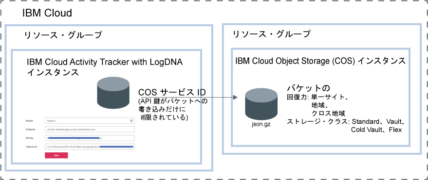

---

copyright:
  years: 2019
lastupdated: "2019-05-25"

keywords: IBM Cloud, LogDNA, Activity Tracker, manage events

subcollection: logdnaat

---

{:new_window: target="_blank"}
{:shortdesc: .shortdesc}
{:screen: .screen}
{:pre: .pre}
{:table: .aria-labeledby="caption"}
{:codeblock: .codeblock}
{:tip: .tip}
{:download: .download}
{:important: .important}
{:note: .note}

# アカウント内のイベントの管理
{: #manage_events}

{{site.data.keyword.cloud_notm}} の {{site.data.keyword.at_full_notm}} サービスの管理者は、モニターする予定の各ロケーションにサービスのインスタンスをプロビジョンする必要があります。アカウント内のイベントを管理するには、アカウント・ガイドラインを定義する必要があります。
{:shortdesc}

## ロケーションごとのサービス・インスタンスのプロビジョニング
{: #manage_events_provision}

アカウント内のアクティビティーを収集してモニターするには、アカウントに {{site.data.keyword.at_full_notm}} サービスをプロビジョンする必要があります。 

ロケーションごとに {{site.data.keyword.at_full_notm}} サービスのインスタンスが 1 つあります。したがって、アカウント内のアクティビティーをモニターするためには、複数の {{site.data.keyword.at_full_notm}} インスタンスをプロビジョンしなければならない場合があります。 

* {{site.data.keyword.cloud_notm}} で、**「メニュー」**アイコン  > **「プログラム識別情報」** > **「Activity Tracker」**をクリックすると、アカウントにプロビジョンされているすべてのインスタンスがリストされたダッシュボードが表示されます。 
* [グローバル・イベント](/docs/services/Activity-Tracker-with-LogDNA?topic=logdnaat-monitor_events#mon_def_global)をモニターする場合は、フランクフルトにインスタンスをプロビジョンする必要があります。 

[サービスのプロビジョニングについての詳細はこちらをご覧ください](/docs/services/Activity-Tracker-with-LogDNA?topic=logdnaat-provision)。

{{site.data.keyword.cloud_notm}} 内のサービス使用可能ロケーションのリストを取得するには、[ロケーション](/docs/services/Activity-Tracker-with-LogDNA?topic=logdnaat-regions)を参照してください。

インスタンスが使用可能になるとすぐに、イベントが収集され、そのインスタンスの Web UI を介してモニターできるようになります。

## イベントのアーカイブ
{: #manage_events_archive}

{{site.data.keyword.at_full_notm}} インスタンスからのイベントを {{site.data.keyword.cos_full_notm}} (COS) インスタンス内のバケットにアーカイブできます。[詳細はこちら](/docs/services/Activity-Tracker-with-LogDNA?topic=logdnaat-archiving)。

* イベントは、1 日 1 回、圧縮フォーマット **(.json.gz)** で自動的にアーカイブされます。 行ごとにそのメタデータが保持されます。
* イベントは、構成の保存後 24 時間から 48 時間以内にアーカイブされます。 

{{site.data.keyword.at_full_notm}} インスタンスごとに独自のアーカイブ構成が定義されます。
{: important}

以下の図に、イベントのアーカイブ時に統合されるさまざまなコンポーネントの概略を示します。

{{site.data.keyword.cos_full_notm}} インスタンスは、リソース・グループのコンテキスト内でプロビジョンされます。 {{site.data.keyword.at_full_notm}} インスタンスも、リソース・グループのコンテキスト内でプロビジョンされます。 両方のインスタンスを同じリソース・グループの下にグループ化することも、別々のリソース・グループに入れることもできます。 

{{site.data.keyword.at_full_notm}} はサービス ID を使用して {{site.data.keyword.cos_full_notm}} サービスと通信します。
* {{site.data.keyword.cos_full_notm}} インスタンス用に作成するサービス ID は、{{site.data.keyword.at_full_notm}} により、{{site.data.keyword.cos_full_notm}} インスタンスの認証とアクセスのために使用されます。 
* このサービス ID には、{{site.data.keyword.cos_full_notm}} インスタンスに対する許可を制限する特定のアクセス・ポリシーを割り当てることができます。 サービス ID を、イベントのアーカイブ場所として計画しているバケットに対する書き込み許可だけを持つように制限します。

## カテゴリーを使用したイベントの分類
{: #manage_events_category}

Web UI の**「カテゴリー」**セクションでカテゴリーを定義できます。 

カテゴリーを定義することでビューをグループ化できます。別のカテゴリー・セットを定義することで、ダッシュボードをグループ化できます。

カテゴリーを使用してリソースをグループ化すると、ユーザーは簡単にリソースを見つけることができるようになります。 

