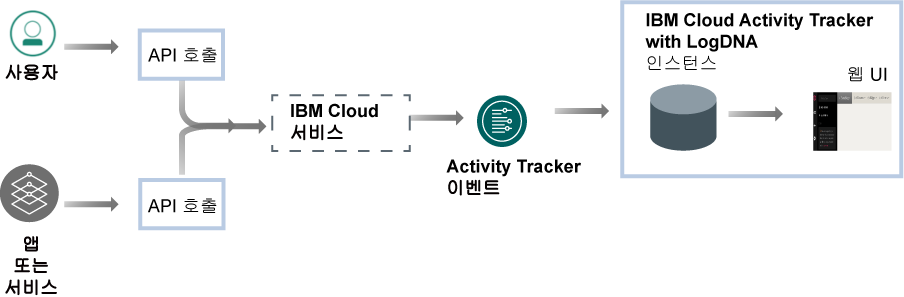

---

copyright:
  years: 2019
lastupdated: "2019-06-06"

keywords: IBM Cloud, LogDNA, Activity Tracker, getting started

subcollection: logdnaat

---

{:new_window: target="_blank"}
{:shortdesc: .shortdesc}
{:screen: .screen}
{:pre: .pre}
{:table: .aria-labeledby="caption"}
{:codeblock: .codeblock}
{:tip: .tip}
{:download: .download}
{:important: .important}
{:note: .note}

# 시작하기 튜토리얼
{: #getting-started}

{{site.data.keyword.at_full}} 서비스를 사용하여 {{site.data.keyword.cloud_notm}} 계정의 활동을 모니터링하십시오. 이 서비스를 사용하여 비정상 활동 및 위험 조치를 조사하고 규정 감사 요구사항을 준수할 수 있습니다. 또한 발생하는 조치에 대한 경보를 받을 수 있습니다. 수집되는 이벤트는 CADF(Cloud Auditing Data Federation) 표준을 준수합니다.
{:shortdesc}

{{site.data.keyword.at_full_notm}}는 {{site.data.keyword.cloud_notm}}에서 실행되는 리소스에 대해 수행된 API 호출의 감사 레코드를 수집하고 저장합니다. 장기간 저장을 위해 {{site.data.keyword.cloud_notm}}에서 이러한 이벤트를 아카이브할 수 있습니다.
{: note}

## {{site.data.keyword.at_full}} 정보
{: #gs_ov}

내부 정책 및 산업 규정의 준수는 애플리케이션이 실행되는 위치(온프레미스, 하이브리드 클라우드 또는 퍼블릭 클라우드)에 상관없이 조직의 전략에서 핵심적인 요구사항입니다. {{site.data.keyword.at_full_notm}} 서비스는 {{site.data.keyword.cloud_notm}}의 서비스에 대한 API 호출을 모니터하기 위한 프레임워크 및 기능을 제공하며 회사 정책 및 산업별 규정을 준수하는 데 필요한 증거를 생성합니다.

{{site.data.keyword.cloud_notm}}와 같은 클라우드 환경에서 작업하는 경우 사용자의 내부 정책과 산업 및 국가 기반 규제 준수 요구사항에 따라 워크로드 및 데이터를 감사하고 모니터하기 위한 클라우드 전략을 계획해야 합니다. {{site.data.keyword.at_full_notm}} 서비스를 통해 등록된 정보를 사용하여 보안 사고를 식별하고 무단 액세스를 발견하며 규정 및 내부 감사 요구사항을 준수할 수 있습니다.

* {{site.data.keyword.at_full_notm}}는 클라우드에서 사용자의 IT 리소스에 대한 상위 레벨의 보안 통제를 제공합니다.
* {{site.data.keyword.at_full_notm}}는 관리자가 단일 위치에서 API 활동을 캡처하고, 저장하고, 보고, 검색하고, 모니터할 수 있는 솔루션을 제공합니다. 또한 지원되는 알림 채널 중 하나를 사용하여 경보를 전송하는 알림 기능을 제공합니다.
* {{site.data.keyword.at_full_notm}}는 감사 추적 보고서를 생성하는 데 사용할 수 있는 이벤트를 다운로드하는 기능을 제공합니다. 사용자의 조직에서 내부 규정과 외부 산업 및 국가 규정을 준수하도록 이러한 보고서가 필요할 수 있습니다.

예를 들어, {{site.data.keyword.at_full_notm}} 이벤트를 사용하여 다음 정보를 식별할 수 있습니다.
* 클라우드 서비스에 대한 API 호출을 수행한 사용자
* API 호출이 수행된 시간소인
* API 호출의 상태
* 조치의 중요도

{{site.data.keyword.at_full_notm}} 서비스에 대해 작업할 때 보안에 대한 다음 정보를 고려하십시오.

* {{site.data.keyword.at_full_notm}} 이벤트를 생성하는 IBM 서비스는 {{site.data.keyword.IBM_notm}} Cloud 보안 정책을 따릅니다. 자세한 정보는 [Trust the security and privacy of IBM Cloud ](https://www.ibm.com/cloud/security){: new_window}를 참조하십시오.
* {{site.data.keyword.at_full_notm}} 서비스는 클라우드 서비스의 상태를 변경하는 사용자 시작 조치를 캡처합니다. 이 정보는 데이터베이스 또는 애플리케이션에 대한 직접 액세스를 제공하지 않습니다.
* 권한 부여된 사용자만 {{site.data.keyword.at_full_notm}} 이벤트 로그를 보고 모니터할 수 있습니다. 각 사용자는 {{site.data.keyword.cloud_notm}}에서 고유 ID로 식별됩니다.
* {{site.data.keyword.cloud_notm}} 위치(지역)당 서비스 인스턴스를 하나만 프로비저닝할 수 있습니다.

## 목표
{: #gs_objectives}

이 튜토리얼을 완료하여 {{site.data.keyword.cloud_notm}}에서 서비스를 프로비저닝하는 방법을 학습하십시오. 각 이벤트에서 사용 가능한 공통 데이터와 클라우드 환경을 모니터하는 데 도움이 될 수 있는 방법을 알아보십시오. 웹 UI에서 탐색하는 방법을 학습하십시오. 

## 전제조건
{: #gs_prereq}

* {{site.data.keyword.cloud_notm}} 계정의 구성원이거나 소유자인 사용자 ID가 필요합니다. {{site.data.keyword.cloud_notm}} 사용자 ID를 가져오려면 [등록 ](https://cloud.ibm.com/login){:new_window}을 참조하십시오.

* 명령행을 사용하여 작업하려면 {{site.data.keyword.cloud_notm}} CLI를 설치해야 합니다. 자세한 정보는 [{{site.data.keyword.cloud_notm}} CLI 설치](/docs/cli?topic=cloud-cli-ibmcloud-cli#ibmcloud-cli)를 참조하십시오.

* 서비스에 대한 액세스를 관리하는 단계를 완료하려면 사용자 ID에 {{site.data.keyword.at_full_notm}} 서비스를 관리하는 **관리자 플랫폼 권한**이 있어야 합니다. 계정 관리자에게 문의하십시오. 계정 소유자는 사용자 액세스를 관리하고 계정 리소스를 관리하기 위해 계정에 다른 사용자 액세스 권한을 부여할 수 있습니다. [자세히 보기](/docs/iam?topic=iam-userroles).

## 1단계. {{site.data.keyword.at_full_notm}} 서비스 인스턴스 프로비저닝
{: #gs_step1}

인스턴스를 프로비저닝하려면 다음 단계를 완료하십시오.

1. [{{site.data.keyword.cloud_notm}} 계정 에 로그인하십시오](https://cloud.ibm.com/login){:new_window}.

	사용자 ID 및 비밀번호를 사용하여 로그인하면 {{site.data.keyword.cloud_notm}} UI가 열립니다.

2. 메뉴 아이콘 으로 이동하십시오. 그런 다음 **관찰 가능성**을 선택하여 *관찰 가능성* 대시보드에 액세스하십시오.

3. **Activity Tracker**를 선택한 후 **인스턴스 작성**을 클릭하십시오. 

4. 서비스 인스턴스의 이름을 입력하십시오.

5. **프랑크푸르트** 위치를 선택하십시오. 

    서비스를 사용할 수 있는 지역에 관한 자세한 정보는 [지역](/docs/services/Activity-Tracker-with-LogDNA?topic=logdnaat-regions)을 참조하십시오.

6. 리소스 그룹을 선택하십시오. 

    기본적으로 **default** 리소스 그룹이 설정됩니다.

    **참고:** 리소스 그룹을 선택할 수 없는 경우 인스턴스를 프로비저닝할 리소스 그룹에 대한 편집 권한이 있는지 확인하십시오.

7. `Lite` 서비스 플랜을 선택하십시오. 

    기본적으로 Lite 플랜이 설정됩니다.

8. **작성**을 클릭하십시오.

인스턴스를 프로비저닝하면 *Activity Tracker* 대시보드가 열립니다. 

## 2단계. 서비스에 대한 액세스 관리
{: #gs_step2}

**계정의 {{site.data.keyword.at_full_notm}} 서비스에 액세스하는 모든 사용자에게 IAM 사용자 역할이 정의된 액세스 정책을 지정해야 합니다.** 정책에 따라 선택한 서비스 또는 인스턴스의 컨텍스트 내에서 사용자가 수행할 수 있는 조치가 판별됩니다. 허용 가능한 조치는 사용자 정의되며 서비스에서 수행될 수 있는 오퍼레이션으로 정의됩니다. 그런 다음 조치가 IAM 사용자 역할에 맵핑됩니다. [자세히 보기](/docs/services/Activity-Tracker-with-LogDNA?topic=logdnaat-iam).

이 튜토리얼에서는 사용자에게 리소스 그룹의 컨텍스트 내에서 {{site.data.keyword.at_full_notm}} 서비스에 대해 작업할 수 있는 관리 권한을 부여하는 방법을 학습합니다.

### 1. 액세스 그룹 작성
{: #gs_step2_1}

액세스 그룹을 작성하려면 다음 단계를 완료하십시오.
1. 메뉴 표시줄에서 **관리** &gt; **액세스(IAM)**를 클릭한 후 **액세스 그룹**을 선택하십시오.
2. **작성**을 클릭하십시오.
3. 그룹의 이름과 선택적 설명을 입력한 후 **작성**을 클릭하십시오.

### 2. 이벤트를 관리하기 위한 권한 추가
{: #gs_step2_2}

그룹을 설정한 후 그룹에 공통 액세스 정책을 지정해야 합니다. 액세스 그룹에 대해 설정하는 정책은 그룹 내의 모든 엔티티, 사용자 및 서비스 ID에 적용됩니다.

정책을 정의할 때 플랫폼 역할 및 서비스 역할을 선택해야 합니다.
* 플랫폼 관리 역할은 인스턴스를 작성하고 삭제하며, 별명, 바인딩 및 인증 정보를 관리하고, 액세스를 관리하는 기능을 포함하여 다양한 조치를 수행합니다. 플랫폼 역할은 관리자, 편집자, 운영자, 뷰어입니다. 플랫폼 관리 역할은 계정 관리 서비스에 지정된 역할에 따라 사용자가 사용자를 초대하고 서비스 ID를 관리하며 정책에 액세스하고 항목을 카탈로그화하며 비용 청구와 사용을 추적할 수 있도록 허용하는 계정 관리 서비스에도 적용됩니다.
* 서비스 액세스 역할을 통해서는 사용자나 서비스가 서비스 인스턴스에서 조치를 수행하는 기능을 정의합니다. 서비스 액세스 역할은 관리자, 작성자 및 독자입니다.

{{site.data.keyword.at_full_notm}} 서비스를 관리하려면 사용자에게 다음 역할이 있어야 합니다.
* 플랫폼 역할: **관리자**. 
* 서비스 역할: **관리자**. 

다음 단계를 완료하여 UI를 통해 정책을 지정하십시오.

1. 메뉴 표시줄에서 **관리** &gt; **액세스(IAM)**를 클릭하십시오.
2. **액세스 그룹**을 선택하십시오.
3. 액세스 권한을 지정할 그룹의 이름을 선택하십시오. 
4. **액세스 정책**을 클릭하십시오.
5. **액세스 권한 지정**을 클릭하십시오.
6. **리소스 그룹 내의 액세스 권한 지정**을 선택하십시오.
7. 리소스 그룹을 선택하십시오.
8. 사용자에게 선택한 리소스 그룹에 대해 이미 부여된 역할이 없는 경우 **리소스 그룹에 대한 액세스 권한 지정** 필드를 위한 역할을 선택하십시오. 

    선택하는 역할에 따라 사용자가 대시보드에서 리소스 그룹을 보거나, 리소스 그룹 이름을 편집하거나, 그룹에 대한 사용자 액세스 권한을 관리할 수 있습니다. 
    
    사용자가 리소스 그룹의 {{site.data.keyword.at_full_notm}} 서비스에만 액세스할 수 있도록 하려는 경우 **액세스 권한 없음**을 선택할 수 있습니다.

9. **IBM Cloud Activity Tracker with LogDNA**를 선택하십시오.
10. 플랫폼 역할 **관리자**를 선택하십시오.
11. 서비스 역할 **관리자**를 선택하십시오.
12. **지정**을 클릭하십시오.

### 3. 그룹에 사용자 추가
{: #gs_step2_3}

액세스 그룹에 사용자를 추가하려면 다음 단계를 완료하십시오.
1. **사용자** 탭에서 **사용자 추가**를 클릭하십시오.
2. 목록에서 추가할 사용자를 선택하고 **그룹에 추가**를 클릭하십시오.

## 3단계. {{site.data.keyword.at_full_notm}} 이벤트 생성
{: #gs_step3}

{{site.data.keyword.cloudcerts_short}} 서비스의 인스턴스를 프로비저닝할 때 다음 단계를 완료하여 이벤트를 생성하십시오. 

1. [{{site.data.keyword.cloud_notm}} 카탈로그 ](https://cloud.ibm.com/catalog){:new_window}에서 **보안 및 ID** 카테고리를 선택하십시오.

2. {{site.data.keyword.cloudcerts_short}} 서비스를 선택하십시오.

3. 서비스 인스턴스의 이름을 입력하십시오.

4. 인스턴스를 프로비저닝할 지역을 선택하십시오.

5. 리소스 그룹을 선택하십시오. 

    기본적으로 **default** 리소스 그룹이 설정됩니다.

    **참고:** 리소스 그룹을 선택할 수 없는 경우 인스턴스를 프로비저닝할 리소스 그룹에 대한 편집 권한이 있는지 확인하십시오.

6. `Free` 서비스 플랜을 선택하십시오. 

7. **작성**을 클릭하십시오.

{{site.data.keyword.cloudcerts_short}} 서비스의 인스턴스가 작성됩니다.

## 4단계. 웹 UI 실행 
{: #gs_step4}

웹 UI를 실행하려면 다음 단계를 완료하십시오.

1. [{{site.data.keyword.cloud_notm}} 계정 에 로그인하십시오](https://cloud.ibm.com/login){:new_window}.

	사용자 ID 및 비밀번호를 사용하여 로그인하면 {{site.data.keyword.cloud_notm}} 대시보드가 열립니다.

2. 탐색 메뉴에서 **관찰 가능성**을 선택하십시오. 

3. **Activity Tracker**를 선택하십시오. 

    {{site.data.keyword.cloud_notm}}에서 사용 가능한 인스턴스의 목록이 표시됩니다.

4. **프랑크푸르트**에 있는 인스턴스를 선택하십시오. 그런 다음 **LogDNA 보기**를 클릭하십시오.

    서비스 프로비저닝과 같은 글로벌 이벤트는 프랑크푸르트에 있는 글로벌 도메인 인스턴스를 통해 사용할 수 있습니다.

웹 UI가 열립니다. 

## 5단계. 이벤트 보기
{: #gs_step5}

{{site.data.keyword.at_full_notm}} 서비스는 {{site.data.keyword.cloud_notm}} 내의 선택된 클라우드 서비스에 대해 수행된 API 호출 및 기타 조치와 관련된 활동 데이터를 캡처합니다. 

* 이벤트는 자동으로 수집됩니다. 
* {{site.data.keyword.at_full_notm}}에서 수집되는 이벤트는 **CADF(Cloud Auditing Data Federation) 표준**을 준수합니다. CADF 표준은 클라우드 환경에서 애플리케이션의 보안을 인증, 관리 및 감사하는 데 필요한 정보가 포함된 전체 이벤트 모델을 정의합니다.
* {{site.data.keyword.at_full_notm}}는 이벤트를 위치별로 저장하고 그룹화합니다. 
* 글로벌 {{site.data.keyword.cloud_notm}} 계정 조치에 대해 보고하는 이벤트는 **프랑크푸르트(EU-DE)**에서 수집하여 저장합니다.
* {{site.data.keyword.at_full_notm}} 인스턴스에 대해 선택하는 서비스 플랜에 따라 웹 UI를 통해 이벤트를 검색에 사용할 수 있는 일 수가 설정됩니다. 

웹 UI가 열리면 **모든 항목** 보기가 표시됩니다. 이 보기를 통해 이벤트를 볼 수 있습니다.

시간소인, 검색 조회 또는 둘 다를 적용하여 이벤트 세트를 보려면 사용자 정의 보기도 정의할 수 있습니다. [자세히 보기](/docs/services/Activity-Tracker-with-LogDNA?topic=logdnaat-views).

## 6단계. 이벤트 구조에 대해 알아보기
{: #gs_step6}

이벤트는 **CADF(Cloud Auditing Data Federation) 표준**을 준수합니다. CADF 표준은 클라우드 환경에서 애플리케이션의 보안을 인증, 관리 및 감사하는 데 필요한 정보가 포함된 전체 이벤트 모델을 정의합니다.

CADF 이벤트 모델에는 다음과 같은 컴포넌트가 포함됩니다.

|컴포넌트 |설명 |
|------------|----------------------------|
| `조치`   |조치는 개시자가 수행하거나, 수행하려고 시도하거나, 완료되기를 대기 중인 오퍼레이션 또는 활동입니다. |
|`개시자`|개시자는 API 호출을 수행하고 CADF 이벤트를 생성하는 리소스입니다. 트리거되는 이벤트는 API 호출에서 요청하는 조치에 따라 달라집니다. |
|`관찰자` |관찰자는 CADF 이벤트에서 사용 가능한 정보로부터 CADF 레코드를 작성하고 저장하는 리소스입니다. |
|`결과`  |결과는 대상에 대한 조치의 상태입니다. |
|`대상`   |대상은 조치가 수행되거나, 수행하려고 시도되거나, 완료 보류 중인 리소스입니다. |
{: caption="표 2. CADF 이벤트 모델에서 사용 가능한 컴포넌트" caption-side="top"} 

[자세히 보기](/docs/services/Activity-Tracker-with-LogDNA?topic=logdnaat-event#event).

## 다음 단계
{: #gs_next_steps}

[사용자 정의 보기를 정의](/docs/services/Activity-Tracker-with-LogDNA?topic=logdnaat-views)하십시오. 

[조회를 적용하여 이벤트를 검색](/docs/services/Activity-Tracker-with-LogDNA?topic=logdnaat-views#views_step2)하고 [경보를 구성](/docs/services/Activity-Tracker-with-LogDNA?topic=logdnaat-alerts)할 수 있도록 {{site.data.keyword.at_full_notm}} 서비스 플랜을 유료 플랜으로 업그레이드하십시오. 

{{site.data.keyword.at_full_notm}} 서비스 플랜에 대한 자세한 정보는 [서비스 플랜](/docs/services/Activity-Tracker-with-LogDNA?topic=logdnaat-service_plan#service_plan)을 참조하십시오.

