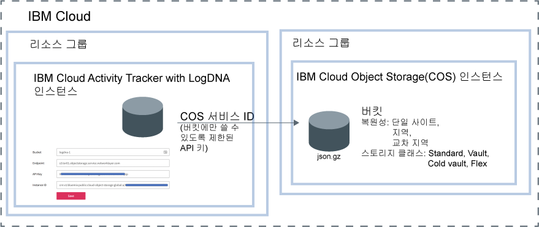

---

copyright:
  years: 2019
lastupdated: "2019-05-25"

keywords: IBM Cloud, LogDNA, Activity Tracker, manage events

subcollection: logdnaat

---

{:new_window: target="_blank"}
{:shortdesc: .shortdesc}
{:screen: .screen}
{:pre: .pre}
{:table: .aria-labeledby="caption"}
{:codeblock: .codeblock}
{:tip: .tip}
{:download: .download}
{:important: .important}
{:note: .note}

# 계정에서 이벤트 관리
{: #manage_events}

{{site.data.keyword.cloud_notm}}의 {{site.data.keyword.at_full_notm}} 서비스 관리자는 모니터링할 각 위치에서 서비스 인스턴스를 프로비저닝해야 합니다. 계정 가이드라인을 정의하여 계정에서 이벤트를 관리해야 합니다.
{:shortdesc}

## 위치별 서비스 인스턴스 프로비저닝
{: #manage_events_provision}

계정에서 활동을 수집하고 모니터링하려면 계정에서 {{site.data.keyword.at_full_notm}} 서비스를 프로비저닝해야 합니다. 

위치당 {{site.data.keyword.at_full_notm}} 서비스의 인스턴스가 하나 있습니다. 그러므로 계정의 활동을 모니터링하려면 여러 {{site.data.keyword.at_full_notm}} 인스턴스를 프로비저닝해야 할 수도 있습니다. 

* {{site.data.keyword.cloud_notm}}에서 **메뉴** 아이콘  > **관찰 가능성** > **활동 트래커**를 클릭하여 계정에서 프로비저닝된 모든 인스턴스가 나열된 대시보드를 확인하십시오.
 
* [글로벌 이벤트](/docs/services/Activity-Tracker-with-LogDNA?topic=logdnaat-monitor_events#mon_def_global)를 모니터링하려면 프랑크푸르트에서 인스턴스를 프로비저닝해야 합니다. 

[서비스를 프로비저닝하는 데 관해 자세히 알아보기](/docs/services/Activity-Tracker-with-LogDNA?topic=logdnaat-provision).

{{site.data.keyword.cloud_notm}}에서 서비스를 사용할 수 있는 위치 목록을 가져오려면 [위치](/docs/services/Activity-Tracker-with-LogDNA?topic=logdnaat-regions)를 참조하십시오.

인스턴스가 사용 가능하게 되면 바로 해당 인스턴스의 웹 UI를 통해 이벤트가 수집되고 모니터링에 사용 가능하게 됩니다.

## 이벤트 아카이브
{: #manage_events_archive}

{{site.data.keyword.at_full_notm}} 인스턴스의 이벤트를 {{site.data.keyword.cos_full_notm}}(COS) 인스턴스의 버킷으로 아카이브할 수 있습니다. [자세히 보기](/docs/services/Activity-Tracker-with-LogDNA?topic=logdnaat-archiving).

* 이벤트는 하루에 한 번 압축된 형식**(.json.gz)**으로 자동 아카이브됩니다. 각 행에는 해당 메타데이터가 유지됩니다.
* 구성을 저장한 후 24 - 48시간 내에 이벤트가 아카이브됩니다. 

각 {{site.data.keyword.at_full_notm}} 인스턴스에는 고유 아카이브 구성이 있습니다.
{: important}

다음 그림은 이벤트를 아카이브할 때 통합되는 여러 컴포넌트의 상위 레벨 보기를 보여줍니다.

{{site.data.keyword.cos_full_notm}} 인스턴스는 리소스 그룹의 컨텍스트 내에 프로비저닝됩니다. 또한 {{site.data.keyword.at_full_notm}} 인스턴스는 리소스 그룹의 컨텍스트 내에 프로비저닝됩니다. 동일한 리소스 그룹에 또는 서로 다른 그룹에서 두 인스턴스를 그룹화할 수 있습니다. 

{{site.data.keyword.at_full_notm}}는 서비스 ID를 사용하여 {{site.data.keyword.cos_full_notm}} 서비스와 통신합니다.
* {{site.data.keyword.cos_full_notm}} 인스턴스에 대해 작성하는 서비스 ID는 {{site.data.keyword.at_full_notm}}에서 {{site.data.keyword.cos_full_notm}} 인스턴스를 인증하고 액세스하는 데 사용됩니다. 
* {{site.data.keyword.cos_full_notm}} 인스턴스에 대한 권한을 제한하는 서비스 ID에 특정 액세스 정책을 지정할 수 있습니다. 이벤트를 아카이브할 버킷에 대한 쓰기 권한만 보유하도록 서비스 ID를 제한하십시오.

## 카테고리를 사용하여 이벤트 분류
{: #manage_events_category}

웹 UI의 **카테고리** 섹션을 통해 카테고리를 정의할 수 있습니다. 

카테고리를 정의하여 보기를 그룹화할 수 있습니다. 다른 카테고리 세트를 정의하여 대시보드를 그룹화할 수 있습니다.

사용자가 쉽게 찾을 수 있도록 카테고리를 사용하여 리소스를 그룹화하십시오. 

