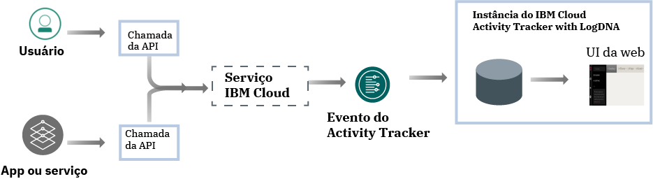
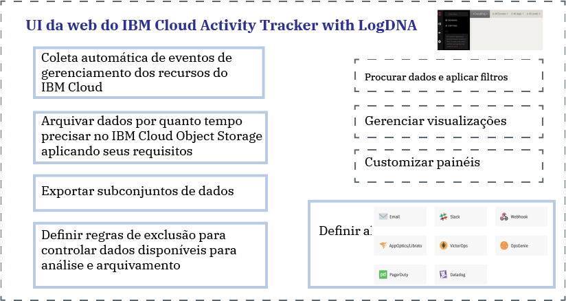

---

copyright:
  years: 2019
lastupdated: "2019-06-06"

keywords: IBM Cloud, LogDNA, Activity Tracker, getting started

subcollection: logdnaat

---

{:new_window: target="_blank"}
{:shortdesc: .shortdesc}
{:screen: .screen}
{:pre: .pre}
{:table: .aria-labeledby="caption"}
{:codeblock: .codeblock}
{:tip: .tip}
{:download: .download}
{:important: .important}
{:note: .note}

# Tutorial Introdução
{: #getting-started}

Use o serviço do {{site.data.keyword.at_full}} para monitorar a atividade de sua conta do {{site.data.keyword.cloud_notm}}. É possível usar esse serviço para investigar atividades anormais e ações críticas e preencher os requisitos de auditoria regulamentares. Além disso, é possível ser alertado sobre as ações conforme elas acontecem. Os eventos que são coletados obedecem ao padrão Cloud Auditing Data Federation (CADF).
{:shortdesc}

O {{site.data.keyword.at_full_notm}} coleta e armazena registros de auditoria para chamadas da API feitas para recursos que são executados no {{site.data.keyword.cloud_notm}}. É possível arquivar esses eventos no {{site.data.keyword.cloud_notm}} para armazenamento de longo prazo.
{: note}

## Sobre o {{site.data.keyword.at_full}}
{: #gs_ov}

Conformidade com políticas internas e regulamentações da indústria é um requisito importante na estratégia
de qualquer organização, independentemente de onde os aplicativos são executados: no local, em uma nuvem híbrida ou em
uma nuvem pública. O serviço do {{site.data.keyword.at_full_notm}} fornece a estrutura e a funcionalidade para monitorar chamadas da API para serviços no {{site.data.keyword.cloud_notm}} e produz a evidência para estar em conformidade com as políticas corporativas e regulamentos específicos do segmento de mercado.

Ao trabalhar em um ambiente de nuvem, como o {{site.data.keyword.cloud_notm}}, deve-se planejar a estratégia de nuvem para auditoria e monitoramento de cargas de trabalho e dados de acordo com suas políticas internas e com os requisitos de conformidade baseados no segmento de mercado e no país. É possível usar as informações que são registradas por meio do serviço {{site.data.keyword.at_full_notm}} para
identificar incidentes de segurança, detectar acesso não autorizado e obedecer aos requisitos de auditoria
regulamentares e internos.

* O {{site.data.keyword.at_full_notm}} suporta o controle de segurança de alto nível para seus recursos de TI na nuvem.
* O {{site.data.keyword.at_full_notm}} fornece uma solução para que os administradores capturem, armazenem, visualizem, procurem e monitorem a atividade da API em um único local. Ele também oferece um recurso de notificações para alertá-lo usando qualquer um dos canais de notificação suportados.
* O {{site.data.keyword.at_full_notm}} fornece recursos para exportar eventos que podem ser usados para gerar um relatório de trilha de auditoria. É possível requerer
esses relatórios para que sua organização obedeça às regulamentações internas e às regulamentações externas da
indústria e do país.

Por exemplo, é possível usar os eventos do {{site.data.keyword.at_full_notm}} para identificar as informações a seguir:
* os usuários que fizeram chamadas de API para serviços de nuvem;
* o registro de data e hora de quando as chamadas de API foram feitas;
* o status da chamada de API;
* a criticidade da ação.

Considere as informações a seguir sobre segurança ao trabalhar com o serviço do {{site.data.keyword.at_full_notm}}:

* Os serviços IBM que geram eventos do {{site.data.keyword.at_full_notm}} seguem a política de segurança do {{site.data.keyword.IBM_notm}} Cloud. Para obter mais informações, veja [Confiar na segurança e privacidade do IBM Cloud ](https://www.ibm.com/cloud/security){: new_window}.
* O serviço {{site.data.keyword.at_full_notm}} captura ações iniciadas pelo usuário que mudam o estado de serviços de nuvem. As informações não fornecem acesso direto a bancos de dados ou aplicativos.
* Somente usuários autorizados podem visualizar e monitorar os logs de eventos do {{site.data.keyword.at_full_notm}}. Cada usuário é identificado por seu ID exclusivo no {{site.data.keyword.cloud_notm}}.
* É possível provisionar somente uma instância do serviço por local (região) do {{site.data.keyword.cloud_notm}}.

## Objetivos
{: #gs_objectives}

Conclua este tutorial para aprender como provisionar um serviço no {{site.data.keyword.cloud_notm}}. Descubra quais dados comuns estão disponíveis em cada evento e como eles podem ajudá-lo a monitorar seu ambiente de nuvem. Aprenda a navegar na UI da web. 

## Pré-requisitos
{: #gs_prereq}

* Você precisa de um ID do usuário que seja um membro ou um proprietário de uma conta do {{site.data.keyword.cloud_notm}}. Para obter um ID do usuário do {{site.data.keyword.cloud_notm}}, acesse: [Registro ](https://cloud.ibm.com/login){:new_window}.

* Se você preferir trabalhar com a linha de comandos, deverá instalar a CLI do {{site.data.keyword.cloud_notm}}. Para obter mais informações, consulte [Instalando a CLI do {{site.data.keyword.cloud_notm}}](/docs/cli?topic=cloud-cli-ibmcloud-cli#ibmcloud-cli).

* Para concluir as etapas de gerenciamento do acesso ao serviço, o seu ID do usuário precisa de **permissões de plataforma do administrador** para gerenciar o serviço do {{site.data.keyword.at_full_notm}}. Entre em contato com o administrador da conta. O proprietário da conta pode conceder a outro usuário acesso à conta com o objetivo de gerenciar o acesso do usuário e os recursos da conta. [ Saiba mais ](/docs/iam?topic=iam-userroles).

## Etapa 1. Provisionar uma instância do serviço do {{site.data.keyword.at_full_notm}}
{: #gs_step1}

Conclua as etapas a seguir para provisionar uma instância:

1. [Efetue login em sua conta do {{site.data.keyword.cloud_notm}} ](https://cloud.ibm.com/login){:new_window}.

	Após você efetuar login com o seu ID do usuário e senha, a UI do {{site.data.keyword.cloud_notm}} será aberta.

2. Acesse o ícone de menu . Em seguida, selecione **Observabilidade** para acessar o painel *Observabilidade*.

3. Selecione **Activity Tracker** e, em seguida, clique em **Criar instância**. 

4. Insira um nome para a instância de serviço.

5. Selecione o local **Frankfurt**. 

    Para obter mais informações sobre as regiões em que o serviço está disponível, consulte [Regiões](/docs/services/Activity-Tracker-with-LogDNA?topic=logdnaat-regions).

6. Selecione um grupo de recursos. 

    Por padrão, o grupo de recursos **default** é configurado.

    **Nota:** se você não puder selecionar um grupo de recursos, verifique se tem permissões de edição no grupo de recursos no qual você deseja provisionar a instância.

7. Selecione o plano de serviço `Lite`. 

    Por padrão, o plano Lite é configurado.

8. Clique em **Criar**.

Depois de provisionar uma instância, o painel *Activity Tracker* será aberto. 

## Etapa 2. Gerenciar acesso ao serviço
{: #gs_step2}

**Uma política de acesso com uma função de usuário do IAM definida deve ser designada a cada usuário que acessa o serviço {{site.data.keyword.at_full_notm}} em sua conta.** A política determina quais ações o usuário pode executar no contexto do serviço ou da instância selecionada. As ações permitidas são customizadas e definidas como operações que têm permissão para serem executadas no serviço. As ações são, então, mapeadas para funções de usuário do IAM. [ Saiba mais ](/docs/services/Activity-Tracker-with-LogDNA?topic=logdnaat-iam).

Neste tutorial, você aprenderá como conceder a um usuário permissões de gerenciamento para trabalhar com o serviço do {{site.data.keyword.at_full_notm}} dentro do contexto de um grupo de recursos.

### 1. Criar um grupo de acesso
{: #gs_step2_1}

Conclua as etapas a seguir para criar um grupo de acesso:
1. Na barra de menus, clique em **Gerenciar** &gt; **Acesso (IAM)** e selecione **Grupos de acesso**.
2. Clique em **Criar**.
3. Insira um nome e uma descrição opcional para seu grupo e clique em **Criar**.

### 2. Incluir permissões para gerenciar eventos
{: #gs_step2_2}

Após você configurar o seu grupo, deverá designar uma política de acesso comum para o grupo. Qualquer política que você configura para um grupo de acesso se aplica a todas as entidades, usuários e IDs de serviço, dentro do grupo.

Quando você define a política, é necessário selecionar uma função da plataforma e uma função do serviço:
* As funções de gerenciamento da plataforma abrangem uma gama de ações, incluindo a capacidade de criar e
excluir instâncias, gerenciar aliases, ligações, credenciais e acesso. As funções da plataforma são administrador,
editor, operador, visualizador. As funções de gerenciamento de plataforma também se aplicam a serviços de gerenciamento de conta que permitem que os usuários convidem usuários, gerenciem IDs de serviço, políticas de acesso, entradas do catálogo e rastreiem faturamento e uso, dependendo de sua função designada em um serviço de gerenciamento de conta.
* As funções de acesso ao serviço definem a capacidade de um usuário ou serviço de executar ações em uma instância de serviço. As funções de acesso de serviço são gerenciador, gravador e leitor.

Para gerenciar o serviço {{site.data.keyword.at_full_notm}}, um usuário precisa das seguintes funções:
* Função de plataforma: **administrador**. 
* Função de serviço: **gerenciador**. 

Conclua as etapas a seguir para designar uma política por meio da IU:

1. Na barra de menus, clique em **Gerenciar** &gt; **Acessar (IAM)**.
2. Selecione **Grupos de acesso**.
3. Selecione o nome do grupo ao qual você deseja designar acesso. 
4. Clique em **Políticas de acesso**.
5. Clique em **Designar acesso**.
6. Selecione **Designar acesso em um grupo de recursos**.
7. Selecione um grupo de recursos.
8. Se o usuário não tiver uma função que já tenha sido concedida para o grupo de recursos selecionado, escolha uma função para o campo **Designar acesso a um grupo de recursos**. 

    Dependendo da função que você selecionar, o usuário poderá visualizar o grupo de recursos em seu painel, editar o nome do grupo de recursos ou gerenciar o acesso de usuário ao grupo. 
    
    Será possível selecionar **Sem acesso**, se você desejar que o usuário tenha acesso somente ao serviço do {{site.data.keyword.at_full_notm}} no grupo de recursos.

9. Selecione **IBM Cloud Activity Tracker with LogDNA**.
10. Selecione a função da plataforma **Administrador**.
11. Selecione a função de serviço  ** Gerenciador **.
12. Clique em  ** Designar **.

### 3. Incluir o usuário no grupo
{: #gs_step2_3}

Conclua as etapas a seguir para incluir o usuário no grupo de acesso:
1. Clique em **Incluir usuários** na guia **Usuários**.
2. Selecione o usuário que você deseja incluir da lista e clique em **Incluir no grupo**.

## Etapa 3. Gerar eventos do {{site.data.keyword.at_full_notm}}
{: #gs_step3}

Conclua as etapas a seguir para gerar um evento quando uma instância do serviço {{site.data.keyword.cloudcerts_short}} for provisionada:

1. No [catálogo do {{site.data.keyword.cloud_notm}} ](https://cloud.ibm.com/catalog){:new_window}, selecione a categoria **Segurança e identidade**.

2. Selecione o serviço {{site.data.keyword.cloudcerts_short}}.

3. Insira um nome para a instância de serviço.

4. Selecione a região na qual você planeja provisionar a instância.

5. Selecione um grupo de recursos. 

    Por padrão, o grupo de recursos **Padrão** é configurado.

    **Nota:** se você não puder selecionar um grupo de recursos, verifique se tem permissões de edição no grupo de recursos no qual você deseja provisionar a instância.

6. Selecione o plano de serviço `Free`. 

7. Clique em **Criar**.

Uma instância do serviço {{site.data.keyword.cloudcerts_short}} será criada.

## Etapa 4. Ativar a UI da web 
{: #gs_step4}

Conclua as etapas a seguir para ativar a IU da web:

1. [Efetue login em sua conta do {{site.data.keyword.cloud_notm}} ](https://cloud.ibm.com/login){:new_window}.

	Depois de efetuar login com seu ID do usuário e senha, o painel do {{site.data.keyword.cloud_notm}} se abre.

2. No menu de navegação, selecione  ** Observabilidade **. 

3. Selecione **Activity Tracker**. 

    A lista de instâncias disponíveis no {{site.data.keyword.cloud_notm}} é exibida.

4. Selecione a instância que está localizada em **Frankfurt**. Em seguida, clique em  ** Visualizar LogDNA **.

    Os eventos globais, como o provisionamento de um serviço, estão disponíveis por meio da instância de domínio global que está localizada em Frankfurt.

A UI da web é aberta. 

## Etapa 5. Visualizar eventos
{: #gs_step5}

O serviço do {{site.data.keyword.at_full_notm}} captura dados de atividade que estão relacionados a chamadas de API e outras ações que são feitas para os serviços de nuvem selecionados no {{site.data.keyword.cloud_notm}}. 

* Os eventos são coletados automaticamente. 
* Os eventos que são coletados no {{site.data.keyword.at_full_notm}} estão em conformidade com o padrão **Cloud Auditing Data Federation (CADF)**. O padrão CADF define um modelo de evento completo que inclui as informações necessárias para
certificar, gerenciar e auditar a segurança de aplicativos em ambientes de nuvem.
* O {{site.data.keyword.at_full_notm}} armazena e agrupa eventos por local. 
* Os eventos que relatam sobre as ações globais de conta do {{site.data.keyword.cloud_notm}} são coletados e armazenados em **Frankfurt (EU-DE)**.
* O plano de serviço que você seleciona para a sua instância do {{site.data.keyword.at_full_notm}} configura o número de dias que os eventos ficam disponíveis para procura por meio da IU da web. 

Quando a IU da web for aberta, a visualização **Tudo** será exibida. É possível ver eventos por meio dessa visualização.

Também é possível definir visualizações customizadas para visualizar um conjunto de eventos aplicando um registro de data e hora, uma consulta de procura ou ambos. [ Saiba mais ](/docs/services/Activity-Tracker-with-LogDNA?topic=logdnaat-views).

## Etapa 6. Aprender sobre a estrutura de um evento
{: #gs_step6}

Os eventos estão em conformidade com o **padrão Cloud Auditing Data Federation (CADF)**. O padrão CADF define um modelo de evento completo que inclui as informações necessárias para
certificar, gerenciar e auditar a segurança de aplicativos em ambientes de nuvem.

O modelo de evento CADF inclui os componentes a seguir:

| Componente | Descrição |
|------------|----------------------------|
| `Action`   | A ação é a operação ou a atividade que um inicializador executa, tenta executar ou está aguardando para concluir. |
| `Initiator`| O inicializador é o recurso que faz uma chamada API e gera um evento CADF. O evento que é acionado depende da ação solicitada pela chamada
API. |
| `Observer` | O observador é o recurso que cria e armazena um registro CADF das informações disponíveis em um evento CADF. |
| `Outcome`  | O resultado é o status da ação com relação ao destino. |
| `Target`   | O destino é o recurso com relação ao qual a ação é executada, a execução é tentada ou cuja conclusão está pendente. |
{: caption="Tabela 2. Componentes que estão disponíveis em um modelo de evento CADF" caption-side="top"} 

[ Saiba mais ](/docs/services/Activity-Tracker-with-LogDNA?topic=logdnaat-event#event).

## Etapas Seguintes
{: #gs_next_steps}

[Definir visualizações customizadas](/docs/services/Activity-Tracker-with-LogDNA?topic=logdnaat-views). 

Faça upgrade do plano de serviço do {{site.data.keyword.at_full_notm}} para um plano pago para ser capaz de [procurar eventos aplicando uma consulta](/docs/services/Activity-Tracker-with-LogDNA?topic=logdnaat-views#views_step2) e de [configurar alertas](/docs/services/Activity-Tracker-with-LogDNA?topic=logdnaat-alerts). 

Para obter mais informações sobre os planos de serviços do {{site.data.keyword.at_full_notm}}, consulte [Planos de serviço](/docs/services/Activity-Tracker-with-LogDNA?topic=logdnaat-service_plan#service_plan).

