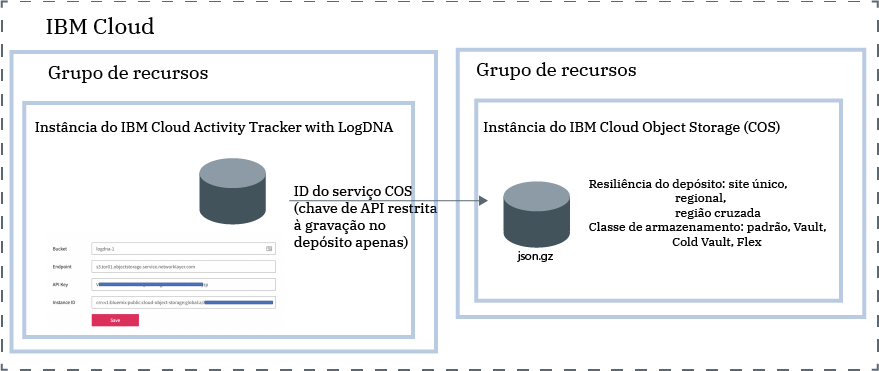

---

copyright:
  years: 2019
lastupdated: "2019-05-25"

keywords: IBM Cloud, LogDNA, Activity Tracker, manage events

subcollection: logdnaat

---

{:new_window: target="_blank"}
{:shortdesc: .shortdesc}
{:screen: .screen}
{:pre: .pre}
{:table: .aria-labeledby="caption"}
{:codeblock: .codeblock}
{:tip: .tip}
{:download: .download}
{:important: .important}
{:note: .note}

# Gerenciando eventos em sua conta
{: #manage_events}

Como um administrador do serviço do {{site.data.keyword.at_full_notm}} no {{site.data.keyword.cloud_notm}}, deve-se provisionar uma instância do serviço em cada local que você planeja monitorar. Deve-se definir as diretrizes de conta para gerenciar eventos na conta.
{:shortdesc}

## Provisionando uma instância do serviço por local
{: #manage_events_provision}

Para coletar e monitorar a atividade em sua conta, deve-se provisionar o serviço do {{site.data.keyword.at_full_notm}} em sua conta. 

Há uma instância do serviço {{site.data.keyword.at_full_notm}} por local. Portanto, para monitorar a atividade em sua conta, pode ser necessário provisionar múltiplas instâncias do {{site.data.keyword.at_full_notm}}. 

* No {{site.data.keyword.cloud_notm}}, é possível clicar no ícone **Menu**  > **Observabilidade** > **Activity Tracker** para ver o painel no qual todas as instâncias provisionadas na conta são listadas. 
* Se você desejar monitorar [eventos globais](/docs/services/Activity-Tracker-with-LogDNA?topic=logdnaat-monitor_events#mon_def_global), deverá provisionar uma instância em Frankfurt. 

[Saiba mais sobre como provisionar o serviço](/docs/services/Activity-Tracker-with-LogDNA?topic=logdnaat-provision).

Para obter a lista de locais em que o serviço está disponível no {{site.data.keyword.cloud_notm}}, consulte [Locais](/docs/services/Activity-Tracker-with-LogDNA?topic=logdnaat-regions).

Assim que uma instância estiver disponível, os eventos serão coletados e disponíveis para monitoramento por meio da IU da web dessa instância.

## Arquivando eventos
{: #manage_events_archive}

É possível arquivar eventos de uma instância do {{site.data.keyword.at_full_notm}} em um depósito em uma instância do {{site.data.keyword.cos_full_notm}} (COS). [ Saiba mais ](/docs/services/Activity-Tracker-with-LogDNA?topic=logdnaat-archiving).

* Os eventos são arquivados automaticamente uma vez por dia em um formato compactado **(.json.gz)**. Cada linha preserva seus metadados.
* Os eventos são arquivados de 24 a 48 horas depois a configuração é salva. 

Cada instância do {{site.data.keyword.at_full_notm}} tem sua própria configuração de arquivamento.
{: important}

A figura a seguir mostra uma visualização de alto nível de diferentes componentes que são integrados ao arquivar eventos:

A instância do {{site.data.keyword.cos_full_notm}} é fornecida dentro do contexto de um grupo de recursos. A instância do {{site.data.keyword.at_full_notm}} também é fornecida dentro do contexto de um grupo de recursos. As duas instâncias podem ser agrupadas no mesmo grupo de recursos ou em grupos de recursos diferentes. 

O {{site.data.keyword.at_full_notm}} usa um ID de serviço para se comunicar com o serviço {{site.data.keyword.cos_full_notm}}.
* O ID de serviço que você cria para uma instância do {{site.data.keyword.cos_full_notm}} é usado pelo {{site.data.keyword.at_full_notm}} para autenticar e acessar a instância do {{site.data.keyword.cos_full_notm}}. 
* É possível designar políticas de acesso específicas para o ID de serviço que restringem as permissões na instância do {{site.data.keyword.cos_full_notm}}. Restrinja o ID de serviço para apenas ter permissões de gravação no depósito em que você planeja arquivar os eventos.

## Classificando eventos usando categorias
{: #manage_events_category}

É possível definir categorias por meio da seção **Categorias** na IU da web. 

É possível definir categorias para agrupar visualizações. É possível definir um conjunto diferente de categorias para agrupar painéis.

Use as categorias para agrupar recursos para que os usuários possam localizá-los facilmente. 

