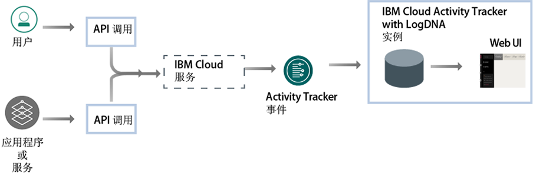

---

copyright:
  years: 2019
lastupdated: "2019-04-04"

keywords: IBM Cloud, LogDNA, Activity Tracker, getting started

subcollection: logdnaat

---

{:new_window: target="_blank"}
{:shortdesc: .shortdesc}
{:screen: .screen}
{:pre: .pre}
{:table: .aria-labeledby="caption"}
{:codeblock: .codeblock}
{:tip: .tip}
{:download: .download}
{:important: .important}
{:note: .note}

# 入门教程
{: #getting-started}

使用 {{site.data.keyword.at_full}} 服务可跟踪应用程序与 {{site.data.keyword.cloud_notm}} 服务进行交互的情况。您可以使用此服务来调查异常活动和关键操作，并满足监管审计要求。此外，您可以在操作发生时收到警报。收集的事件符合 Cloud Auditing Data Federation (CADF) 标准。
{:shortdesc}

{{site.data.keyword.at_full_notm}} 会收集并存储对 {{site.data.keyword.cloud_notm}} 中运行的资源所发起 API 调用的审计记录。您可以在 {{site.data.keyword.cloud_notm}} 上归档这些事件以进行长期存储。
{: note}

## 关于 {{site.data.keyword.at_full}}
{: #ov}

符合内部策略和行业法规是任何组织的策略中的关键要求，与应用程序的运行位置（内部部署、混合云或公共云）无关。{{site.data.keyword.at_full_notm}} 服务提供了框架和功能，可监视对 {{site.data.keyword.cloud_notm}} 上服务的 API 调用并生成证据，证明符合公司政策和特定于行业的市场监管。

在云环境（例如，{{site.data.keyword.cloud_notm}}）中工作时，必须根据内部策略以及基于行业和国家或地区的合规要求，计划用于审计和监视工作负载与数据的云策略。可以使用通过 {{site.data.keyword.at_full_notm}} 服务注册的信息来确定安全事件，检测未经授权的访问，以及符合监管和内部审计要求。

* {{site.data.keyword.at_full_notm}} 支持云中 IT 资源的高级安全监管。
* {{site.data.keyword.at_full_notm}} 为管理员提供了在一个位置中捕获、存储、查看、搜索和监视 API 活动的解决方案。还提供了通知功能，可使用任何支持的通知通道向您发出警报。
* {{site.data.keyword.at_full_notm}} 提供了导出事件的功能，您可以接着使用这些事件来生成审计跟踪报告。您可能需要这些报告，以便您的组织符合内部条例和外部行业与国家或地区法规。

例如，可以使用 {{site.data.keyword.at_full_notm}} 事件来确定以下信息：
* 对云服务发起 API 调用的用户
* 发起 API 调用时的时间戳记
* API 调用的状态
* 操作的关键程度

使用 {{site.data.keyword.at_full_notm}} 服务时，请考虑有关安全性的以下信息：

* 生成 {{site.data.keyword.at_full_notm}} 事件的 IBM 服务遵循 {{site.data.keyword.IBM_notm}} 云安全策略。有关更多信息，请参阅[信任 IBM Cloud 的安全性和隐私 ](https://www.ibm.com/cloud/security){: new_window}。
* {{site.data.keyword.at_full_notm}} 服务捕获用户发起的用于更改云服务状态的操作。信息不提供对数据库或应用程序的直接访问。
* 只有授权用户才能查看和监视 {{site.data.keyword.at_full_notm}} 事件日志。每个用户通过 {{site.data.keyword.cloud_notm}} 中的用户唯一标识进行确定。

## 目标
{: #gs_objectives}

完成本教程以了解如何在 {{site.data.keyword.cloud_notm}} 中供应服务。了解每个事件中可用的常见数据以及如何使用这些数据来帮助您监视云环境。了解如何在 Web UI 中导航。 

## 先决条件
{: #gs_prereq}

* 您需要作为 {{site.data.keyword.cloud_notm}} 帐户的成员或所有者的用户标识。要获取 {{site.data.keyword.cloud_notm}} 用户标识，请转至：[注册 ](https://cloud.ibm.com/login){:new_window}。

* 您的 {{site.data.keyword.IBM_notm}} 标识必须已分配 IAM 策略，才能在 {{site.data.keyword.cloud_notm}} 中使用 {{site.data.keyword.at_full_notm}} 服务。下表列出了完成本教程所需的最低许可权： 

| 资源                             | 访问策略的作用域 | 角色       | 区域     | 信息                  |
|--------------------------------------|----------------------------|---------|-----------|------------------------------|
| 资源组 **Default**           |  资源组            |编辑者 | us-south  | 要允许用户查看 Default 资源组中的服务实例，此策略是必需的。|
| {{site.data.keyword.at_full_notm}} 服务 |  资源组            |编辑者 | us-south  | 要允许用户供应和管理 Default 资源组中的 {{site.data.keyword.at_full_notm}} 服务，此策略是必需的。|
{: caption="表 1. 完成教程所需的 IAM 策略的列表" caption-side="top"} 

* 如果您希望使用命令行，那么必须安装 {{site.data.keyword.cloud_notm}} CLI。有关更多信息，请参阅[安装 {{site.data.keyword.cloud_notm}} CLI](/docs/cli?topic=cloud-cli-ibmcloud-cli#ibmcloud-cli)。

## 步骤 1. 供应 {{site.data.keyword.at_full_notm}} 服务的实例
{: #gs_step1}

要供应实例，请完成以下步骤：

1. [登录到 {{site.data.keyword.cloud_notm}} 帐户 ](https://cloud.ibm.com/login){:new_window}。

	使用用户标识和密码登录后，{{site.data.keyword.cloud_notm}} UI 即会打开。

2. 转至“菜单”图标 。然后，选择**可观察性**以访问*可观察性*仪表板。

3. 选择 **Activity Tracker**，然后单击**创建实例**。 

4. 输入服务实例的名称。

5. 选择要在其中供应实例的区域。

6. 选择资源组。 

    缺省情况下，已设置 **Default** 资源组。

    **注：**如果无法选择资源组，请检查您是否具有对要在其中供应实例的资源组的编辑许可权。

7. 选择`轻量`服务套餐。 

    缺省情况下，已设置轻量套餐。

8. 单击**创建**。

供应实例后，将打开 *Activity Tracker* 仪表板。 

## 步骤 2. 管理对服务的访问权
{: #gs_step2}

**对于访问您帐户中的 {{site.data.keyword.at_full_notm}} 服务的每个用户，必须向其分配定义了 IAM 用户角色的访问策略。**策略确定用户可以在您选择的服务或实例的上下文中执行的操作。允许的操作是定制的，并且定义为允许在服务上执行的操作。然后，这些操作将映射到 IAM 用户角色。 

在本教程中，您将学习如何授予用户管理许可权，以在资源组的上下文中使用 {{site.data.keyword.at_full_notm}} 服务。[了解更多信息](/docs/services/Activity-Tracker-with-LogDNA?topic=logdnaat-iam#iam)。

### 1. 创建访问组
{: #gs_step2_step1}

要创建访问组，请完成以下步骤：

1. 在菜单栏中，单击**管理** &gt; **访问权 (IAM)**，然后选择**访问组**。
2. 单击**创建**。
3. 输入组的名称和可选描述，然后单击**创建**。

### 2. 添加许可权以管理事件
{: #gs_step2_step2}

设置组后，可以为该组分配公共访问策略。

要向用户授予管理员角色来管理帐户中资源组内的实例，用户必须在资源组上下文中具有包含对 {{site.data.keyword.at_full_notm}} 服务的**管理员**平台角色的 IAM 策略。 

要通过 UI 为访问组分配策略，请完成以下步骤：

1. 在菜单栏中，单击**管理** &gt; **访问权 (IAM)**。
2. 选择**访问组**。
3. 选择要为其分配访问权的组的名称。 
4. 单击**访问策略**。
5. 单击**分配访问权**。
6. 选择**在资源组中分配访问权**。
7. 选择资源组。
8. 如果尚未向用户授予针对所选资源组的角色，请为**分配对资源组的访问权**字段选择角色。 

    根据选择的角色，用户可以在其仪表板上查看资源组，编辑资源组名称或管理用户对该组的访问权。 
    
    如果希望用户仅有权访问资源组中的 {{site.data.keyword.at_full_notm}} 服务，那么可以选择**无访问权**。

9. 选择 **IBM Cloud Activity Tracker with LogDNA**。
10. 选择**管理员**平台角色。
11. 选择**管理者**服务角色。
12. 单击**分配**。

### 3. 将用户添加到组
{: #gs_step2_step3}

要将用户添加到访问组，请完成以下步骤：
1. 单击**用户**选项卡上的**添加用户**。
2. 从列表中选择要添加的用户，然后单击**添加到组**。

## 步骤 3. 生成 {{site.data.keyword.at_full_notm}} 事件
{: #gs_step3}

要在创建访问组时生成事件，请完成以下步骤：

1. 从 [{{site.data.keyword.cloud_notm}}“目录”](https://cloud.ibm.com/catalog){:new_window} 中，选择**管理** &gt; **安全性和身份**。

2. 选择**访问组**。

3. 选择**创建**。然后，输入访问组的名称。

4. 单击**创建**。

将创建访问组。

## 步骤 4. 启动 Web UI 
{: #gs_step4}

要启动 Web UI，请完成以下步骤：

1. [登录到 {{site.data.keyword.cloud_notm}} 帐户 ](https://cloud.ibm.com/login){:new_window}。

	使用用户标识和密码登录后，{{site.data.keyword.cloud_notm}}“仪表板”即会打开。

2. 在导航菜单中，选择**可观察性**。 

3. 选择 **Activity Tracker**。 

    这将显示 {{site.data.keyword.cloud_notm}} 上可用的实例的列表。

4. 选择一个实例。然后，单击**查看 LogDNA**。

这将打开 Web UI。 

## 步骤 5. 查看事件
{: #gs_step5}

{{site.data.keyword.at_full_notm}} 服务捕获与 {{site.data.keyword.cloud_notm}} 中对所选云服务发起的 API 调用和其他操作相关的活动数据。 

* 事件会自动收集。 
* {{site.data.keyword.at_full_notm}} 中收集的事件符合 **Cloud Auditing Data Federation (CADF) 标准**。CADF 标准定义了完整事件模型，包含证明、管理和审计云环境中应用程序安全性所需的信息。
* {{site.data.keyword.at_full_notm}} 按区域存储和分组事件。 
* 报告全局 {{site.data.keyword.cloud_notm}} 帐户操作的事件会收集并存储在**美国南部**区域中。
* 为 {{site.data.keyword.at_full_notm}} 实例选择的服务套餐将确定事件可供通过 Web UI 进行搜索的天数。 

您可以随时在上下文中查看每个事件行。要在上下文中查看事件，请完成以下步骤： 

1. 在 Web UI 中，单击**视图**图标 。
2. 选择**所有内容**。
3. 确定要探索的行。
4. 展开事件行。 

    这将显示有关行标识、标记和标签的信息。

5. 单击**在上下文中查看**，以在该主机和/或应用程序的其他条目的上下文中查看事件行。

完成探索事件后，单击**关闭**以关闭该行。

[了解更多信息](/docs/services/Activity-Tracker-with-LogDNA?topic=logdnaat-view_events.md#view_events.md)。

## 步骤 6. 了解事件的结构
{: #gs_step6}

事件符合 **Cloud Auditing Data Federation (CADF) 标准**。CADF 标准定义了完整事件模型，包含证明、管理和审计云环境中应用程序安全性所需的信息。

CADF 事件模型包含以下组件：

| 组件 | 描述 |
|------------|----------------------------|
| `操作`     | 操作是发起者执行、尝试执行或等待完成的行动或活动。|
| `发起者`   | 发起者是发起 API 调用并生成 CADF 事件的资源。触发的事件取决于 API 调用请求的操作。|
| `观察者`   | 观察者是通过 CADF 事件中可用的信息来创建和存储 CADF 记录的资源。|
| `结果`     | 结果是针对目标所执行的操作的状态。|
| `目标`     | 目标是对其执行操作、尝试执行操作或待完成操作的资源。|
{: caption="表 2. CADF 事件模型中可用的组件" caption-side="top"} 

[了解更多信息](/docs/services/Activity-Tracker-with-LogDNA?topic=logdnaat-event#event)。

## 后续步骤
{: #gs_next_steps}

将 {{site.data.keyword.at_full_notm}} 服务套餐升级到付费套餐，以便能够[过滤事件](/docs/services/Activity-Tracker-with-LogDNA?topic=logdnaat-views.md#views_step1)、[搜索事件](/docs/services/Activity-Tracker-with-LogDNA?topic=logdnaat-views.md#views_step2)、[定义视图](/docs/services/Activity-Tracker-with-LogDNA?topic=logdnaat-views.md#views_step3)和[配置警报](/docs/services/Activity-Tracker-with-LogDNA?topic=logdnaat-alerts.md#alerts.md)。 

有关 {{site.data.keyword.at_full_notm}} 服务套餐的更多信息，请参阅[服务套餐](/docs/services/Activity-Tracker-with-LogDNA?topic=logdnaat-service_plan#service_plan)。

