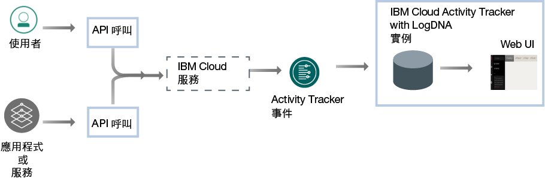
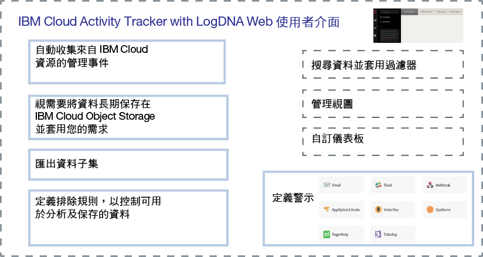

---

copyright:
  years: 2019
lastupdated: "2019-06-06"

keywords: IBM Cloud, LogDNA, Activity Tracker, getting started

subcollection: logdnaat

---

{:new_window: target="_blank"}
{:shortdesc: .shortdesc}
{:screen: .screen}
{:pre: .pre}
{:table: .aria-labeledby="caption"}
{:codeblock: .codeblock}
{:tip: .tip}
{:download: .download}
{:important: .important}
{:note: .note}

# 入門指導教學
{: #getting-started}

使用 {{site.data.keyword.at_full}} 服務可監視 {{site.data.keyword.cloud_notm}} 帳戶的活動。也可以使用此服務，來調查異常活動和重要動作，並符合法規審核需求。此外，您可以在動作發生時收到警示。所收集的事件符合「雲端審核資料聯盟 (CADF)」 標準。
{:shortdesc}

{{site.data.keyword.at_full_notm}} 會收集並儲存 API 呼叫的審核記錄，而這些 API 呼叫是針對 {{site.data.keyword.cloud_notm}} 中執行的資源所進行的。您可以在 {{site.data.keyword.cloud_notm}} 上保存這些事件以進行長期儲存。
{: note}

## 關於 {{site.data.keyword.at_full}}
{: #gs_ov}

不管應用程式是在何處執行（內部部署、在混合式雲端中或在公用雲端中），符合內部原則及產業法規是任何組織策略的主要需求。{{site.data.keyword.at_full_notm}} 服務會提供架構及功能，以監視 {{site.data.keyword.cloud_notm}} 上服務的 API 呼叫，並產生符合公司政策及市場產業特定法規的證明。

當您在雲端環境（例如 {{site.data.keyword.cloud_notm}}）中工作時，您必須規劃用來審核及監視工作負載和資料的雲端策略，使它符合內部原則及產業和各國法規遵循需求。您可以使用透過 {{site.data.keyword.at_full_notm}} 服務所登錄的資訊來識別資安事件、偵測未獲授權的存取，以及符合法規和內部審核需求。

* {{site.data.keyword.at_full_notm}} 支援雲端中 IT 資源的高階安全控管。
* {{site.data.keyword.at_full_notm}} 提供一個解決方案，可讓管理者在單一位置中擷取、儲存、檢視、搜尋及監視 API 活動。它還提供通知功能，藉由使用任何支援的通知頻道來警示您。
* {{site.data.keyword.at_full_notm}} 提供功能，可讓您匯出隨後可用來產生審核追蹤報告的資料。您可能需要這些報告，使您的組織符合內部規定及外部產業和國家法規。

例如，您可以使用 {{site.data.keyword.at_full_notm}} 事件來識別下列資訊：
* 對雲端服務發出 API 呼叫的使用者
* 發出 API 呼叫時的時間戳記
* API 呼叫的狀態
* 動作的重要性

使用 {{site.data.keyword.at_full_notm}} 服務時，請考量下列有關安全的資訊：

* 產生 {{site.data.keyword.at_full_notm}} 事件的 IBM 服務會遵循 {{site.data.keyword.IBM_notm}} Cloud 安全原則。如需相關資訊，請參閱 [Trust the security and privacy of IBM Cloud ](https://www.ibm.com/cloud/security){: new_window}。
* {{site.data.keyword.at_full_notm}} 服務會擷取使用者起始的動作，這些活動會變更「雲端」服務的狀態。此資訊不提供資料庫或應用程式的直接存取權。
* 只有獲授權的使用者才能檢視及監視 {{site.data.keyword.at_full_notm}} 事件日誌。每一個使用者都是透過其在 {{site.data.keyword.cloud_notm}} 中的唯一 ID 加以識別。
* 每個 {{site.data.keyword.cloud_notm}} 位置（地區）只能佈建 1 個服務實例。

## 目標
{: #gs_objectives}

請完成本指導教學，以瞭解如何在 {{site.data.keyword.cloud_notm}} 中佈建服務。找出每一個事件中可用的一般資料，以及它如何協助您監視雲端環境。學習在 Web 使用者介面中進行導覽。 

## 必要條件
{: #gs_prereq}

* 您需要的使用者 ID 是 {{site.data.keyword.cloud_notm}} 帳戶的成員或擁有者。若要取得 {{site.data.keyword.cloud_notm}} 使用者 ID，請移至：[登錄 ](https://cloud.ibm.com/login){:new_window}。

* 如果您偏好使用指令行，則必須安裝 {{site.data.keyword.cloud_notm}} CLI。如需相關資訊，請參閱[安裝 {{site.data.keyword.cloud_notm}} CLI](/docs/cli?topic=cloud-cli-ibmcloud-cli#ibmcloud-cli)。

* 若要完成管理服務存取權的步驟，您的使用者 ID 需要**管理者平台許可權**才能管理 {{site.data.keyword.at_full_notm}} 服務。請與帳戶管理者聯絡。帳戶擁有者可以授與另一個使用者對於帳戶的存取權，以便管理使用者存取權和管理帳戶資源。[進一步瞭解](/docs/iam?topic=iam-userroles)。

## 步驟 1. 佈建 {{site.data.keyword.at_full_notm}} 服務的實例
{: #gs_step1}

請完成下列步驟來佈建實例：

1. [登入 {{site.data.keyword.cloud_notm}} 帳戶 ](https://cloud.ibm.com/login){:new_window}。

	在使用您的使用者 ID 和密碼登入之後，{{site.data.keyword.cloud_notm}} 使用者介面即會開啟。

2. 移至功能表圖示 。然後，選取**觀察**以存取*觀察* 儀表板。

3. 選取 **Activity Tracker**，然後按一下**建立實例**。 

4. 輸入服務實例的名稱。

5. 選取**法蘭克福**位置。 

    如需服務在其中可用的地區的相關資訊，請參閱[地區](/docs/services/Activity-Tracker-with-LogDNA?topic=logdnaat-regions)。

6. 選取資源群組。 

    依預設，會設定 **Default** 資源群組。

    **附註：**如果您無法選取資源群組，請檢查您對要佈建實例的資源群組是否具有編輯許可權。

7. 選取`精簡`服務方案。 

    依預設，會設定精簡方案。

8. 按一下**建立**。

在佈建實例之後，*Activity Tracker* 儀表板即會開啟。 

## 步驟 2. 管理服務的存取
{: #gs_step2}

**必須將已定義 IAM 使用者角色的存取原則，指派給在您帳戶中存取 {{site.data.keyword.at_full_notm}} 服務的每位使用者。**原則決定使用者可以在您所選服務或實例的環境定義中執行什麼動作。容許的動作是自訂的，並定義為容許在服務上執行的作業。然後，這些動作會對映至 IAM 使用者角色。[進一步瞭解](/docs/services/Activity-Tracker-with-LogDNA?topic=logdnaat-iam)。

在本指導教學中，您會瞭解如何將管理許可權授與使用者，讓其可在資源群組的環境定義內使用 {{site.data.keyword.at_full_notm}} 服務。

### 1. 建立存取群組
{: #gs_step2_1}

請完成下列步驟來建立存取群組：
1. 從功能表列中，按一下**管理** &gt; **存取權 (IAM)**，然後選取**存取群組**。
2. 按一下**建立**。
3. 輸入群組的名稱和選用說明，然後按一下**建立**。

### 2. 新增許可權以管理事件
{: #gs_step2_2}

設定群組後，必須為該群組指派一般存取原則。您針對存取群組設定的任何原則都會套用至群組內的所有實體、使用者和服務 ID。

當您定義原則時，需要選取平台角色及服務角色：
* 平台管理角色涵蓋某個範圍的動作，包括建立及刪除實例、管理別名、連結、認證，以及管理存取權的能力。平台角色包括：管理者、編輯者、操作員、檢視者。平台管理角色也適用於帳戶管理服務，這些服務可讓使用者根據本身在帳戶管理服務上指派的角色邀請使用者、管理服務 ID、存取原則、型錄項目，以及追蹤計費和用量。
* 服務存取角色會定義使用者或服務能否對服務實例執行動作。服務存取角色包括：管理員、撰寫者和讀者。

若要管理 {{site.data.keyword.at_full_notm}} 服務，使用者需要下列角色：
* 平台角色：**管理者**。 
* 服務角色：**管理員**。 

請完成下列步驟，透過使用者介面指派原則：

1. 從功能表列中，按一下**管理** &gt; **存取權 (IAM)**。
2. 選取**存取群組**。
3. 選取您要指派存取權的群組名稱。 
4. 按一下**存取原則**。
5. 按一下**指派存取權**。
6. 選取**指派資源群組內的存取權**。
7. 選取資源群組。
8. 如果未授與使用者所選資源群組的角色，請針對**指派資源群組的存取權**欄位，選擇一個角色。 

    視您選取的角色而定，使用者可以在其儀表板上檢視資源群組、編輯資源群組名稱，或管理群組的使用者存取權。 
    
    如果您希望使用者只具有資源群組中對 {{site.data.keyword.at_full_notm}} 服務的存取權，可以選取**不存取**。

9. 選取 **IBM Cloud Activity Tracker with LogDNA**。
10. 選取平台角色**管理者**。
11. 選取服務角色**管理員**。
12. 按一下**指派**。

### 3. 將使用者新增至群組
{: #gs_step2_3}

請完成下列步驟，將使用者新增至存取群組：
1. 按一下**使用者**標籤上的**新增使用者**。
2. 從清單選取您要新增的使用者，然後按一下**新增至群組**。

## 步驟 3. 產生 {{site.data.keyword.at_full_notm}} 事件
{: #gs_step3}

請完成下列步驟，以在佈建 {{site.data.keyword.cloudcerts_short}} 服務實例時產生事件：

1. 從 [{{site.data.keyword.cloud_notm}} 型錄 ](https://cloud.ibm.com/catalog){:new_window} 中，選取**安全及身分**種類。

2. 選取 {{site.data.keyword.cloudcerts_short}} 服務。

3. 輸入服務實例的名稱。

4. 選取您計劃要在其中佈建實例的地區。

5. 選取資源群組。 

    依預設，會設定 **Default** 資源群組。

    **附註：**如果您無法選取資源群組，請檢查您對要佈建實例的資源群組是否具有編輯許可權。

6. 選取`免費`服務方案。 

7. 按一下**建立**。

這將建立 {{site.data.keyword.cloudcerts_short}} 服務的實例。

## 步驟 4. 啟動 Web 使用者介面 
{: #gs_step4}

請完成下列步驟來啟動 Web 使用者介面：

1. [登入 {{site.data.keyword.cloud_notm}} 帳戶 ](https://cloud.ibm.com/login){:new_window}。

	在使用您的使用者 ID 和密碼登入之後，{{site.data.keyword.cloud_notm}} 儀表板即會開啟。

2. 在導覽功能表中，選取**觀察**。 

3. 選取 **Activity Tracker**。 

    即會顯示 {{site.data.keyword.cloud_notm}} 上可用的實例清單。

4. 選取位於**法蘭克福**的實例。然後，按一下**檢視 LogDNA**。

    廣域事件（如佈建服務）透過位於法蘭克福的廣域網域實例提供。

Web 使用者介面即會開啟。 

## 步驟 5. 檢視事件
{: #gs_step5}

{{site.data.keyword.at_full_notm}} 服務會擷取與 API 呼叫相關的活動資料，以及對 {{site.data.keyword.cloud_notm}} 中選取之雲端服務所進行的其他動作。 

* 會自動收集事件。 
* 在 {{site.data.keyword.at_full_notm}} 中所收集的事件符合**雲端審核資料聯盟 (CADF) 標準**。CADF 標準定義一個完整事件模型，它包括在雲端環境中認證、管理及審核應用程式安全所需的資訊。
* {{site.data.keyword.at_full_notm}} 會依位置儲存及分組事件。 
* 報告廣域 {{site.data.keyword.cloud_notm}} 帳戶動作的事件會收集並儲存在**法蘭克福 (EU-DE)**。
* 為 {{site.data.keyword.at_full_notm}} 實例選取的服務方案將設定事件可供透過 Web 使用者介面進行搜尋的天數。 

Web 使用者介面開啟時，將顯示**全部**視圖。您可以透過此視圖來檢視事件。

您還可以定義自訂視圖，以藉由套用時間戳記及（或）搜尋查詢來檢視一組事件。[進一步瞭解](/docs/services/Activity-Tracker-with-LogDNA?topic=logdnaat-views)。

## 步驟 6. 瞭解事件的結構
{: #gs_step6}

事件符合**雲端審核資料聯盟 (CADF) 標準**。CADF 標準定義一個完整事件模型，它包括在雲端環境中認證、管理及審核應用程式安全所需的資訊。

CADF 事件模型包含下列元件：

| 元件 | 說明 |
|------------|----------------------------|
| `Action`   | 動作是指起始者執行、嘗試執行或等待完成的作業或活動。|
| `Initiator`| 起始者是指發出 API 呼叫及產生 CADF 事件的資源。所觸發的事件視 API 呼叫所要求的動作而定。|
| `Observer` | 觀察者是指可從 CADF 事件中可用的資訊建立及儲存 CADF 記錄的資源。|
| `Outcome`  | 結果是指針對目標所執行之動作的狀態。|
| `Target`   | 目標是指針對其執行、嘗試執行或擱置完成動作的資源。|
{: caption="表 2. 在 CADF 事件模型中提供的元件" caption-side="top"} 

[進一步瞭解](/docs/services/Activity-Tracker-with-LogDNA?topic=logdnaat-event#event)。

## 後續步驟
{: #gs_next_steps}

[定義自訂視圖](/docs/services/Activity-Tracker-with-LogDNA?topic=logdnaat-views)。 

將 {{site.data.keyword.at_full_notm}} 服務方案升級為付費方案，以便能夠[套用查詢來搜尋事件](/docs/services/Activity-Tracker-with-LogDNA?topic=logdnaat-views#views_step2)以及[配置警示](/docs/services/Activity-Tracker-with-LogDNA?topic=logdnaat-alerts)。 

如需 {{site.data.keyword.at_full_notm}} 服務方案的相關資訊，請參閱[服務方案](/docs/services/Activity-Tracker-with-LogDNA?topic=logdnaat-service_plan#service_plan)。

