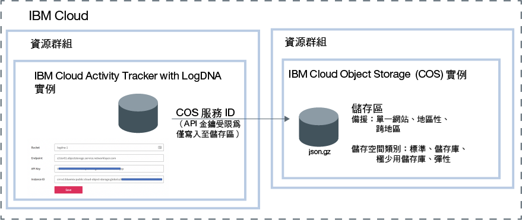

---

copyright:
  years: 2019
lastupdated: "2019-05-25"

keywords: IBM Cloud, LogDNA, Activity Tracker, manage events

subcollection: logdnaat

---

{:new_window: target="_blank"}
{:shortdesc: .shortdesc}
{:screen: .screen}
{:pre: .pre}
{:table: .aria-labeledby="caption"}
{:codeblock: .codeblock}
{:tip: .tip}
{:download: .download}
{:important: .important}
{:note: .note}

# 管理帳戶中的事件
{: #manage_events}

作為 {{site.data.keyword.cloud_notm}} 中 {{site.data.keyword.at_full_notm}} 服務的管理者，您必須在計劃監視的每個位置佈建服務的實例。您必須定義帳戶準則以管理帳戶中的事件。
{:shortdesc}

## 依位置佈建服務實例
{: #manage_events_provision}

若要收集並監視帳戶中的活動，必須在帳戶中佈建 {{site.data.keyword.at_full_notm}} 服務。 

每個位置有 1 個 {{site.data.keyword.at_full_notm}} 服務實例。因此，若要監視帳戶中的活動，可能需要佈建多個 {{site.data.keyword.at_full_notm}} 實例。 

* 在 {{site.data.keyword.cloud_notm}} 中，您可以按一下**功能表**圖示  > **觀察** > **Activity Tracker**，以查看儀表板，在儀表板上會列出帳戶中佈建的所有實例。 
* 如果要監視[廣域事件](/docs/services/Activity-Tracker-with-LogDNA?topic=logdnaat-monitor_events#mon_def_global)，則必須在法蘭克福佈建實例。 

[進一步瞭解佈建服務](/docs/services/Activity-Tracker-with-LogDNA?topic=logdnaat-provision)。

若要取得服務在 {{site.data.keyword.cloud_notm}} 中可用位置的清單，請參閱[位置](/docs/services/Activity-Tracker-with-LogDNA?topic=logdnaat-regions)。

實例可用後，事件將立即進行收集並可供透過該實例的 Web 使用者介面進行監視。

## 保存事件
{: #manage_events_archive}

您可以將事件從 {{site.data.keyword.at_full_notm}} 實例保存至 {{site.data.keyword.cos_full_notm}} (COS) 實例中的儲存區。
[進一步瞭解](/docs/services/Activity-Tracker-with-LogDNA?topic=logdnaat-archiving)。

* 事件會以壓縮格式 **(.json.gz)** 自動保存，一天一次。每一行都會保留其 meta 資料。
* 事件會在您儲存配置之後的 24-48 小時內進行保存。 

每一個 {{site.data.keyword.at_full_notm}} 實例都有它自己的保存配置。
{: important}

下圖顯示在保存事件時整合之不同元件的高階視圖：

{{site.data.keyword.cos_full_notm}} 實例是在資源群組的環境定義內佈建。{{site.data.keyword.at_full_notm}} 實例也是在資源群組的環境定義內佈建。這兩個實例可以在相同的資源群組之下或在不同的資源群組中分組。 

{{site.data.keyword.at_full_notm}} 會使用服務 ID 與 {{site.data.keyword.cos_full_notm}} 服務通訊。
* 您為 {{site.data.keyword.cos_full_notm}} 實例建立的服務 ID 是由 {{site.data.keyword.at_full_notm}} 用來鑑別及存取 {{site.data.keyword.cos_full_notm}} 實例。 
* 您可以將特定存取原則指派給限制 {{site.data.keyword.cos_full_notm}} 實例之許可權的服務 ID。將服務 ID 限制為僅對您計劃保存事件的儲存區具有寫入許可權。

## 使用種類對事件分類
{: #manage_events_category}

可以透過 Web 使用者介面中的**種類**區段來定義種類。 

可以定義種類以對視圖分組。您可以定義一組不同的種類來對儀表板分組。

使用種類對資源分組，以便使用者可以輕鬆找到資源。 

