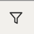
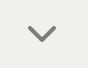

---

copyright:
  years: 2019, 2020
lastupdated: "2020-01-08"

keywords: IBM Cloud, LogDNA, Activity Tracker, IAM events

subcollection: Activity-Tracker-with-LogDNA

---

{:new_window: target="_blank"}
{:shortdesc: .shortdesc}
{:screen: .screen}
{:pre: .pre}
{:table: .aria-labeledby="caption"}
{:codeblock: .codeblock}
{:tip: .tip}
{:download: .download}
{:important: .important}
{:note: .note}


# Monitoring user API keys
{: #tutorial_iam_apikeys}

As a security officer, auditor, or manager, you can use the {{site.data.keyword.at_full_notm}} service to track how users and applications interact with the {{site.data.keyword.iamlong}} (IAM) service in {{site.data.keyword.cloud_notm}}. This tutorial shows how to monitor actions on user API keys in your account.
{:shortdesc}


## Overview
{: #tutorial_iam_apikeys_ov}

A federated user or non-federated user can create an API key to use on the CLI or as part of automation to log in as your user identity. You can use the UI or the CLI to manage your API keys by listing your keys, creating keys, locking and unlocking keys, updating keys, or deleting keys. [Learn more](/docs/iam?topic=iam-userapikey).

You can manage {{site.data.keyword.cloud_notm}} API keys that are associated with your user identity from the UI or by using CLI commands.
{: note}

To manage user API keys from the UI, go to **Manage** &gt; **Access (IAM)** &gt; **IBM Cloud API keys**. Then, you can create, lock, unlock, edit, or delete API keys. 

To manage user API keys from the command-line, you can run any of the following CLI commands:
* [ibmcloud iam api-key-create](/docs/cli/reference/ibmcloud?topic=cloud-cli-ibmcloud_commands_iam#ibmcloud_iam_api_key_create)
* [ibmcloud iam api-key-update](/docs/cli/reference/ibmcloud?topic=cloud-cli-ibmcloud_commands_iam#ibmcloud_iam_api_key_update)
* [ibmcloud iam api-key-delete](/docs/cli/reference/ibmcloud?topic=cloud-cli-ibmcloud_commands_iam#ibmcloud_iam_api_key_delete)
* [ibmcloud iam api-key-lock](/docs/cli/reference/ibmcloud?topic=cloud-cli-ibmcloud_commands_iam#ibmcloud_iam_api_key_lock)
* [ibmcloud iam api-key-unlock](/docs/cli/reference/ibmcloud?topic=cloud-cli-ibmcloud_commands_iam#ibmcloud_iam_api_key_unlock)

When you run any of these actions, an event is generated. You can use these events to monitor user API keys in the account. You monitor these events through the {{site.data.keyword.at_short}} instance that is available in the Frankfurt location.

For example, you might be interested in finding out why an action to delete a user API key fails. Has it failed because the initiator of the action does not have the correct permissions in the account? Has it failed because the API key is locked, and any update and delete actions are blocked and consequently fail? 


## Prereqs
{: #tutorial_iam_apikeys_prereqs}

1. You need a user ID that is a member or an owner of an {{site.data.keyword.cloud_notm}} account. To get an {{site.data.keyword.cloud_notm}} user ID, go to: [Registration ](https://cloud.ibm.com/login){:new_window}.

2. To work with the command-line, you must install the {{site.data.keyword.cloud_notm}} CLI. For more information, see [Installing the {{site.data.keyword.cloud_notm}} CLI](/docs/cli?topic=cloud-cli-ibmcloud-cli#ibmcloud-cli).

3. You need an {{site.data.keyword.at_full_notm}} instance that is provisioned in Frankfurt with a 7-day, 14-day, or 30-day plan. [Learn more](/docs/services/Activity-Tracker-with-LogDNA?topic=Activity-Tracker-with-LogDNA-provision).

4. Your user ID must have assigned an IAM policy to work in the {{site.data.keyword.cloud_notm}} with the {{site.data.keyword.at_full_notm}} service. [Learn more](/docs/iam?topic=iam-iammanidaccser#access_to_resources).


## Step 1. Launch the web UI in Frankfurt
{: #tutorial_iam_apikeys_step1}

1. [Log in to your {{site.data.keyword.cloud_notm}} account ](https://cloud.ibm.com/login){:new_window}.

	After you log in with your user ID and password, the {{site.data.keyword.cloud_notm}} dashboard opens.

2. Click the **Menu** icon  &gt; **Observability**. 

3. Select **Activity Tracker**. 

    The list of instances that are available on {{site.data.keyword.cloud_notm}} is displayed.

4. Select the instance whose region is set to **Frankfurt**. Then, click **View LogDNA**. The Web UI opens.


## Step 2. Generate events
{: #tutorial_iam_apikeys_step2}

### Generate events through the UI
{: #tutorial_iam_step1_1}

Complete the following steps to generate events from the UI:

1. [Create an API key](/docs/iam?topic=iam-userapikey#create_user_key).
2. [Add or modify the description of the API key](/docs/iam?topic=iam-userapikey#update_user_key).
3. [Lock the API key](/docs/iam?topic=iam-userapikey#lock_user_key).
4. [Unlock the API key](/docs/iam?topic=iam-userapikey#lock_user_key).
5. [Delete the API key](/docs/iam?topic=iam-userapikey#delete_user_key).

In the web UI, verify that you see the events for each of these actions. 

For example, if you create an API key with name `demo-key`, you can see the following events:

```
7/May/2019:11:44:09 IAM Identity Service: create user-apikey demo-key
17/May/2019:11:44:35 IAM Identity Service: update user-apikey demo-key
17/May/2019:11:44:38 IAM Identity Service: update user-apikey demo-key
17/May/2019:11:44:44 IAM Identity Service: update user-apikey demo-key
17/May/2019:11:44:51 IAM Identity Service: delete user-apikey demo-key
```
{:screen}


### Generate events by using the CLI
{: #tutorial_iam_apikeys_step1_2}

Complete the following steps to generate events by using the command-line:

1. [Create an API key](/docs/iam?topic=iam-userapikey#create_user_key).
2. [Add or modify the description of the API key](/docs/iam?topic=iam-userapikey#update_user_key).
3. [Lock the API key](/docs/iam?topic=iam-userapikey#lock_user_key).
4. [Unlock the API key](/docs/iam?topic=iam-userapikey#lock_user_key).
5. [Delete the API key](/docs/iam?topic=iam-userapikey#delete_user_key).

In the web UI, verify that you see the events for each of these actions. 

For example, if you create an API key with name `demo-key`, you can see the following events:

```
17/May/2019:11:50:52 IAM Identity Service: create user-apikey demo-key-cli
17/May/2019:11:51:17 IAM Identity Service: update user-apikey demo-key-cli
17/May/2019:11:51:50 IAM Identity Service: update user-apikey demo-key-cli
17/May/2019:11:52:01 IAM Identity Service: update user-apikey demo-key-cli
17/May/2019:11:52:09 IAM Identity Service: delete user-apikey demo-key-cli
```
{:screen}


### Generate events by using the CLI for actions that fail
{: #tutorial_iam_apikeys_step1_3}

Complete the following steps to generate events as a result of actions on user API keys in the account :  This step will generate an event that reports an action that fails.

1. [Create an API key](/docs/iam?topic=iam-userapikey#create_user_key).
2. [Lock the API key](/docs/iam?topic=iam-userapikey#lock_user_key).
3. [Add or modify the description of the API key](/docs/iam?topic=iam-userapikey#update_user_key).
4. [Rename the API key](/docs/iam?topic=iam-userapikey#update_user_key).
5. [Delete the API key](/docs/iam?topic=iam-userapikey#delete_user_key).
6. [Unlock the API key](/docs/iam?topic=iam-userapikey#lock_user_key).
7. [Delete the API key](/docs/iam?topic=iam-userapikey#delete_user_key).

In the web UI, verify that you see the events for each of these actions. 

```
    17/May/2019:16:34:44 IAM Identity Service: create user-apikey demo-key-for-fail-scenario
    17/May/2019:16:34:59 IAM Identity Service: update user-apikey demo-key-for-fail-scenario
    17/May/2019:16:36:29 IAM Identity Service: update user-apikey demo-key-for-fail-scenario -failure
    17/May/2019:16:36:59 IAM Identity Service: update user-apikey demo-key-for-fail-scenario -failure
    17/May/2019:16:37:16 IAM Identity Service: delete user-apikey demo-key-for-fail-scenario -failure
    17/May/2019:16:37:30 IAM Identity Service: update user-apikey demo-key-for-fail-scenario
    17/May/2019:16:37:40 IAM Identity Service: delete user-apikey demo-key-for-fail-scenario
```
{:screen}


## Step 3. Configure a view to see events 
{: #tutorial_iam_apikeys_step3}

From the {{site.data.keyword.at_short}} web UI, complete the following steps to customize views that you can use to monitor user API key actions in your account:

1. In the web UI, click the **Views** icon .
2. Select **Everything**.
3. Choose a search condition. The following table shows different actions and the corresponding search condition:

    <table>
      <caption>Table 1. Condition to filter user API key events for create, delete, lock, unlock, and update actions.</caption>
      <tr>
        <th>Action</th>
        <th>Search condition</th>
      </tr>
      <tr>
        <td>View user API key events</td>
        <td>`(action user-apikey) -login`</td>
      </tr>
      <tr>
        <td>View failed user API key events</td>
        <td>`(action user-apikey) -login failure`</td>
      </tr>
      <tr>
        <td>View events related to deletion of a user API key</td>
        <td>`(action user-apikey.delete) -login`</td>
      </tr>
      <tr>
        <td>View events related to locking a user API key, renaming a key, or changing the description field.</td>
        <td>`(action user-apikey.update) -login`</td>
      </tr>
      <tr>
        <td>View events that originate from actions in the UI</td>
        <td>`initiator.host.agent:"NotSet" (action user-apikey) -login`</td>
      </tr>
      <tr>
        <td>View events that originate from actions in the CLI</td>
        <td>`initiator.host.agent:"IBM Cloud CLI" (action user-apikey) -login`</td>
      </tr>
    </table>

4. Enter the condition in the **Search bar**, then click `Enter`. 

    For example, create a view to show events that report deletion of user API keys. The condition is `(action user-apikey.delete) -login`.

    As you apply the search criteria, notice that the name of the view changes from **Everything** to **Unsaved View**.

5. Click **Unsaved View** and select, **Save as new view / alert**. A *Create View* page opens.

6. Enter a name for the view.

7. Optionally, choose a category. You can create a new one too.

8. Click **Save View**.

To create multiple views based on the search condition, repeat the tasks in this step of the tutorial.


## Step 4. Define an email alert
{: #tutorial_iam_apikeys_step4}

After you save a view, you might decide that you want to be notified when certain conditions occur. 

In the previous step, you saved a view to monitor deletion of user API keys. When you configure an alert on a view, you can choose to be notified when a key is deleted, when a number of keys are deleted, or after a period of time.

Complete the following steps to configure an email alert:

1. In the web UI, click the **Views** icon .
2. Select your view. Then, click **Attach an alert**.
3. Choose **View-specific alert** and select **Email**.
4. Select the type of notification. Choose **Presence** to trigger an alert when a number of events show in the view, or after a period of time. You can use the *absence* type to trigger an alert when events are not shown in the view after a period of time. 
5. Configure the condition that triggers the alert. 

    You can configure any of the following conditions for an alert:

    * *Time frequency*: Specify how often to trigger an alert. Valid values are: 30 seconds, 1 minute, 5 minutes, 15 minutes, 30 minutes, 1 hour, 6 hours, 12 hours, 24 hours

    * *event lines counter*: Specify the number of event lines that match the view's filtering and search criteria. When the number of event lines is reached, an alert is triggered.
 
    To define the threshold condition, set the number of lines after which you want the alert to trigger. Enter **2**.

6. Choose the trigger condition **Immediately after 2 lines**.
7. Enter one or more recipients. 

8. Optionally, enter a time zone. This setting indicates the timestamp of the events that are reported through the email.

9. Click **Save alert**.


To verify the alert, you can generate more events. Check that you run delete actions. 

After you delete 2 user API keys, you get an email from LogDNA with information about the user API keys that are deleted.


## Step 5. Configure a dashboard
{: #tutorial_iam_apikeys_step5}


Complete the following steps to configure a dashboard:

1. In the web UI, click the **Dashboards** icon .
2. Select **NEW BOARD**.
3. Click **Add Graph**.
4. Choose a field to graph. Select **action**. Then, click **Add Graph**.
5. Click the **Search** icon . Enter **iam-identity.user-apikey.*** to filter out all actions that are related to user API keys.
6. Select the time interval that you want to see through this dashboard. Choose **Live** to see the past 60 minutes.
7. Click the **expand** icon . Choose the breakdown type *histogram*.
8. Select the field to distribute the data in the histogram. Choose **action**. Then, click **Add breakdown**. You see entries for each action of type *iam-identity.user-apikey* that has data in the time interval that you selected.

    

9. Select a line entry in the histogram to see the total number of records in that time interval.

    

10. Click **Edit** to enter the name of the dashboard. Optionally, you can also create or add the dahboard to a category. Click **Save**.


